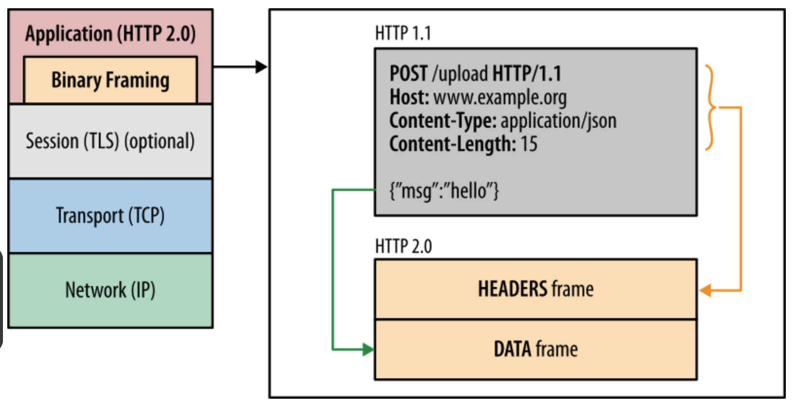

# http의 버전

## HTTP/1.0
- 수명이 짧은 연결
- http 연결은 자체 요청에서 완료됨.
- 각 http 요청 당 TCP 핸드 쉐이크가 발생되며, 기본적으로 한 연결 당 하나의 요청을 처리하도록 설계됨.
- 한 번 연결할 때마다 TCP 연결을 계속해야 하니 RTT가 늘어나는 문제 발생.
    - RTT(Round Trip Time : 왕복 지연 시간)란?
        - 신호를 전송하고 해당 신호의 수신 확인에 걸린 시간을 더한 값이자, 어떤 메시지가 두 장치 사이를 왕복하는 데 걸리는 시간.

## HTTP/1.1
- HTTP/1.0의 단점을 보완한 프로토콜
- 3가지의 차이점
    1. keep-alive default
        - 매번 데이터를 요청할 때마다 TCP 연결을 하는 게 아닌 한 번 해놓고 계속해서 데이터를 받을 수 있게 함.
        
        - keep-alive header
            - TCP 연결을 유지하는 것을 알려주는 헤더
            - 연결 유지 시간인 timeout과 최대 요청 수 max를 정할 수 있음
            - node.js의 경우 연결 유지시간인 timeout 시간만 지정 가능.
    2. 호스트 헤더
        - HTTP/1.0은 서버가 하나의 호스트만 가진다고 가정하기에 HTTP/1.0은 헤더에 호스트를 포함 X 
            따라서 HTTP/1.0은 하나의 호스트만 가짐.
        - 그러나 사실 서버는 여러 개의 호스트를 가질 수 있음. 
            따라서 이런 유연성을 위해 헤더에 특정 호스트를 포함할 수 있게 변경됨.
    3. 대역폭 최적화
        - HTTP/1.0의 경우 어떠한 파일을 다운로드 하다 연결이 끊기면 다시 다운로드 받는 것이 불가능했음.
        - 이젠 다시 다운로드 받을 수 있었음.
            - 10KB 파일을 5KB까지 받고 다시 다운로드를 받는 게 불가능 했지만, 
                HTTP/1.1에선 Rage:bytes=5000-라는 헤더를 추가해 다운로드 재개 요청 가능.

### 요청을 줄이기 위한 기술
- HTTP/1.1로 발전했음에도 서버 요청 시에 RTT는 계속 증가됨. 그에 따른 기술 발전
- 예 ) 이미지 스프라이트(image sprite), 코드 압축, Base64 인코딩 기술

#### 이미지 스프라이트
- 수많은 이미지를 하나의 이미지로 만들어 하나의 이미지만 다운 받아놓고 이를 통해 수많은 이미지를 다운받는 듯한 효과.
    
#### 코드 압축
- 코드를 압축하여 서빙
#### 이미지 Base64 인코딩
- 이미지 파일을 64진법으로 이루어진 문자열로 인코딩 해 이미지 서버에 대한 HTTP 요청을 할 필요 없이 만드는 것.
- 하지만 Base64 인코딩의 경우 파일 크기가 37퍼센트 크기가 더 커짐.

### HTTP/1.1의 고질적인 문제 : HOL
- 네트워크에서 같은 큐에 있는 패킷이 그 첫 번째 패킷에 의해 지연될 때 발생하는 성능저하현상.
- 그니까 효율적으로 첫 패킷의 크기가 너무 커버리면 비교적 작은 크기의 뒤에 패킷이 다운로드 속도가 지연된다는 것.
    

## HTTP/2
- 2009년 구글은 HTTP/1.1의 한계를 극복하기 위해 SPDY 프로토콜 개발.
- 이 SPDY를 기반으로 한 HTTP/2 프로토콜 개발.

### 바이너리 포맷 계층
- 애플리케이션 계층와 전송 계층 사이 바이너리 포맷 계층 추가.
- HTTP/1.0은 일반 텍스트 메세지를 전송하고 줄바꿈으로 데이터를 나눔.
- HTTP/2.0은 바이너리 데이터(0과1)로 변경되었고, 더 작은 메세지가 프레임으로 캡슐화 되어 전송됨.
    

### 멀티플랙싱
- 단일 TCP 연결의 여러 스트림에서 여러 HTTP 요청과 응답을 비동기적으로 보낼 수 있음. 
    => HOL 해결
- HTTP/1.1에선 병렬 요청 시 다중 TCP 연결을 해야 했고, TCP 연결 하나 당 병렬 요청이 불가능 했음.
- HTTP/2.0에선 리소스를 작은 프레임으로 나누고 이를 스트림으로 프레임을 전달. 
    각각의 프레임은 스트림ID, 해당 청크의 크기를 나타내는 프레임이 추가됨. 
    따라서 작게 나눠서 다운로드가 되더라도 결과적으로 응답 데이터에선 올바른 순서로 재조립할 수 있게됨.
    
    

### 서버 푸시
- 서버가 리소스를 클라이언트에게 푸시 가능.
- 요청된 html파일과 함께 다른 개체를 별도로 보낼 수 있음.
- 만약 요청한 html에 css가 포함 되어 있다면 별도 요청 없이 css도 같이 보낼 수 있음.
    

### 헤더 압축
- HTTP/1.1에선 무거운 헤더와 있었지만 이를 허프만 인코딩 압축 방법 등으로 압축시킴.
- 똑같은 서버에서 2개의 이미지를 준다고 했을 때 중복되는 헤더는 제외한 채 보냄. 
    해당 공통 필드로 헤더를 재구성 하며 중복되지 않은 헤더값은 허프만 인코딩 압축 방법으로 압축해 전송.

### 우선 순위
- 서버에서 원하는 순서대로 우선순위를 정해 리소스를 전달.

## HTTP/3
- HTTP/2는 여전히 TCP를 사용하기 때문에 초기 연결 때 RTT로 인한 지연 시간 문제점.
- 이를 해결한 버전이 HTTP/3
- QUIC(Quick UDP Internet Connections)이라는 계층 위에서 돌아가며, TCP 기반이 아닌 UDP 기반으로 돌아 가며, 멀티플렉싱, 초기 연결 설정 시 지연시간 감소
    
- HTTP/2.0의 경우 3 - RTT, QUIC은 1 - RTT만 필요함.
- HTTP/2의 경우 클라이언트와 서버 간 연결을 맺어 세션을 만드는 데 필요한 핸드쉐이크, 암호화 통신을 구축하기 위한 TLS 핸드 쉐이크가 각각 필요 했음.
- HTTP/3는 TLS로 암호화 통신을 구축할 때 단 한 번의 핸드 쉐이크를 활용해 클라이언트와 서버 간 연결, 엄호화 통신 모두 다 구축. 따라서 1 - RTT 만에 모든 연결 성립.
    
- 전송된 패킷이 손실 됐다면 수신 측에서 에러를 검출/수정 하는 방식. 
    열악한 네트워크 환경에서도 낮은 패킷 손실률을 자랑하는 순방향 오류 수정 메커니즘.

## 참고
https://www.akamai.com/ko/blog/performance/deliver-fast-reliable-secure-web-experiences-http3
https://gngsn.tistory.com/234
https://ibocon.tistory.com/257
https://seeun0210.tistory.com/26
https://jaehoney.tistory.com/281
https://velog.io/@mooongs/CSS-%EC%9D%B4%EB%AF%B8%EC%A7%80-%EC%8A%A4%ED%94%84%EB%9D%BC%EC%9D%B4%ED%8A%B8-%EA%B8%B0%EB%B2%95
https://velog.io/@uoayop/HTTP