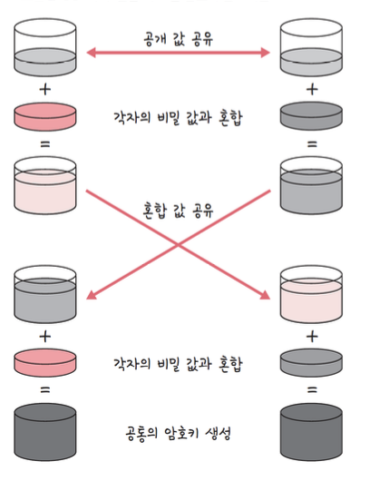
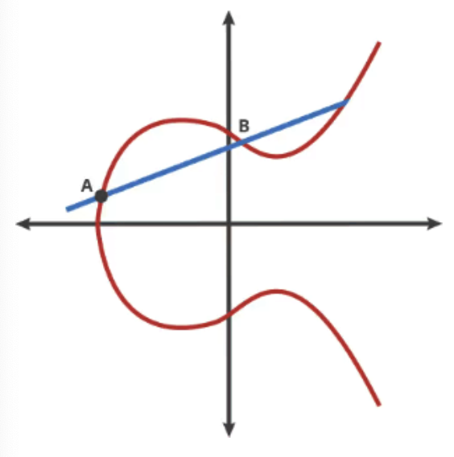
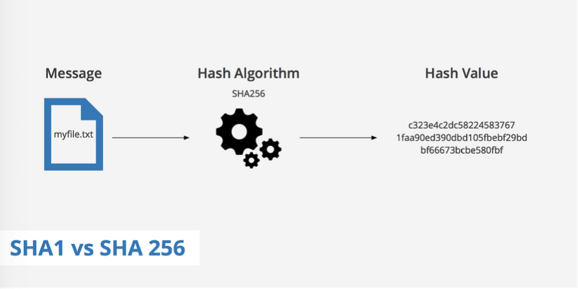

# HTTPS와 TLS

## 암호화
- 승인된 당사자만 정보를 이해할 수 있도록 "스크램블"한 방법

## 스크램블
- 각 단어나 문자를 패턴에 따라 암호화 하는 것이 아닌 무작위 방식으로 개별 데이터 비트를 섞는 것.

## 대칭 암호화
- 키를 하나만 사용하는 암호화 방법.
- 예
    - Plaintext + key = ciphertext: hello + 2jd8932kd8 = X5xJCSycg14=  
    - Ciphertext + key = plaintext: X5xJCSycg14= + 2jd8932kd8 = hello
- 대표 알고리즘으로 DES, AES

## 비대칭 암호화
- 공개 키 암호화 방식이라고도 함.
- 두 개의 다른 키(공개키, 개인키)로 데이터를 암호화하거나 서명하고 키 중 하나인 공개 키를 누구나 사용할 수 있도록 하는 방법.
- 대표 알고리즘 RSA, DH
- TLS는 부분적 비대칭 암호화 방식. 비대칭 암호화로 인증 후 대칭 암호화로 보안적 통신
- TLS 핸드쉐이크 과정에서 처음 인증할 때 비대칭 암호화, 이후 클라이언트와 서버는 "세션키"를 기반으로 대칭 암호화 기반 통신.

## 암호화의 필요성
- 민감한 데이터의 유출 방지
- 데이터 무결성 보장(데이터의 정확성, 일관성)

# TLS 핸드 쉐이크
- SSL로 시작하여 버전이 올라가며 TLS로 명칭 변경.
- 전송 계층에서 보안을 제공하는 프로토콜. 클라이언트와 서버 간 통신 시 TLS를 통해 하이재킹 예방.
- 사용할 TLS 버전을 정하고, 사이퍼슈트, 서버의 공개키, SSL 인증서 기반 인증 작업 수행 후 대칭 암호화를 위해 세션키 생성.

## 과정
1. Client Hello
    - 클라이언트는 TLS 버전, 사이퍼슈트와 클라이언트 랜덤값(무작위 문자열), 임시 DH 매개변수를 서버에게 전송.
2. Server Hello, EncryptedExtensions, Certificate, CertificateVerify
    - 서버는 클라이언트로부터 받은 옵션 확인
    - 서버와 클라이언트 모두 지원되는 TLS 버전 식별 후 결정
    - 사이퍼슈트 지원 여부 확인
    - 공개키가 포함된 SSL 인증서, 서버 랜덤값, 임시 DH 매개변수를 보냄.
    - 그리고 클라이언트와 서버 각각 서로 교환한 DH 매개변수를 사용하여 임시 암호 키(세션키)를 생성.
3. Finished
    - 서버와 클라이언트 모두 이전에 교환된 모든 메세지에 대한 무결성과 인증 확인하는 메세지를 전송
    - 클라이언트와 서버와 세션키를 기반으로 대칭 암호화 통신 시작.

## 키교환 알고리즘
- 대표적으로 RSA와 DH
- TLS1.3버전에선 RSA 같은 경우 취약점이 있기 때문에 공식 지원 X.

## DH 매개변수
- Diffie-Hellman을 의미
- 서로 공개값 공유, 비밀값과 혼합, 혼합값과 공유, 각자의 비밀값과 혼합해서 공통의 암호키를 만드는 알고리즘.
    
- DH는 Diffie-Hellman을 사용하는 DHE와 타원곡선암호화 방법과 DH를 섞은 ECDHE를 씀.

### 타원곡선 암호화 방법

- 곡선을 사용하여 개인 키 보유자만 알 수 있는 타원곡선을 그림
- 이걸 기반으로 교차점을 생성하여 이 교차점의 수를 기반으로 암호를 설정하는 방법

## 사이퍼 슈트
- 프로토콜, AEAD 사이퍼 모드, 해싱 알고리즘이 나열된 규약
- 암호제품군이라고도 불림.
- TLS1.3 버전엔 다섯 개가 잇음
    - TLS_AES_128_GCM_SHA256
        - TLS는 프로토콜
        - AES_128_GCM은 AEAD 사이퍼 모드
        - SHA256 해싱 알고리즘
    - TLS_AES_256_GCM_SHA384
    - TLS_CHACHA20_POLY1305_SHA256
    - TLS_AES_128_CCM_SHA256
    - TLS_AES_256_CCM_8_SHA256

### AEAD 사이퍼 모드
- 데이터 암호화 알고리즘

### 해싱 알고리즘
- 데이터를 추정하기 힘든 더 작고, 섞여 있는 조각으로 만드는 알고리즘
    
- TLS에서 인증서가 올바른 인증서인 지 확인할 때 전자서명을 이용하는 데 이 때 해싱 알고리즘 사용
    1. 인증 생성 작업 : 전자 서명을 만드는 데 서명되는 메세지를 해싱
    2. 인증 확인 작업 : 메세지를 복호화 해서 해시를 서로 비교해 올바른 메세지인 지 확인.
- 전자 서명은 송신자가 자신의 신원을 증명하는 절차 또는 정보

### 인증서
1. 주체(인증서 발급한 CA, 도메인, 웹 사이트 소유자, 인증서 소유자)
2. 공개키(공개키, 공개키암호화방법)를 포함하는 단순한 데이터 파일. 
    자신의 웹사이트 안에서 SSL 인증서를 만들 수도 있지만 보통은 인증기관인 CA에서 발급한 SSL 인증서를 기반으로 인증 작업을 수행.
- 주체는 클라이언트가 접속한 서버가 클라이언트가 의도한 서버가 맞는 지 확인할 때 쓰이고 공개키는 처음 인증 작업을 수행할 때 쓰임.

### CA
- 인증서의 역할은 클라이언트가 접속한 서버가 클라이언트가 의도한 서버가 맞는 지를 보장하는 역할.
- 인증서를 발급하는 기업들이 CA
- 인증서 유형
    - 단일 도메인 : 단 하나의 도메인에 적용되는 인증서
    - 와일드카드 : 도메인의 하위 도메인도 포함하는 인증서(naver.com, blog.naver.com)
    - 멀티 도메인 : 멀티 도메인 SSL 인증서는 관련되지 않은 다수의 도메인에 적용될 수 있는 인증서.

## RSA의 취약점
- 클라이언트가 생성한 임시 암호값을 서버로 전송하지만 DH의 경우 클라이언트와 서버가 서로 교환한 DH 매개변수를 사용해 개인키 생성. 
    따라서 RSA는 클라이언트에서 생성한 임시 암호값이 탈취당한 경우 해킹의 위험성 내포.

## 0 - RTT
- 세션키 생성 후 세션키를 기반으로 연결을 생성하기 때문에 인증에 비용 X 
    따라서 인증에 관한 RTT가 들지 않기 때문에 0 - RTT
    