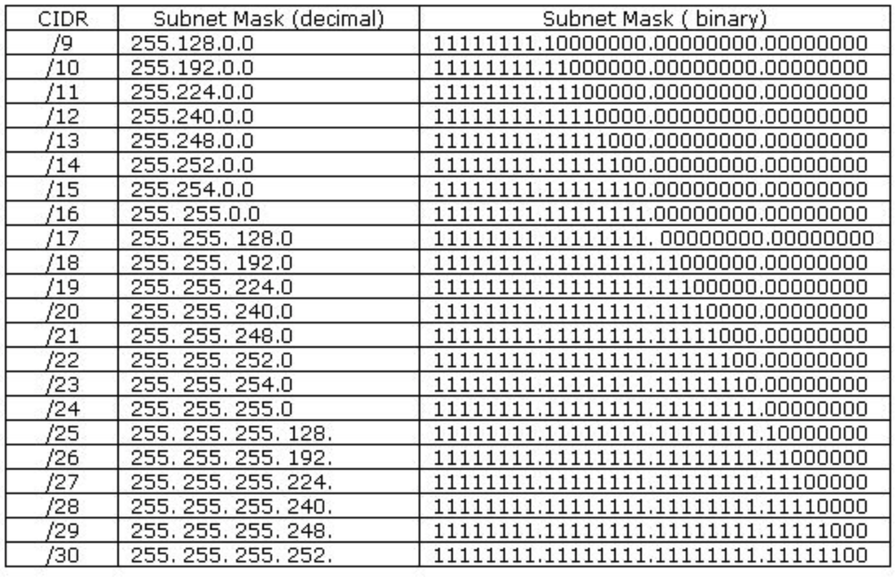

# 클래스리스와 서브넷 마스크, 서브네팅
- 클래스풀의 단점을 보완하고자 등장
- 클래스로 나누는 것이 아닌 서브넷 마스크를 중심으로 어디까지가 네트워크 주소고 어디까지가 호스트 주소인지를 나눔
    - 서브네팅 : 네트워크를 나눈다는 의미
    - 서브넷 : 서브 네트워크, 쪼개진 네트워크
    - 서브넷 마스크 : 서브네트워크를 위한 비트 마스크
    참고로 현재 저희의 주소체계는 클래스리스

## 클래스리스
- 클래스 기반의 제한을 없애고 고정된 서브넷 마스크 대신 가변 길이 서브넷 마스크(VLSM)를 사용하여 네트워크와 호스트 부분을 동적으로 나누는 방법

## 서브넷마스크
- 네트워크 주소 부분만 모두 1, 호스트 주소 부분은 0으로 설정해 나눔
- 예 )
    - 192.168.50.112라면 
    - 한 옥텟 당 8비트니까 해당 네트워크 주소의 8비트 부분을 모두 1로, 호스트는 0으로 채움
        - 255.255.255.0
    - 여기에서 192.168.50.112과 255.255.255.0을 &(엔드 연산자)를 사용하면 192.168.50.0이 됨
        - 왜나면 각 네트워크 주소의 비트들은 1로, 호스트는 0으로 되어 있기 때문
            

- 맨 왼쪽은 서브넷 마스크의 값을 얼마로 할 껀 지 선정
- /20이라면 왼쪽부터 서브넷 마스크의 비트 값으로 비트 자리 20까지 1로 채우겠단 의미
    - 11111111.11111111.11110000.00000000 => 255.255.240.0
- /24라면?
    - 11111111.11111111.11111111.00000000 => 255.255.255.0 /24
- /25라면?
    - 11111111.11111111.11111111.10000000 => 255.255.255.128 /25

- 만약 10개의 사무실이 있으며 사무실당 12개의 장치를 연결해야 한다면?
    - 한 서브넷당 123.12.12.12/28로 16개의 네트워크를 확보해야 함. 16-2 = 14개 장치니까
    - 123.12.12.12
    - 255.255.255.
- 그러니까 할당된 기존 IP를 커스텀 하여 서브넷으로 바꾼 후 원하는 만큼 분할하여 사용
- 할당받은 IP 블록 내에서 원하는 만큼 서브넷으로 분할하여 네트워크 주소와 호스트 주소를 재설정 가능

## 공인 IP(public IP)와 사설 IP(private IP)와 NAT

- IP 주소의 부족을 공인 IP(public IP)와 사설 IP(private IP)로 나누고 중간에 NAT라는 기술을 통해 해결
- NAT(Network Address Translation)는 패킷이 트래픽 라우팅 장치를 통해 전송되는 동안 패킷의 IP 주소를 변경, IP 주소를 다른 IP 주소로 매핑하는 방법.
- NAT를 통해 내부 네트워크 IP가 노출되는 않는다는 점이 장점.
### 공유기와 NAT
- 실생활에서 인터넷 회선 하나를 개통하고 보통 공유기를 써서 wifi를 만들곤 하는데 이 때 여러 대의 호스트가 하나의 공인 IP 주소를 사용하여 인터넷에 접속하게 됨.