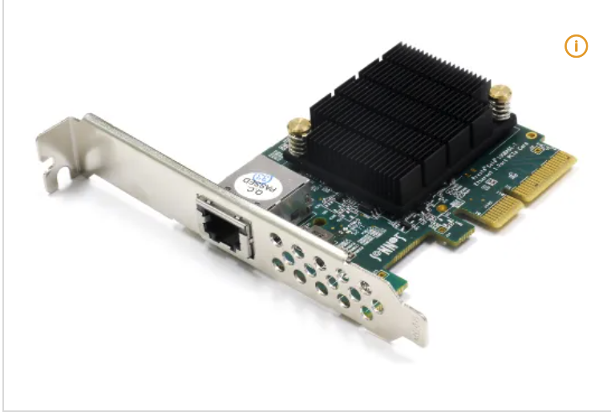
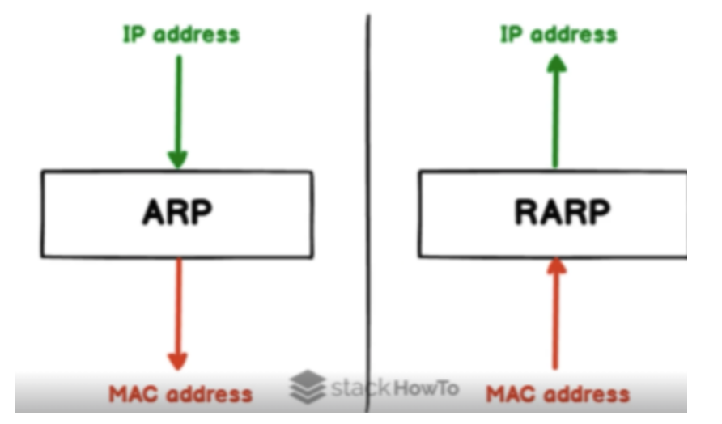
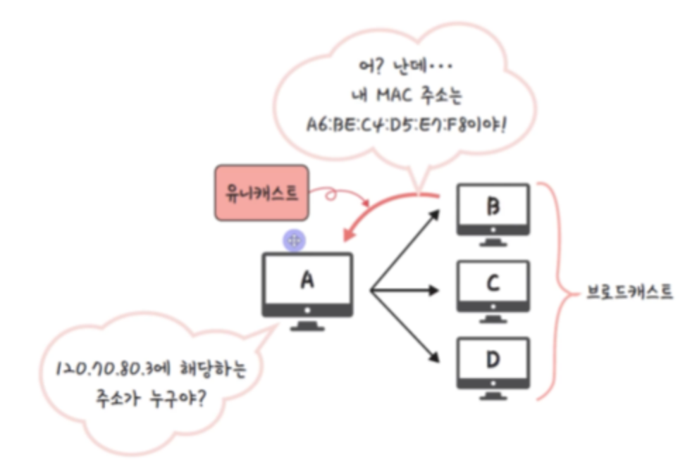

# IP 주소, MAC 주소, ARP, RARP

## IP 주소
- 논리적 주소
- 컴퓨터 네트워크에서 장치들이 서로를 인식하고, 통신을 하기 위해 사용하는 특수한 번호
- IP를 기반으로 통신하긴 하지만 그 아래에 물리적 주소인 MAC 주소를 통해 통신
- 예 ) 같은 노트북이라도 어느 네트워크에 연결 했냐에 따라 부여 받는 IP 주소가 달라짐.

## MAC 주소(Media Access Control Address)

- PC의 NIC 카드(MAC 주소가 담겨 있는 카드)
- 네트워크 인터페이스에 할당된 고유 식별자이자 보통 장치의 NIC에 할당됨.
- 48비트로 이루어져 있으며 24비트의 OUI와 24비트의 UAA로 이루어짐.
    - OUI : IEEE에서 할당한 제조사 코드
    - UAA : 제조사에서 구별되는 코드

## IP 주소와 MAC 주소
- IP 주소는 네트워크에서 할당된 주소, MAC 주소는 장치(컴퓨터의 LAN 카드)에 부여된 고유 식별 번호
- 즉, 같은 노트북일 때 어느 네트워크에 연결 했냐에 따라 부여 받는 IP 주소는 달라지지만, MAC 주소는 바뀌지 않음.
- IP 주소는 네트워크 계층에, MAC 주소는 데이터 링크 계층에서 사용됨.
- 최종
    - LAN 포트가 있는 하드웨어 장치가 NIC(Network Interface Card)
    - 이 NIC에 MAC 주소가 할당 되어 있음
    - 이 때 MAC 주소는 데이터 링크 계층에서, IP 주소는 네트워크 계층에서 사용됨. 

### TCP/IP 4계층과 연결
- 네트워크 계층
    - IP 주소가 사용되는 계층
    - DNS를 통해 받은 목적지의 IP 주소와 본인 IP 주소를 데이터의 헤더에 삽입하여 패킷화
- 데이터링크 계층
    - 데이터 링크 계층에선 출발지의 MAC 주소와 목적지의 MAC 주소를 설정하여 데이터를 프레임화
    - 여기서 출발지 MAC 주소는 본인 장치의 NIC의 MAC 주소를 삽입
    - IP 주소만으로는 최종 목적지의 MAC 주소를 알 수 없으므로 바로 다음 목적지(경유지)의 주소(로컬의 기본 게이트위이 MAC 주소)로 설정.
    - 여기서 출발지/목적지 MAC 주소는 최종 목적지로 전달되기 위해 거쳐 가는 노드들(스위치, 라우터 등을 포함하는 출발지와 목적지 사이에 위치한 네트워크 장치들)에 따라서 변경됨. 
        => 가변성을 가짐
        1. 게이트웨이가 클라이언트로부터 받은 프레임을 뜯음.
        2. 프레임을 뜯으면 패킷이 나오고, 그 패킷에 있는 최종 목적지 IP 주소와 자신의 라우팅 테이블을 통해 데이터를 전달할 다음 노드를 선정
        3. 선정된 노드의 MAC 주소를 목적지 MAC 주소로, 자신의 MAC 주소를 출발지 주소로 재캡슐화
        4. 이후 해당 노드에게 전송
        - 이 과정을 반복하여 최종 IP 목적지에게 데이터 전달
        - 여기에서 각 노드들끼리 패킷을 전달한다고 하는 이유는 결국 프레임은 실질적 데이터가 아닌 경유지 주소의 역할이기 때문
        - IP 주소가(192.168.00.00) 머 이런 식이니까 그거에 대응하는 라우팅 테이블을 통해서 전달한다고 함. 
            자세하겐 다음에
    - 즉, 이 데이터 링크 계층의 프레임 데이터는 가변적으로 각 노드와 도착지에 따라 값(주소)이 변경됨.

## ARP와 RARP

- ARP를 통해 IP 주소에서 MAC 주소를 찾을 수 있음
- RARP를 통해 MAC 주소를 IP 주소로 찾을 수 있음

### ARP

1. 해당 IP 주소에 맞는 MAC 주소를 찾기 위해 해당 데이터를 '브로드캐스팅'을 통해 연결된 네트워크에 있는 장치에게 모두 보냄
2. 맞는 장치가 있다면 해당 장치는 보낸 장치에게 유니캐스트로 데이터를 전달해 주소를 찾게 됨.

### 고정 IP
- DNS가 IP를 찾을 때 중요 웹 사이트 같은 경우는 수시로 바뀌면 접속율이 떨어지기 고정 IP로 되게끔
