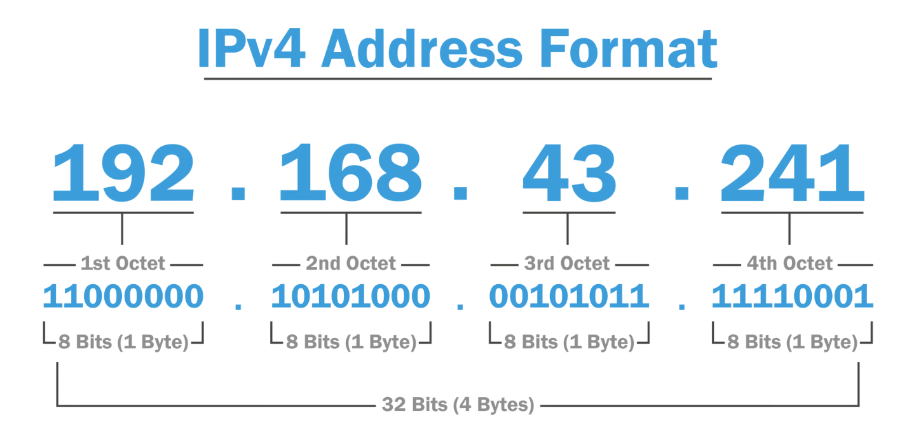
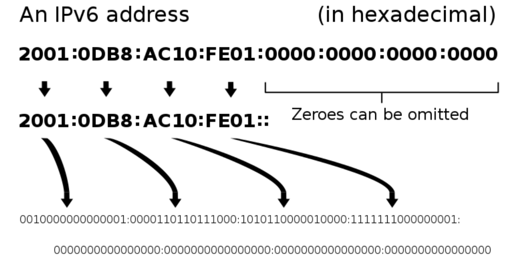
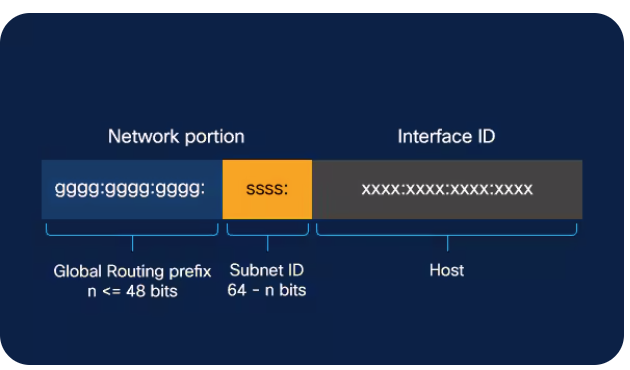
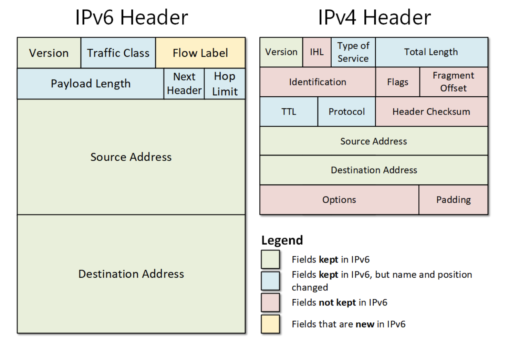
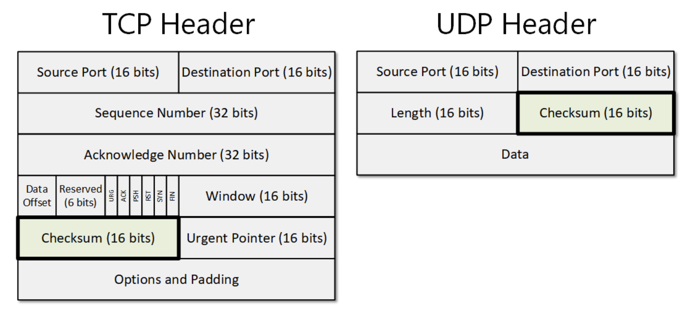
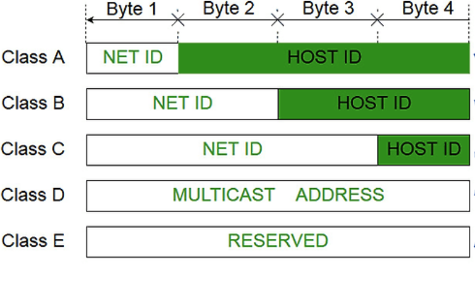
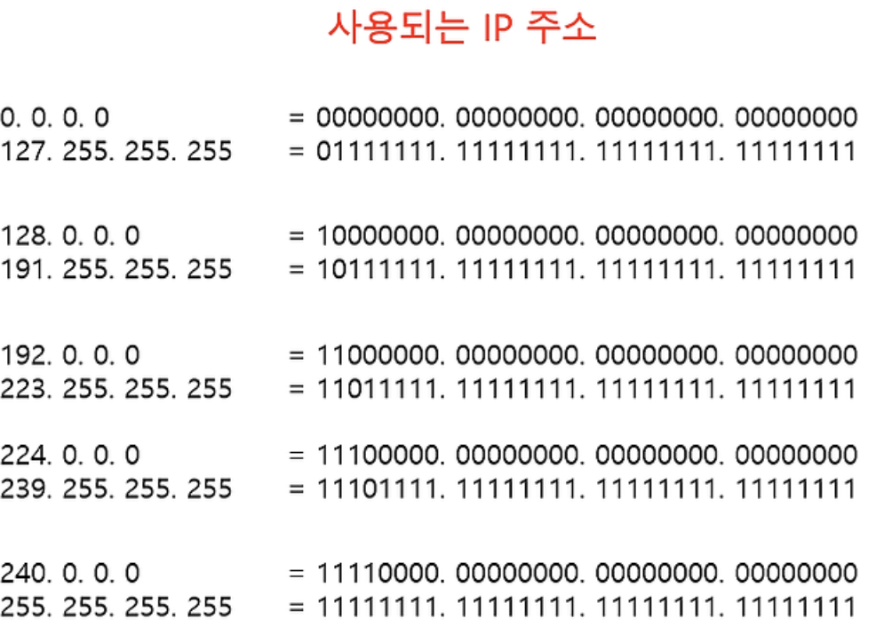
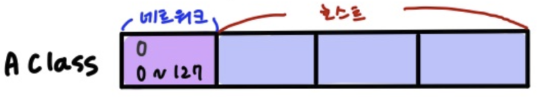
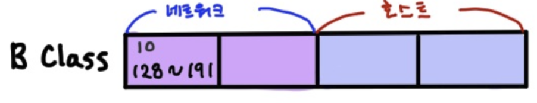
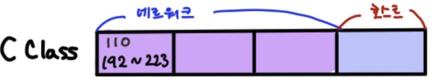

# IPv4와 IPv6

- IP 주소는 인터넷 주소로 IPv4, IPv6로 나뉨

## IPv4

- 32비트, 2^32개의 주소(41억 9천만 주소) 표현
- 8비트 단위로 점을 찍어 4개로 구분(단위를 옥텟). 8비트를 10진수로 표현
- 주소가 부족하기 때문에 NAT, 서브네팅 여러 개의 부수적인 기술 필요

## IPv6

- 128비트, 2^128개의 주소 표현(많은 주소 처리 가능하며 NAT, 서브네팅이 필요하지 않음)
- 16비트씩 8개로 구분
- 16비트는 16진수로 변환되어 콜론(:)으로 구분
- 앞의 연속되는 0은 생략 가능
- 앞 64비트는 네트워크, 뒤 64비트는 인터페이스 주소
    
    - IPSec이 내장되어 있음
    - IPSec은 데이터 패킷을 암호화 하는 보안 네트워크 프로토콜 제품군

### IPv4와 IPv6의 헤더 차이점
- 단순해진 헤더 포맷
    
    - IPv4 헤더의 불필요한 필드를 제거하여 보다 빠른 처리 가능
- IPv4는 체크섬이 있지만 IPv6는 체크섬이 없음
    
    - IPv6는 헤더의 효율화를 위해 CRC(순환중복검사)를 제외.
    - 다만 상위 프로토콜(TCP, UDP)에서 이미 체크섬이 있기 때문에 이를 제거할 수 있음. 
        (전송 계층 TCP의 3-way-handShaking)
    - 참고로 UDP를 사용할 때는 체크섬 필드는 선택사항 이지만 UDP + IPv6로 사용할 때는 반드시 체크섬 필드를 사용한다고 설정해야 함.
- 헤더 길이
    - IPv4는 헤더가 가변길이지만, IPv6는 고정길이(40바이트)라서 '인터넷 헤더길이'에 대한 정보, 식별, 플래그 등이 삭제됨
- CRC
    - 순환중복검사로 네트워크 상에서 데이터에 오류가 있는 지 확인하기 위해 체크값을 결정하는 방식
    - 데이터를 전송하기 전에 주어진 데이터 값에 따라 CRC 값을 계산하여 데이터에 붙여 전송하고, 데이터 전송이 끝난 후 받은 데이터의 값으로 다시 CRC 값을 계산
    - 이어서 두 값을 비교하고, 이 두 값이 다르면 데이터 전송 과정에서 잡음 등에 의해 오류가 덧븉어 전송된 것임을 알 수 있음
    - crc를 확인해볼 수 있는 라이브러리도 있음
- TTL은 HOP limit으로 대체됨
    - TTL은 IPv4에서 TTL 필드는 네트워크에서 무한  순환하지 않도록 하는 변수
    - 패킷이 네트워크에서 라우터를 거칠 때마다 값이 1씩 감소함. 0이 되면 패킷이 폐기됨
-
### IPv4와 IPv6의 속도 차이
- 보통 IPv6가 속도가 더 빠르지만 IPv6이 사용하는 더 큰 패킷 크기로 인해 일부 사용 사례에서는 속도가 느려질 수 있음

## 클래스풀
- 네트워크를 구별하는 방법 중 하나
- IP 주소는 인터넷 주소로 네트워크 주소, 호스트 주소 즉, 두 부분으로 나뉨
    - 네트워크 주소는 호스트들을 모은 네트워크를 지칭
    - 네트워크 주소 = 로컬네트워크
    - 호스트 주소는 호스트를 구분하기 위한 주소
        - Ipv4를 기준으로 설명
        - 네트워크 호스트는 컴퓨터 네트워크에 연결된 컴퓨터나 기타 장치
- 정의
    - 네트워크 주소를 매기고 그에 따라 네트워크 크기를 다르게 구분하여 클래스를 할당하는 주소체계
    - 구분하는 기준자(첫, 2, 3옥텟)을 서브넷마스크라고 함
        
    - 맨 앞자리가 0 = A, 두 번째 0 = B, 세 번째 0 = C인 이진수를 십진수로 표현
        
### Class A

- 2^24 - 2 = 한 네트워크 당 16,777,214 호스트 ID(약 1600만 개) / 0
- 네트워크 주소 범위 : 1 ~ 126로 시작 / 원래는 127.255.255.255까지 포함이지만 127.X는 루프백 주소이기 때문에 포함 X
    - 본인 네트워크를 지정하는 주소를 루프백이라 함
- 0.0.0.0도 특수 주소로 포함 X(알 수 없는 대상에게 지정)

### Class B

- 2^16 - 2 = 한 네트워크당 65,534 호스트 ID(6만 5천 개) / 10
- 네트워크 주소 범위 : 128 ~ 191 로 시작

### Class C

- 2^8 - 2 = 한 네트워크 당 254 호스트 ID / 110
- 네트워크 주소 범위 : 192 ~ 223로 시작

### 각 Class 호스트 ID 연산에서 - 2를 하는 이유
- 예를 들어 Class C의 192.0.0.0은 해당 네트워크에 대한 기본 정보를 제공하기 때문에 호스트 할당 불가
- 마지막 .255는 브로드캐스팅 주소

### 문제점
- 따라서 네트워크 크기가 작은 경우 큰 네트워크를 필요로 하는 조직은 여러 개를 확보해야 하는 어려움.
- 작은 네트워크가 필요한 조직의 경우 너무 많은 IP를 가져가므로 IP가 낭비됨.

