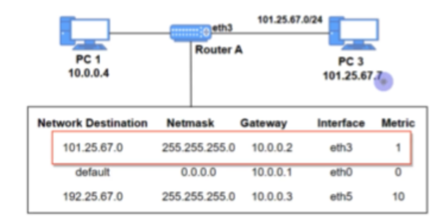
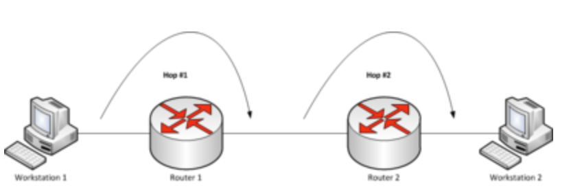

# 라우팅

## 라우팅?
- 네트워크에서 데이터를 보낼 때 최적의 경로를 선택하는 과정.
- 데이터는 보통 출발지에서 목적지로 가는 동안 여러 개의 라우터를 거쳐 여러 번의 라우팅을 수행. 
    (라우팅은 보통 초당 수백만 번 일어남)

## 라우터
- 네트워크 사이에서 데이터를 전달하는 장치
- 보통 둘 이상의 서로 다른 네트워크에 연결
- 데이터를 목적지로 보낼 대 최적의 경로를 결정하고 경로가 결정되면 해당 경로로 데이터를 넘겨주는 일(라우팅) 수행.
- 라우터는 라우팅 테이블을 기반으로 데이터를 다음 목적지에게 전달.

### 라우팅 테이블
- IP 주소를 기반으로 라우터의 위치를 저장한 테이블 or 데이터베이스
- 다양한 네트워크에 대한 정보와 해당 네트워크에 연결하는 방법이 포함되어 있음.

### 라우팅 테이블 구성 요소

- 네트워크 대상(Network Destination)
    - 목적지의 네트워크의 IP 주소
- 서브넷 마스크(Netmask)
    - 대상 주소를 설명할 때 쓰이는 값.
- 게이트웨이(Gateway)
    - 이 장치와 연결 되어 있는 홉, 패킷이 전달되는 다음 IP 주소(외부 네트워크와 연결된 장치)
    - 만약 목적지가 로컬 네트워크라면 '연결됨'라고 표기 되며 다른 네트워크라면 해당 네트워크의 게이트웨이를 가리킴
- 인터페이스(Interface)
    - 게이트웨이로 가기 위해 거치는 장치
- 메트릭(Metric)
    - 우선 순위라고도 불리며, 패킷 전송을 위해 최적의 경로가 선택되도록 참고되는 값.
    - 동일한 라우팅 테이블 요소가 2개 있을 때 이 값이 낮은 요소가 선택됨.
    - 매트릭은 일반적으로 **홉 수(hop count)**가 들어가며 지연시간, 처리량 등이 들어감.
    - 매트릭의 크기가 라우팅 시 최적 경로를 선택할 때 영향을 줌

### 게이트웨이
- 프로토콜 변환기이며 네트워크와 네트워크를 연결하는 장치 
    (로컬 네트워크에서 외부 네트워크로 이어질 떄 그 사이에 위치한다고 생각하면 됨.)

### 홉
- 네트워크에서 출발지와 목적지 사이에 위치한 장치를 의미
- 홉 카운트는 데이터가 출발지와 목적지 사이에서 통과해야 하는 홉의 개수를 의미함
    