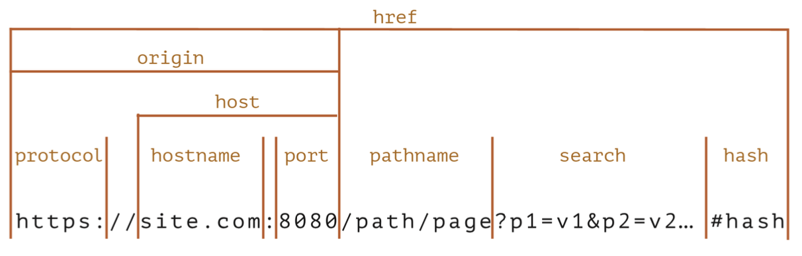

## 오리진과 SOP

### 오리진
- 오리진은 전에 봤던 것처럼 https://site.com:8080까지 (포트)를 의미
    

### SOP(Same-Origin Policy)
- 브라우저 상에서 오로지 같은 오리진끼리만 요청을 허가하는 보안정책
    
- 이유
    - 예를 들어 은행 계좌 서버에 로그인하고 악의적인 사이트를 방문하면 내가 모르는 사이 은행 서버로 요청할 수 있게 되어 내 계정 정보가 변경되거나 유출될 수 있음
    - 즉, 악성스크립트가 다른 오리진의 서버에 요청을 보내고 사용자의 리소스를 임의적으로 접근할 수 있음.
    - 이를 1차적으로 막아주는 게 SOP
- 근데 Open API 같은 경우는 다른 오리진끼리 요청해야 하는 경우도 있고, localhost도 그렇고. 
    => 그래서 다른 오리진 끼리도 요청/응답할수 있게 만든 메커니즘이 CORS

### CORS의 의미
- CORS(cross origin resource sharing)란 HTTP 헤더를 기반으로 브라우저가 다른 오리진에 대한 리소스 로드를 허용할 지 말지에 대한 메커니즘
    - 리소스 : 이미지, CSS, JS, 비디오 등

### preflight request와 simple request

#### 과정
- 만약 요청할 때 다음의 메서드 타입, 헤더에 해당되지 앟는 게 하나라도 포함되어 있다면? 
    => preflight request를 보내게 됨.
- 반대로 다음의 메서드 타입, 헤더를 모두 가진 요청을 간단한 요청(simple request)이자 안전한 요청이라 함

##### preflight request 과정
1. OPTIONS 메서드로 해당 서버에 원래의 요청을 보내기 전 요청을 보냄
2. 요청을 받은 서버는 Access-Control-* 헤더로 응답
3. Access-Control-* 헤더에 요청한 오리진이 존재하지 않는다면 CORS 에러를 보내게 됨.
    - Access-Control-* 헤더
        - Access-Control-Allow-Headers : Content-Type
        - Access-Control-Allow-Origin : https://devpals.com
        - Access-Control-Allow-Methods : GET, DELETE, HEAD, OPTIONS
        - 그 외에 Access-Control-Max-Age 등이 있음