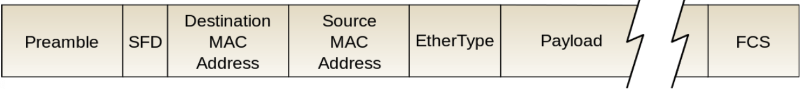

# 이더넷 프레임은 무엇이며 구조가 어떻게 되나?
- 데이터 링크 계층의 데이터 단위이며 이더넷 프레임을 기반으로 데이터가 전달됨.
    
    1. Preamble[7바이트] : 이더넷 프레임이 시작됨을 알려줌
    2. SFD[1바이트] : Start frame delimiter, 다음 필드부터 주소 필드가 시작됨을 알림.
    3. Destination Address[6바이트] : 목적지 주소
    4. Source Address[6바이트] : 시작지 주소
    5. EtherType[2바이트] : 데이터 링크 계층 위의 IP 프로토콜 정의(IPv4, IPv6)
    6. Payload[가변바이트] : 가변길이 필드. 이진데이터로 구성됨.
    7. FCS[4바이트] : frame check sequence이며 수신측의 에러 검출을 위해 삽입하는 필드. CRC 에러 검출 기법에 의해 생성된 비트배열이 여기 담김.
