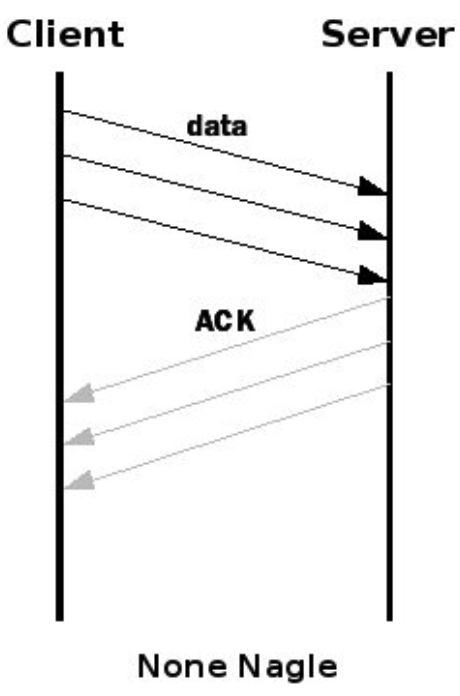
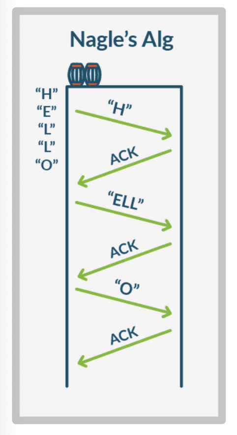

# 네이글 알고리즘
- 네트워크의 효율성을 높이기 위해 네트워크를 통해 전송 되어야 하는 패킷의 수를 줄이고, 적은 양의 데이터를 자주 보내면 발생되는 대역폭 낭비를 막아주는 방법.
- 패킷을 보낼 때 고정 크기의 버퍼에 모아두고 버퍼에 어느 정도 차면 그 때 보내고, 다시 ACKrㅏ 오면 버퍼에 찬 데이터를 보내는 방법
    
    

## 네이글 알고리즘의 장점
1. 네트워크 혼잡 감소
    - 패킷 수가 많으면 장비들의 처리 부담으로 인한 네트워크 혼잡도 증가.
    - 패킷 수를 줄여 네트워크의 전반적인 혼잡 상태 개선 및 패킷 손실률 감소
2. 오버헤드 감소
    - 패킷 전송 때도 헤더가 포함됨. 작은 패킷들이 전송될 때 각 패킷에 담긴 헤더들이 쌓여 유용한 데이터 전송보다 많은 대역폭을 소모할 수 있음
    - 패킷 수를 줄여 이러한 오버헤드 감소를 이끌어, 더 많은 데이터를 같은 양의 대역폭으로 전송 가능

## 네이글 알고리즘의 단점 : 지연 시간 즈악
1. 작은 패킷 수를 줄이기 위해 데이터를 버퍼링, 충분한 양의 데이터가 모일 때까지 패킷 전송을 지연시킴
2. ACK를 받기 전 데이터를 전송하지 않기 때문에 지연시간 발생. 
    따라서 실시간 데이터를 전송하는 애플리케이션에선 적합하지 않음