# TCP/IP 4계층 모델
- 인터넷 프로토콜 스위트(internet protocol suite)는 인터넷에서 컴퓨터들이 서로 정보를 주고 받는 데 쓰이는 프로토콜 집합.
- 이를 TCP/IP 4계층 모델로 설명하거나 OSI 7계층 모델로 설명하기도 함.

## 계층 구조
- TCP/IP 계층은 4 개의 계층을 가짐, OSI 7계층과 많이 비교됨.
    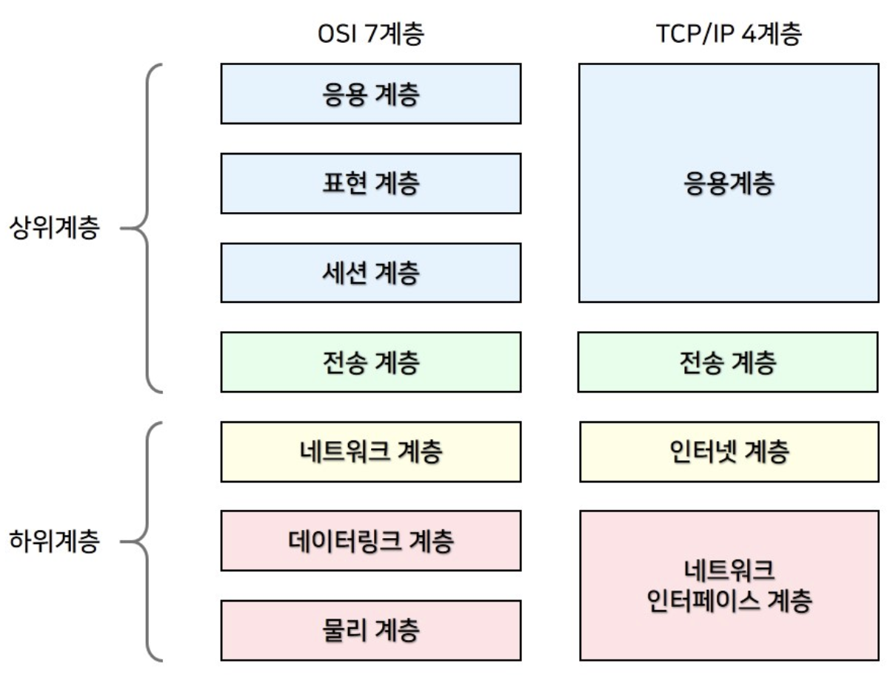
    - 이 계층들은 특정 계층이 변경 되었을 때 다른 계층이 영향 받지 않도록 설계됨. 
        (예. TCP를 UDP로 바꿨다고 해서 인터넷 웹 브라우저를 다시 설치할 필요 X)
    
### 애플리케이션 계층
- FTP, HTTP, SSH, SMTP, DNS 등 응용 프로그램이 사용되는 프로토콜 계층.
- 웹 서비스, 이메일 등 서비스를 사람들에게 제공하는 층.
- 용어 정리
    - FTP
        - 정치와 장치 간 파일을 전송하는 데 사용되는 표준 통신 프로토콜
    - SSH(TLS)
        - 암호화 네트워크 프로토콜
    - HTTP
        - 데이터 통신의 기초이자 웹 사이트르 이용하는 데 쓰는 프로토콜
    - SMTP
        - 전자 메일 전송을 위한 인터넷 표준 통신 프로토콜
    - DNS
        - 도메인 이름과 IP 주소를 매핑해주는 서버.

### 전송 계층
- 송신자와 수신자를 연결하는 통신 서비르르 제공하며 연결 지향 데이터 스트림 지원, 신뢰성, 흐름 제어를 제공할 수 있으며 
    애플리케이션과 인터넷 계층 사이의 데이터가 전달될 때 중계 역할.
- 대표적으로 TCP와 UDP
    - TCP
        - 패킷 사이의 순서를 보장하고 연결 지향 프로토콜을 사용해 연결하여 신뢰성 구축, 수신 여부 확인.
        - "가상회선 패킷 교환 방식" 사용 
    - UDP
        - 순서 보장 X, 수신 여부 확인 X
        - 단순 데이터만 주는 "데이터그램 패킷 교환 방식" 사용
#### 가상회선 패킷 교환 방식
- 각 패킷에는 가상회선 식별자가 포함되며 모든 패킷을 전송하면 가상 회선이 해제되고 패킷들은 전송된 '순서대로' 도착하는 방식.
    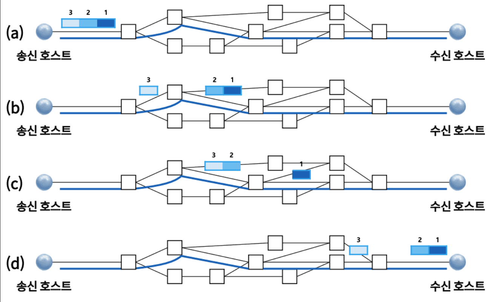
#### 데이터그램 패킷 교환 방식
- 패킷이 독립적으로 이동하며 최적의 경로를 선택해 감.
- 하나의 메시지에서 분할된 여러 패킷은 서로 다른 경로로 전송될 수 있으며 도착한 '순사가 다를 수' 있는 방식.
    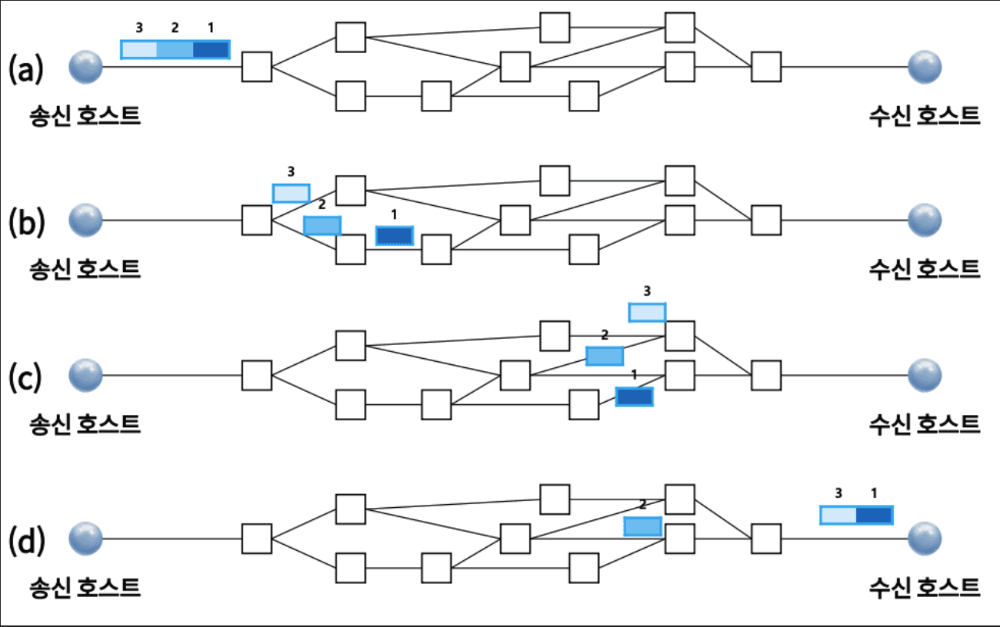
#### TCP 연결 성립 과정
- TCP의 신뢰성 확보는 3-way-handShake 작업을 통해 진행.
    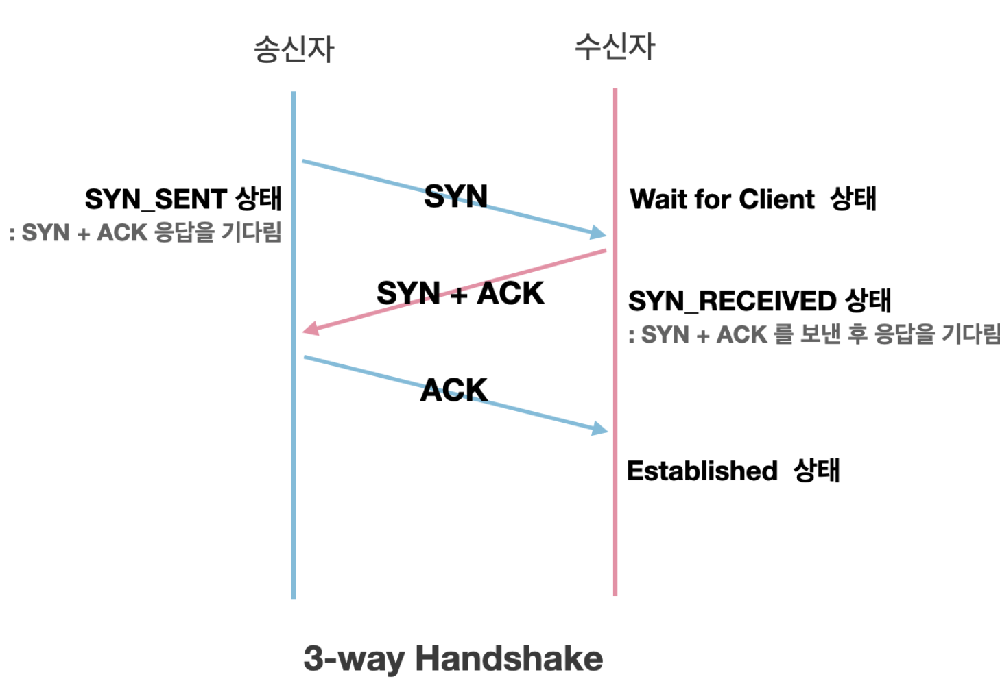
    1. SYN 단계
        - 클라이언트는 서버에 클라이언트의 ISN을 담아 SYN을 전송.
        - ISN은 새로운 TCP 연결의 첫 번째 패킷에 할당된 임의의 시퀀스 번호를 말함.
    2. SYN + ACK 단계
        - 서버는 클라이언트의 SYN을 수신.
        - 서버의 ISN을 보내며 승인번호를 클라이언트의 ISN + 1을 전송
    3. ACK 단계
        - 클라이언트는 서버의 ISN + 1한 값인 승인 번호를 담아 ACK를 서버에 전송
- 해당 과정 이후 신뢰성이 구축되고, 데이터 전송 시작
- 이 과정의 유무로 TCP는 신뢰성, UDP는 비신뢰성.
#### TCP 연결 해제 과정
- 연결을 해제할 때는 4-way-handShake 작업 진행
    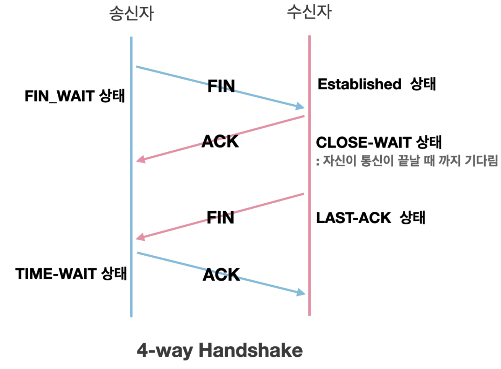
    1. 먼저 클라이언트가 연결을 닫을 때 FIN으로 설정된 세그먼트 전송. 
    클라이언트는 FIN_WAIT_1 상태로 들어가 서버의 응답 대기.
    2. 서버는 클라이언트로 ACK라는 승인 세그먼트 전송.  그리고 CLOSE_WAIT 상태로 들어감. 
    클라이언트가 세그먼트를 받으면 FIN_WAIT_2 상태로 들어감
    3. 서버는 ACK를 보내고 일정 시간 이후 클라이언트에 FIN이라는 세그먼트 전송
    4. 클라이언트는 TIME_WAIT 상태가 되고 다시 서버로 ACK를 보내 서버는 CLOSED 상태가 됨. 
    이후 클라이언트는 어느 정도 시간을 대기한 후 연결이 닫히고 클라이언트/서버의 모든 자원 연결 해제
- 해당 과정에서 TIME_WAIT은 왜 존재할까?
    1. 지연 패킷이 발생한 경우를 대비
        - 패킷이 뒤늦게 도달해 이를 처리하지 못하면 무결성 문제 발생.
    2. 두 장치의 연결이 닫혔는 지 여부를 확인
        - 만약 LAST_ACK 상태에서 닫히게 되면 새로운 연결을 시도할 때 장치는 줄곧 LAST_ACK로 되어 있기 때문에 접속 오류 가능성 내제.

### 인터넷 계층
- 장치로부터 받은 네트워크 패킷을 IP 주소로 지정된 목적지로 전송하기 위해 사용되는 계층
- IP, ARP, ICMP 등 패킷을 수신해야 할 상대의 주소를 지정하여 데이터 전달.
- 상대방이 제대로 받았는 지에 대해 보장하지 않는 비연결형적인 특징을 가짐.

### 링크 계층
- 전선, 광섬유, 무선 등으로 실질적으로 데이터를 전달하며 장치 간 신호를 주고 받는 '규칙'을 정하는 계층. 
    네트워크 접근 계층이라고도 함.
- 이 계층을 물리 계층와 데이터 링크 계층으로 나누기도 함.
    - 물리 계층은 무선 LAN과 유선 LAN을 통해 0과 1로 이루어진 데이터를 보내는 계층
    - 데이터 링크 계층은 '이더넷 프레임'을 통해 에러 확인, 흐름 제어, 접근 제어를 담당하는 계층
#### 이더넷 프레임
- 전달 받은 데이터의 에러를 검출, 캡슐화하며 다음과 같은 구조를 가짐
    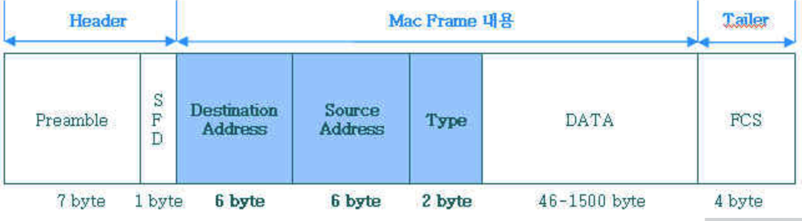
    1. Preamble : 이더넷 프레임의 시작임을 알림.
    2. SFD(Start Frame Delimiter) : 다음 바이트부터 MAC 주소 필드가 시작됨을 알림.
    3. DMAC, SMAC : 수신/송신 MAC 주소를 말함
    4. EtherType : 데이터 계층 위에 계층인 IP 프로토콜을 정의(Ipv4, Ipv6)
    5. Payload : 전달 받은 데이터
    6. CRC : 에러 확인 비트
- MAC 주소
    - 네트워크 연결을 위한 장치(LAN 카드)를 구별하기 위한 식별번호.
    - 6바이트(48비트)로 구분됨.

#### 유선 LAN
- 유선 LAN을 이루는 이더넷은 IEEE802.3이란 프로토콜을 따르며 전이중화 통신 사용
##### 전이중화 통신
- 양쪽 장치 간 동시에 송수신할 수 있는 방식을 말함.
- 이는 송신로와 수신로로 나눠서 데이터를 주고 받으며 현대의 고속 이너뎃은 이 방식을 기반으로 통신.
    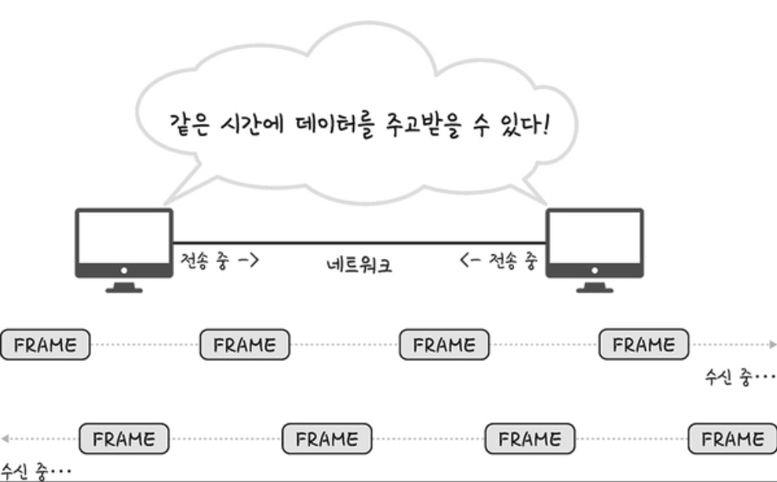
##### CSMA/CD
- 이전에는 유선 LAN에 '반이중화 통신' 중 하나인 CSMA/CD 방식 사용.
- 이 방식은 전송 후 충돌 발생 시 일정 시간 이후 재전송 하는 방식.
- 따라서 수신로/송신로 이렇게 나눈 것이 아닌 동일한 하나의 경로를 기반으로 데이터를 보내기 때문에 충돌을 대비해야 했음.
#### 무선 LAN
- 수신과 송신에 같은 채널을 사용하기 때문에 반이중화 통신 사용
##### 반이중화 통신
- 양쪽 장치는 서로 통신할 수 있지만, 동시에는 통신할 수 없으며 한 번에 한 방향만 통신 가능
    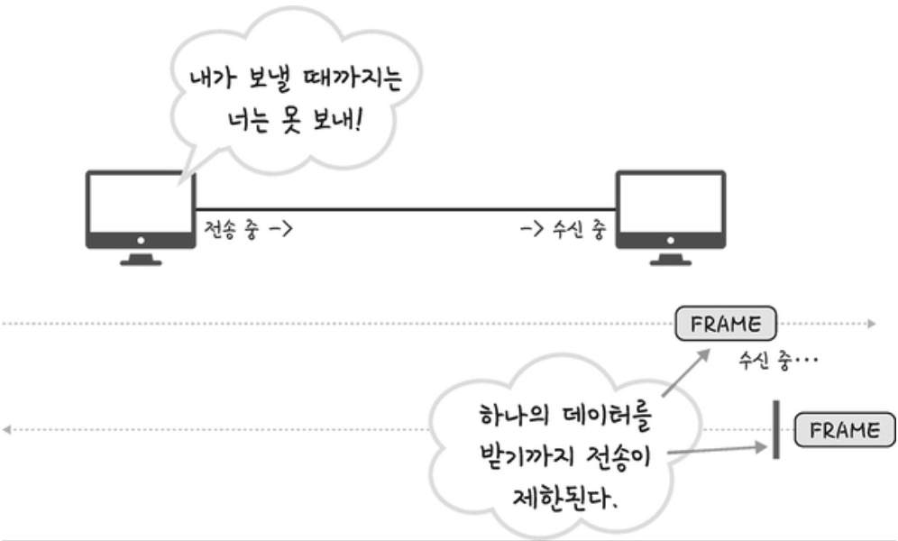
- 일반적으로 한 쪽의 전송이 끝날 떄까지 기다려야함.
- 서로 통신하려 하면 충돌로 인한 메세지 손실/왜곡이 있을 수 있기 때문에 충돌 방지 시스템 필요
##### CSMA/CA
- 반이중화 통신 중 하나로 장치에서 데이터를 보내기 전 일련의 과정을 기반으로 사전에 가능한 한 충돌을 방지하는 방식
- CSMA/CA로 프레임을 보낼 때 과정
    1. 사용 중인 채널이 있다면 다른 채널을 감지하다 유후 사태인 채널 발견
    2. 프레임 간 공간 시간인 IFS(InterFrame Space) 시간 만큼 대기 
        IFS는 프레임의 우선 순위를 정의할 때도 사용됨. 
        IFS가 낮으면 우선 순위가 높음.
    3. 프레임을 보내기 전 랜덤 상수를 기반으로 결정된 시간 만큼 기다린 뒤 프레임을 보냄. 
        프레임을 보낸 뒤 제대로 송신이 되었고 ACK 세그먼트를 받았다면 마침. 
        but 받지 못했다면 과정 반복. 반복하다 반복 횟수 기준을 초과하면 해당 프레임 전송을 버림.

### 계층 간 데이터 송수신 과정
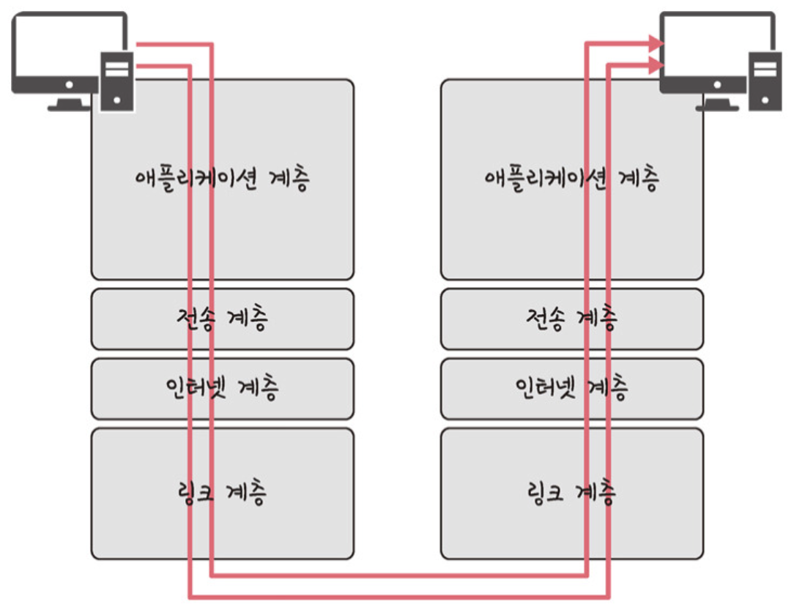
- 애플리케이션 계층에서 전송 계층으로 필자가 보내는 요청(request)값들이 캡슐화 과정을 거쳐 전달
- 다시 링크 계층을 통해 해당 서버와 통신
- 해당 서버의 링크 계층으로부터 애플리케이션까지 비캡슐화 과정을 거쳐 데이터 전송.
#### 캡슐화 과정
- 상위 계층의 헤더와 데이터를 하위 계층의 데이터 부분에 포함시키고 해당 계층의 헤더를 삽입하는 과정
    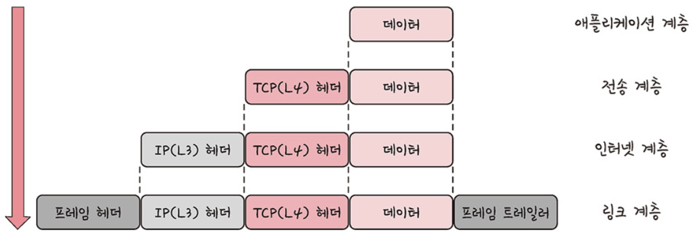
- 데이터의 각 계층별 흐름
    - 애플리케이션 계층 -> 데이터가 전송 계층으로 전송 되면서 '세그먼트' or '데이터그램'화 되며 TCP(L4) 헤더가 붙음.
    - 이후 인터넷 계층으로 가면서 IP(L3) 헤더가 붙여지게 되며 '패킷'화됨.
    - 이후 링크 계층으로 전달되면서 프레임 헤더와 프레임 트레일러가 붙어 '프레임'화가 됨.
#### 비캡슐화 과정
- 하위 계층에서 상위 계층으로 가며 각 계층의 헤더 부분을 제거하는 과정.
    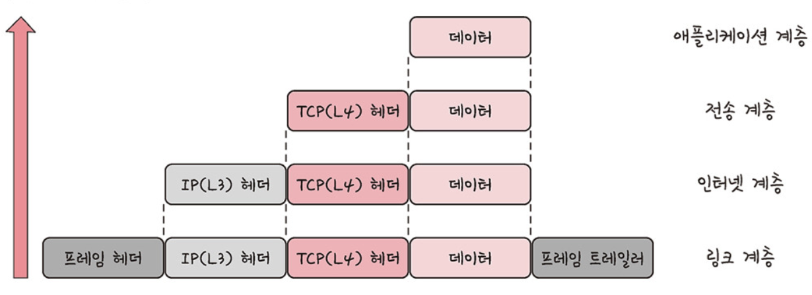
    - 캡슐화의 역순 과정을 거침
    - 최종적으로 사용자에게 애플리케이션의 PDU인 메세지로 전달됨.
## PDU
- 네트워크의 어떠한 계층에서 계층으로 데이터가 전달될 때 한 덩어리의 단위를 PDU라 함.
- 제어 관련 정보들이 포함된 '헤더', 데이터를 의미하는 '페이로드'로 구성되어 있음.
- 계층 마다 부르는 명칭이 다름
    - 애플리케이션 계층 : 메시지
    - 전송 계층 : 세그먼트(TCP), 데이터그램(UDP)
    - 인터넷 계층 : 패킷
    - 링크 계층 : 프레임(데이터 링크 계층), 비트(물리 계층)

## 면접 예상 질문 및 직무 연관성 고려
1. 프론트엔드 개발자가 TCP/IP 프로토콜 스택에 대해 이해 해야 하는 이유
    - 프론트엔드 개발자는 브라우저에서 서버와 HTTP 기반 통신을 수행하므로, 네트워크의 기본 동작 원리를 이해하면 문제 해결 및 성능 최적화에 도움이 될 거 같음.  
    ex ) 요청 지연, 패킷 손실, 연결 설정 과정을 이해하면 디버깅이나 UX에 큰 도움이 됨.
2. 

## 배운점/느낀점
- 왜 axios, socket 같은 통신 메서드에선 송/수신되는 데이터를 payload라 하는 지 이해하는 계기가 됐음.