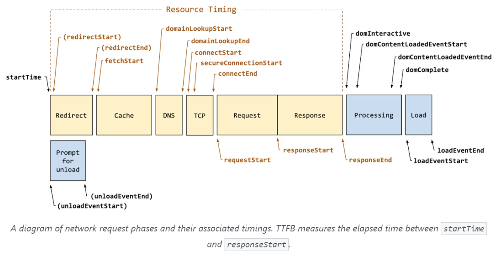

# www.naver.com을 쳤을 때 생기는 과정, 그리고 DNS까지 설명

- 리다이렉트, 캐싱, DNS, Ip 라우팅 & ARP, TCP 연결 구축을 거쳐 요청, 응답이 일어나는 TTFB가 시작되고 이 후 컨텐츠를 다운 받게 되고 이 후 브라우저 렌더링 과정을 거쳐 네이버라는 화면이 나타남
    

## 리다이렉트
- 리다이렉트가 있다면 진행하고, 없다면 해당 요청에 대한 과정 진행

## 캐싱
- 해당 요청이 캐싱 가능한 지 확인.
- 캐싱된 요청이라면 캐싱된 값을 반환, 아니라면 다음 단계로 넘어감
- 브라우저 캐시와 공유 캐시로 나뉨

### 브라우저 캐시
- 쿠키, 로컬스토리지 등을 포함한 캐시
- 브라우저 자체가 사용자가 HTTP를 통해 다운로드하는 모든 문서를 보유하는 것을 말함

### 공유 캐시
- 클라이언트와 서버 사이에 있으며 사용자 간 공유할 수 있는 응답을 저장할 수 있음. 
    예 ) 서버 앞단에 프록시 서버가 하는 캐싱, Cloudfront와 같은 CDN을 통한 캐싱

### DNS
- 브라우저가 요청한 FQDN(Fully Qualified Domain Name)인 www.naver.com 등의 이름을 DNS를 통해 실제 IP 주소 반환. 
    여기서 FQDN은 호스트와 도메인이 합쳐진 완전한 도메인명
- DNS는 계층적인 도메인 구조와 분산된 데이터베이스를 이용한 시스템으로 FQDN을 인터넷 프로토콜인 IP로 바꿔주는 시스템
- DNS 관련 요청을 네임서버로 전달하고 해당 응답값을 클라이언트에게 전달하는 리졸버, 도메인을 IP로 변환하는 네임서버 등으로 이루어짐

### IP 라우팅
- IP를 기반으로 IP 라우팅이 일어나 ARP 과정을 거쳐 실제 서버를 찾음

### TCP 연결 구축
- 3-way handShaking, TSL 보안 인증을 통해 연결 설정.
- 이후 요청을 보낸 후 해당 요청한 서버로부터 응답 받음

### 컨텐츠 다운로드
- 브라우저는 사용자가 요청한 컨텐츠를 서버로부터 다운 받음

### 브라우저 렌더링
- 받은 데이터를 바탕으로 브라우저 엔진이 브라우저 렌더링 과정을 거쳐 화면을 만듬