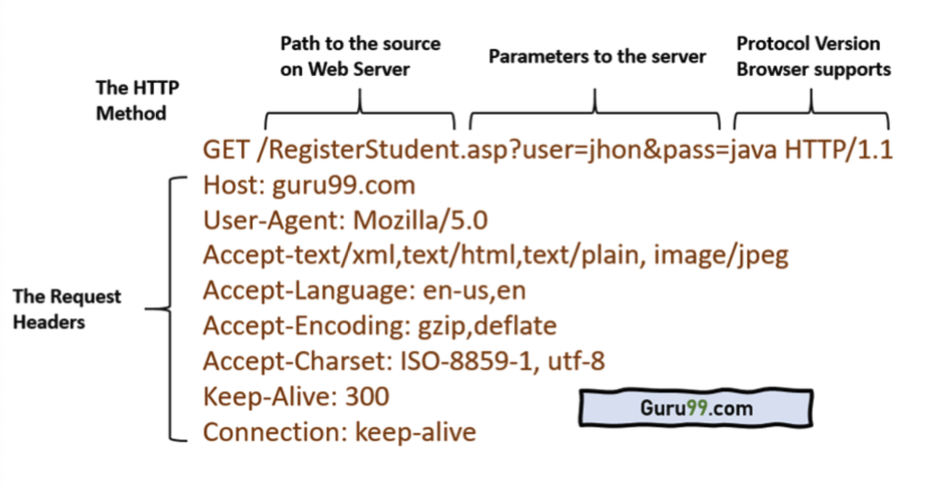

# GET, POST, PUT, PATCH

## GET

- URL을 기반으로 데이터를 요구하는 방법
- URL을 기반으로 하기 때문에 길이 제한(2000자 미만)
- 성공 시 HTTP 상태 코드 200 반환
- 캐싱 가능
- 해당 요청의 파라미터가 브라우저에 기록됨
- 요청 시 ASCII 문자열만을 보낼 수 있음
- 사용자 이름, 비밀번호 등 민감한 정보를 전달할 때 사용 X

## POST
- URL이 아닌 HTTP message body를 통해 데이터 전달
- HTTP message body를 통해 전달되기 때문에 길이 제한 X
- 캐싱 불가능
- 해당 요청의 파라미터가 브라우저 기록에 남지 않음
- HTTP message body로 요청하기 때문에 ASCII 문자열 뿐 아니라 모든 유형의 데이터 기반으로 요청 가능
- 사용자 이름, 비밀번호 등 민감한 정보를 전달할 때 사용

## PUT 
- 요청 시 해당 데이터 전체를 보내야 하고 전체 데이터의 교체를 의미
- 만약 해당 데이터가 없으시 생성, 있을 시 요청된 데이터와 교체

## PATCH
- 요청 시 보낼 떄 수정하는 일부분만 보내면 되고 일부분의 교체를 의미

