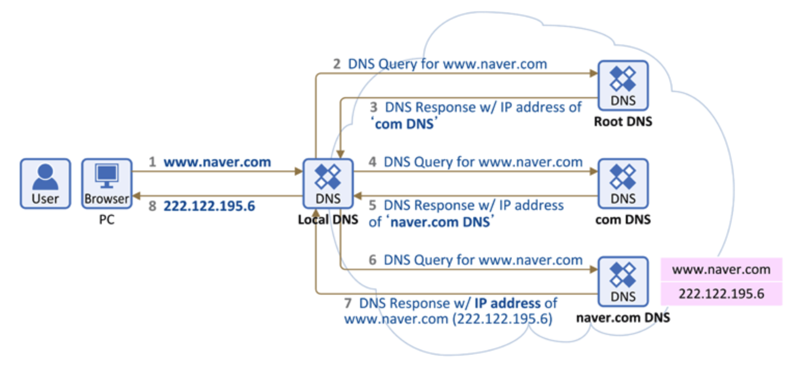
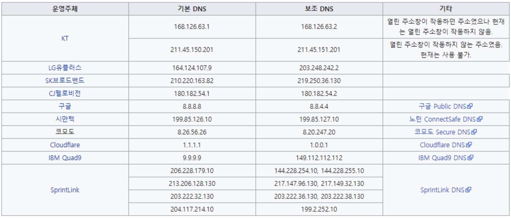
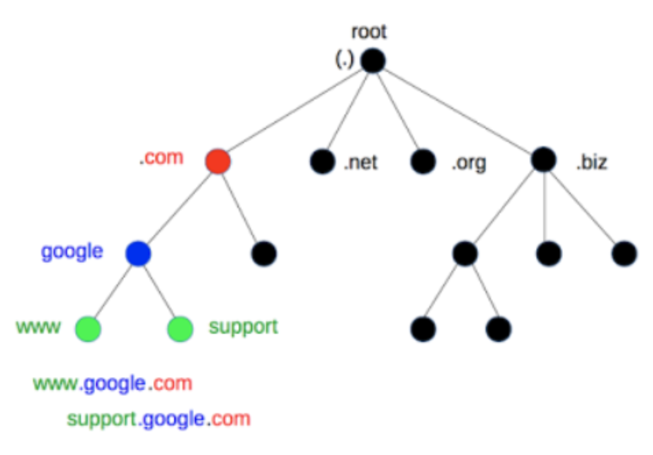
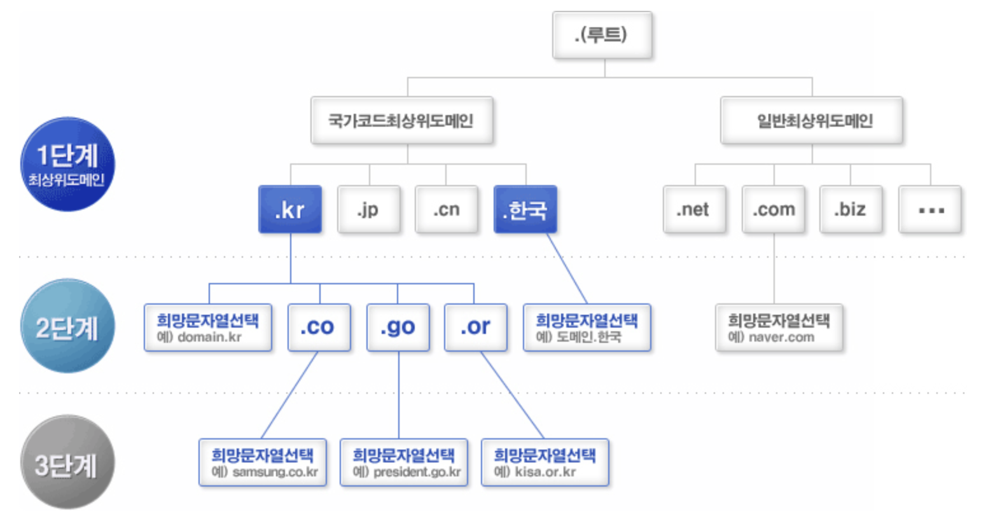
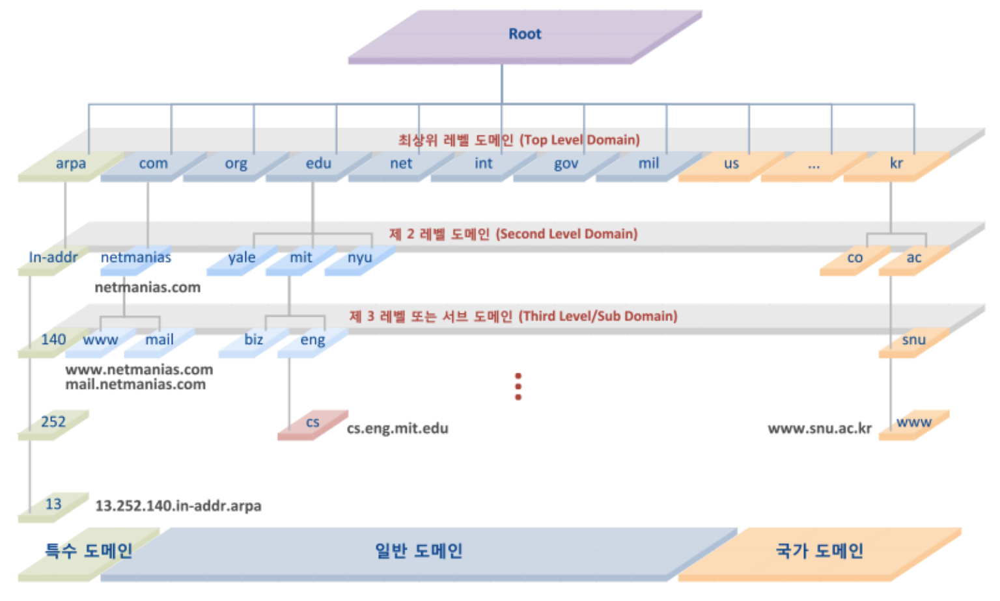
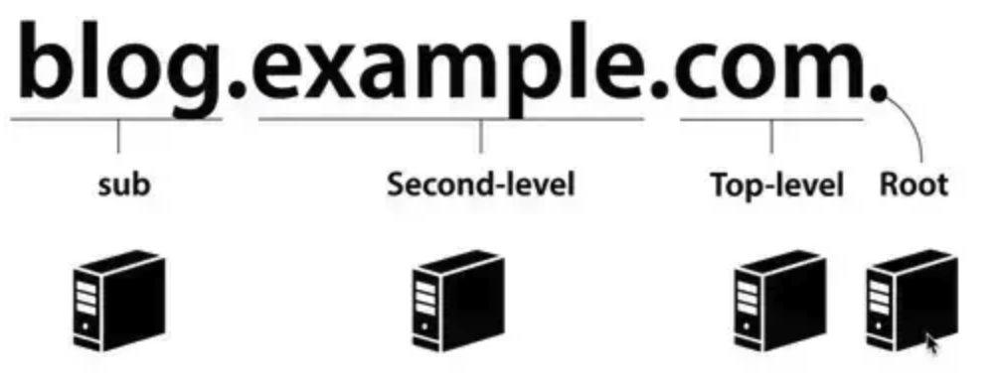

# DNS
- 지피티가 동작 원리를 물어봤는데 답을 못해 공부

## DNS란?
- 도메인 네임 시스템(Domain Name System, DNS)은 호스트의 도메인 이름을 호스트 네트워크 주소로 바꾸거나 그 반대의 변환을 수행할 수 있도록 하기 위해 개발.
- 즉, IP의 가명 혹은 별명인 셈(개발에서 **변수**의 느낌?)

## 동작 원리
- 아래의 일련의 과정을 통해 답을 찾는 과정을 **재귀적 쿼리**라고 함.

1. 웹 브라우저에서 도메인 입력 시 먼저 PC에 저장된 Local DNS(기지국 DNS 서버)에게 도메인에 대한 IP 주소 요청
    - Local DNS(기지국 DNS 서버)란?
        - 기본적으로 인터넷을 사용하려면 IP를 할당해주는 통신사(KT, SKT, LG 등)에 등록
        - LAN선을 통해 연결되면, 가입했던 각 통신사의 기지국 DNS 서버가 등록됨.
        - KT 쓰면 KT DNS, SKT 쓰면 SKT DNS가 자동 셋팅
    - 만약 예전에 해당 도메인으로 접속했었다면?
        - Local DNS에 접속 정보가 캐싱 되어, 바로 IP 주소를 바로 받고 끝남(1번에서 바로 8번으로 수행)
    - 없으면 2번  수행
2. Local DNS는 해당 도메인의 IP 주소를 찾기 위해 다른 DNS 서버들과 통신(DNS 쿼리) 시작. 
가장 먼저 **Root DNS 서버에 IP** 주소 요청
    - Root DNS(루트 네임 서버)란?
        - 인터넷의 도메인 네임 시스템의 루트 존
        - ICANN이 직접 관리하는 절대 존엄 서버
        - TLD DNS 서버 IP들을 저장해두고 안내하는 역할
        - 전 세계 961개의 루트 DNS가 운영되고 있음.
3. Root DNS 서버에서 해당 도메인에 대한 IP주소를 못찾으면 다른 DNS 서버에게 요청하라 응답.
4. 그럼 Local DNS 서버는 com 도메인을 관리하는 **TLD DNS 서버(최상위 도메인 서버)**에 IP 주소 요청.
    - TLD(Top-Level Domain, 최상위 도메인) DNS Server 란?
        - TLD는 도메인 등록 기관이 관리하는 서버.
        - 도메인 네이밍의 가장 마지막 부분(.com, .org 등)
        - Authoritative DNS 서버 주소를 저장해두고 안내하는 역할
5. com 도메인을 관리하는 DNS 서버에도 해당 도메인에 대한 IP주소를 못찾으면 다른 DNS 서버에게 요청하라 응답.
6. 그럼 Local DNS 서버는 **Authoritative DNS 서버**에게 IP 주소 요청
    - Authoritative DNS Server란?
        - 실제 개인 도메인과 IP 주소의 관계가 기록/저장/변경되는 서버.
        - 일반적으로 도메인/호스팅 업체의 '네임서버'를 말함.
        - 개인이나 회사 DNS 서버 구축을 한 경우에도 여기에 해당됨.
7. Authoritative DNS 서버에는 해당 도메인에 대한 IP주소가 있음.  따라서 Local DNS 서버에게 해당 IP 주소 응답.
8. Local DNS는 해당 IP 주소를 캐싱하고 다른 요청이 있을 시 응답할 수 있도록 IP 주소 정보를 단말(PC)에 전달.

## DNS 서버 종류
### 기지국 DNS 서버
- 각 통신사 마다 가지는 DNS 서버
    

### Root DNS 서버
- 이 DNS를 시작으로 아래 딸린 node DNS 서버에게로 차례차례 물어보게 되는 구조로 짜여짐.
    
- 따라서 모든 서버는 Root DNS의 주소를 알고 있음.
- 근데 자기 목록에 모르는 도메인이 있다면, 다음 DNS 서버로 리턴함 => TLD(최상위 도메인) 서버
- 즉, google.com 이렇게 왔다면?
    - google.com 이건 못본 도메인인데... 
    - .com이 있으니 TLD한테 물어봐봐 하는 거임

### TLD 서버
- TLD는 국가명을 나타내는 **국가최상위도메인**과 일반적으로 사용되는 **일반최상위도메인**으로 나뉨.
- 도메인 구입 시 1단계의 도메인 중 하나를 선택 후 원하는 도메인명을 지정하여 등록.
    
    - .biz : 사업
    - .com : 영리 목적의 기업 혹은 단체
    - .co. : 국가로 쓰임(co.kr 등) => 국가 사업 및 공기업?
    - .edu : 미국의 4년제 이상 교육기관
    - .info : 정보 관련
    - .jobs : 취업 관련 사이트
    - .name : 개인 사용자
    - .net : 네트워크를 관리하는 기관
    - .org : 비영리 기관

### Second-level DNS 서버 (2차 도메인)
- TLD 서버에선 Second-level DNS 서버를 return
- 만약 naver.com이나 google.com을 요청했다면?
    - TLD 서버는 .com을 파악 후 앞에 달린 문자열을 보고 네이버나 구글 서버에게 요청
- 요청 받은 Second DNS 서버는 자체적으로 sub 도메인 서버로 또 넘기게 됨.

### Sub DNS 서버(최하위 서버)
- www. dev. blog. mail. 등등을 구분하는 최하위 서버
- ex ) mail.google.com / blog.naver.com 등

### 전체 DNS 서버 구조

## DNS 문자열 구조

1. 즉, Root 서버는 TLD를 담당하는 서버 목록 IP를 알고 있음
2. TLD 서버는 Second-level domain을 담당하는 서버 목록과 IP를 알고 있음
3. Second-level domain 서버는 Sub domain을 담당하는 서버 목록과 IP를 알고 있음
4. 최종적으로 전체 도메인의 IP 주소는 Sub domain을 전담하는 DNS 서버가 알고 있음.
    - Host가 Root에 IP를 물어봄
    - com으로 끝나니까, com을 전담하는 DNS server를 알려줌
    - example.com을 전담하는 DNS server를 알려줌
    - Sub domain DNS server를 알려줌
    - 해당 Domain에 대한 IP 주소를 Host에게 보냄 
    - IP 주소 get!

## DNS Cache
- 자, 그럼 이렇게 로컬로 받은 IP 주소를 효율적으로 하기 위해 PC에 있는 DNS Cache를 활용해 Cache 안에 자주 쓰는 Domain Name 주소를 저장 해놓음.
- ipconfig /displaydns를 window에서 실행하면 캐시된 도메인 주소들이 나옴.
- 캐시이기 때문에 당연히 유효기간이 있고, 이를 TTL(Time To Live)이라는 옵션값으로 유효시간을 알려줌. (해당 값은 3600초를 시작으로 매초마다 감소)

## 궁금한 점
- Authoritative DNS 서버와 Second-level 서비스는?
    - 같은 것. 명명하는 게 다른 것 뿐.
    - Authoritative DNS 서버엔 자체적으로 google, naver에 대한 실제 서비스 IP 주소가 매핑되어 있음.   이를 **레코드**라고 함.
    - 따라서 Authoritative DNS 서버에서 별도에 요청 없이 바로 IP 주소를 Local DNS 서버로 응답해줌.
- mail. 과 같은 서브 주소가 있다면(두 가지로 나뉨)
    - Authoritative DNS 서버가 직접 관리하는 경우
        - google.com에서 관리하는 모든 하위 도메인의 레코드를 직접 관리.
        - 이 경우엔 레코드에 서브 DNS 서버 없이 mail.google.com의 IP 주소도 가지고 있음
    - 위임된 경우
        - 큰 조직의 경우 별도 관리를 위해 mail.google.com 서브 도메인을 독립된 네임 서버로 위임.
        - 따라서 mail.google.com에 대한 네임 서버 정보를 위임하여, 위임 받은 Sub DNS 서버에서 관리
        - Sub DNS 서버는 여전히 구글 전체 DNS 관리 쳬계의 일부이지만, mail 서비스에 특화된 별도의 서버로 운영됨.

## 참고
https://inpa.tistory.com/entry/WEB-%F0%9F%8C%90-DNS-%EA%B0%9C%EB%85%90-%EB%8F%99%EC%9E%91-%EC%99%84%EB%B2%BD-%EC%9D%B4%ED%95%B4-%E2%98%85-%EC%95%8C%EA%B8%B0-%EC%89%BD%EA%B2%8C-%EC%A0%95%EB%A6%AC#dns_%EB%8F%99%EC%9E%91_%EC%88%9C%EC%84%9C
https://somaz.tistory.com/172
https://velog.io/@goban/DNS%EC%99%80-%EC%9E%91%EB%8F%99%EC%9B%90%EB%A6%AC