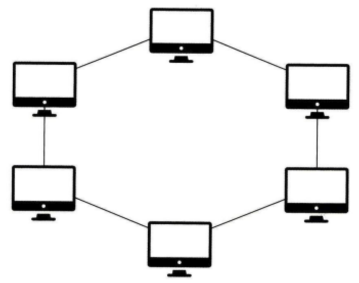

# 네트워크 기초

## 네트워크 
- 노드(node)와 링크(link)가 서로 연결되어 있거나 연결 되어 있으며 리소스를 공유하는 집합

### 노드
- 서버, 라우터, 스위치 등 네트워크 장치를 의미

### 링크
- 유선 or 무선을 의미하며, 노드와 노드 사이의 연결성을 의미

## 처리량과 지연 시간
- 좋은 네트워크
    1. 많은 처리량
    2. 짧은 지연 시간
    3. 적은 장배 빈도
    4. 좋은 보안

### 처리량
- 링크 내에서 성공적으로 전달된 데이터의 양. 
보통 얼만큼의 트래픽을 처리했는 지를 나타냄. 
(많은 트래픽 처리량 === 많은 처리량을 가짐)
- 단위는 bps(bits per second)
- 처리량은 사용자들이 많이 접속할 때마다 커지는 트래픽, 네트워크 장치 간의 대역폭, 네트워크 중간에 발생하는 에러, 장치의 하드웨어 스펙에 영향을 받음.

### 트래픽
- 특정 시점에 링크 내에 '흐르는' 데이터의 양
- ex ) 서버에 저장된 파일(문서, 이미지, 영상 등)을 클라이언트가 다운 받을 때 발생되는 데이터의 누적량을 의미

### 트래픽과 처리량의 차이점
- 트래픽이 많아졌다. === 흐르는 데이터가 많아졌다.
- 처리량이 많아졌다. === 처리되는 트래픽이 많아졌다.

### 대역폭
- 주어진 시간 동안 네트워크 연결을 통해 흐를 수 있는 최대 비트 수

### 지연 시간
- 요청이 처리되는 시간을 말하며, 어떤 메세지가 두 장치 사이를 왕복하는 데 걸린 시간을 말함.
- 지연 시간은 매체 타입(유무선), 패킷 크기, 라우터의 패킷 처리 시간에 영향을 받음.

## 네트워크 토폴로지와 병목 현상

### 네트워크 토폴로지
- 노드와 링크의 배치/연결 형태.

#### 트리 토폴로지 
- 계층형 토폴로지라고도 함.
- 트리 형태로 배치한 네트워크 구성을 말함
    
- 장점
    - 노드의 추가, 삭제가 쉬음.
- 단점
    - 특정 노드에 트래픽이 집중될 때 하위 노드에 영향을 끼칠 수 있음.

#### 버스 토폴로지
- 중앙 통신 회선 하나에 여러 개의 노드가 연결되어 공유하는 네트워크 구성.
- 주로 근거리 통신망에 많이 사용함.
    
- 장점
    - 적은 설치 비용
    - 우수한 신뢰성
    - 중앙 통신 회선에 노드의 추가/삭제가 쉬움
- 단점
    - 스누핑 가능성 내제
    - 스누핑은 LAN상에서 송신부의 패킷을 송신과 관련 없는 다른 호스트에 가지 않도록 하는 스위칭 기능을 마비시키거나 속여서 특정 노드에 해당 패킷이 오도록 처리하는 것을 말함.
        

#### 스타 토폴로지
- 중앙에 있는 노드에 모두 연결된 네트워크 구성
    
- 장점
    - 쉬운 노드 추가 및 에러 탐지
    - 적은 패킷 충돌 가능성
    - 어떤 노드에 발생한 장애도 쉽게 발견 가능
    - 장애 노드가 중앙 노드가 아닌 경우, 다른 노드에 끼치는 영향이 적음.
- 단점
    - 중앙 노드에 문제가 발생하면 전체 네트워크를 사용 불가능
    - 설치 비용이 높음.

#### 링형 토폴로지
- 각각의 노드가 양 옆에 두 노드와 연결하여 전체적으로 고리처럼 하나의 연속된 길을 통해 통신 하는 네트워크 구성
    
- 데이터는 노드에서 노드로 이동, 각각의 노드는 고리 모양의 길을 통해 패킷을 처리
- 장점
    - 노드 수가 증가 되어도 네트워크 상의 손실이 거의 없음.
    - 충돌 발생 가능성 낮음.
    - 노드의 고장 발견이 쉬움
- 단점
    - 네트워크 구성 변경이 어려움
    - 회선에 장애가 발생하면 전체 네트워크에 영향을 크게 끼침

#### 메시 토폴로지
- 망형 토폴로지라고도 함
- 그물망처럼 연결되어 있는 네트워크 구성
    
- 장점
    - 한 단말 장치에 장애가 발생해도 여러 개의 경로가 존재하므로 네트워크를 계속 사용 가능
    - 트래픽도 분산 처리 가능
- 단점
    - 어려운 노드 추가
    - 구축 비용과 운용 비용이 고가

### 병목 현상
- 네트워크 구조에서 토폴로지가 중요한 이유는 이 병목 현상을 찾을 때 중요한 기준이 되기 때문.
- 전체 시스템의 성능이나 용량이 하나의 구성 요소로 인해 제한 받는 현상
- [회선 추가 전]
    
    - 위와 같은 예시로 병목 현상이 발생했을 경우
        - 네트워크가 어떤 토폴로지인 지 안다면 필요한 회선을 추가하기 편함.
- [회선 추가 후]
    

## 네트워크 분류
- 규모를 통해 분류
- 사무실과 개인 규모 **LAN**(Local Area Network)
- 서울시 등 규모 **MAN**(Metropolitan Area Network)
- 세계 규모 **WAN**(World Area Network)

### LAN
- 근거리 통신망
- 캠퍼스와 같은 좁은 의미
- 특징
    - 빠른 전송 속도
    - 혼잡하지 않음

### MAN
- 대도시 지역 네트워크
- 도시 같은 넓은 지역에서 사용
- 특징
    - 평균 수준의 전송 속도
    - LAN보다는 많이 혼잡

### WAN
- 광역 네트워크를 의미
- 국가 or 대륙 단위에 넓은 지역에서 운영
- 특징
    - 낮은 전송 속도
    - MAN 더 혼잡

## 네트워크 성능 분석 명령어
- 애플리케이션 코드 상엔 문제가 없지만, 사용자가 서비스에서 데이터를 가져오지 못한다 => 병목 현상 가능성
- 주된 원인
    - 네트워크 대역폭
    - 네트워크 토폴로지
    - 서버 CPU, 메모리 사용량
    - 비효율적인 네트워크 구성
- 이 땐 네트워크 테스트를 통해 **원인**을 찾고, 성능 분석을 해봐야 함.

### ping
- 네트워크 상태를 확인하려는 대상 노드를 향해 일정 크기의 패킷을 전송하는 명령어.
- 알 수 있는 정보
    - 해당 노드의 패킷 수신 상태
    - 도달하기까지의 시간
    - 해당 노드와의 네트워크 연결성 확인
- TCP/IP 프로토콜 중 ICMP 프로토콜을 통해 동작 
=> ICMP를 지원하지 않는다면 실행 X
- 주된 사용 목적
    - 대상 노드의 네트워크 상태 확인

### netstat
- 접속되어 있는 서비스들의 네트워크 상태를 표시
- 알 수 있는 정보
    - 네트워크 접속
    - 라우팅 테이블
    - 네트워크 프로토콜 리스트
- 주된 사용 목적
    - 주로 서비스 포트가 열려 있는 지 여부를 확인할 때 사용

### nslookup
- DNS에 관련된 내용을 확인하기 위해 사용하는 명령어
- 주된 사용 목적
    - 특정 도메인에 매핑된 IP를 확인하기 위해 사용

### tracert
- 윈도우에선 tracert, 리눅스에선 traceroute
- 목적지 노드까지 네트워크 경로를 확인할 때 사용하는 명렁어
- 주된 사용 목적
    - 목적지 노드까지 구간들 중 어느 구간에서 응답 시간이 느려지는 지 등을 확인할 때 사용

### 그 밖에 일부 명령어
- ftp
    - 대형 파일을 전송하여 테스팅
- tcpdump
    - 노드로 오고 가는 패킷을 캡쳐
- 네트워크 분석 프로그램
    - wireshark, netmon 등

## 네트워크 프로토콜 표준화
- 다른 장치들끼리 데이터를 주고 받기 위해 설정된 공통된 인터페이스
- IEEE or IETF라는 표준화 단체가 정함.
- IEEE802.3은 유선 LAN 프로토콜, 유선으로 LAN을 구축할 때 쓰이는 프로토콜
- ex ) HTTP => 이 프로토콜을 통해 노드들은 웹 서비스를 기반으로 데이터를 주고 받음

## 면접 예상 질문 및 직무 연관성 고려
1. HTTP와 HTTPS의 차이점
    - HTTP에 TLS 프로토콜을 추가하여 보안을 강화 했다는 차이
2. '트래픽'과 '처리량'의 차이
    - 트래픽은 노드 사이에 연결된 특정 지점에서의 데이터 흐름의 세기
    - 처리량은 트래픽을 통해 성공적으로 처리된 양
3. 네트워크 지연 시간과 대역폭이 웹 애플리케이션에 미치는 영향
    - 로딩 시간이 길어지거나, 가끔 렉같은 형상으로 서비스가 멈추는 경우
    - 해결법(하드웨어 자원이 한정적일 경우)
        - 페이지 로드 최적화를 위한 텍스트 압축, 이미지 압축 등 => UX 향상
        - 무한 스크롤과 같은 서버로부터의 데이터를 효율적으로 가져오는 형태
        - React Query를 통해 캐시 활용 등
        - CDN 활용
        - 서버 사이드 최적화
4. DNS의 동작 원리
    - 생각해본 적 없어 DNS.md로 따로 공부
5. 데이터 전송 시 병목 현상이 발생할 수 있는 이유와 이를 해결하기 위한 방법
    - 트래픽에 비해 대역폭이 작은 경우, 비효율적으로 데이터가 중복하여 응답받는 경우
    - 해결법
        - 이미지, 텍스트 압축
        - 캐시를 활용한 비효율적인 데이터 응답 줄이기
6. CORS란?
    - 브라우저의 동일 출처 정책(Same-Origin Policy)으로 인해 발생하는 제약을 완화하기 위한 메커니즘
    - 서버가 특정 출처의 요청에 대해 접근을 허용하면, 클라이언트는 다른 출처의 리소스를 안전하게 요청
7. 네트워크 장애 발생 시 원인 분석과 문제 해결 과정
    - 원인 분석
        - 원인 분석 도구 활용
        - 개발자 도구에서 네트워크 탭 활용
    - 문제 해결
        - 로딩 스피너 혹은 예외 상황 처리

#### HTTP/2가 병목 현상을 해결하는 방법 중 하나인 이유
- 멀티플렉싱
    - 하나의 연결에서 여러 요청/응답을 동시에 처리 가능
- 헤더 압축
    - HTTP 헤더 정보를 압축. 불필요한 데이터 전송 축소
- 서버푸시
    - 클라이언트의 요청 없이도 서버가 미리 필요한 리소스를 전송 가능