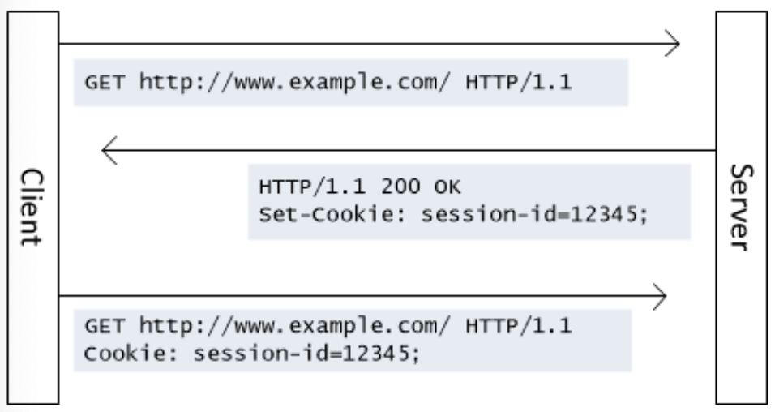
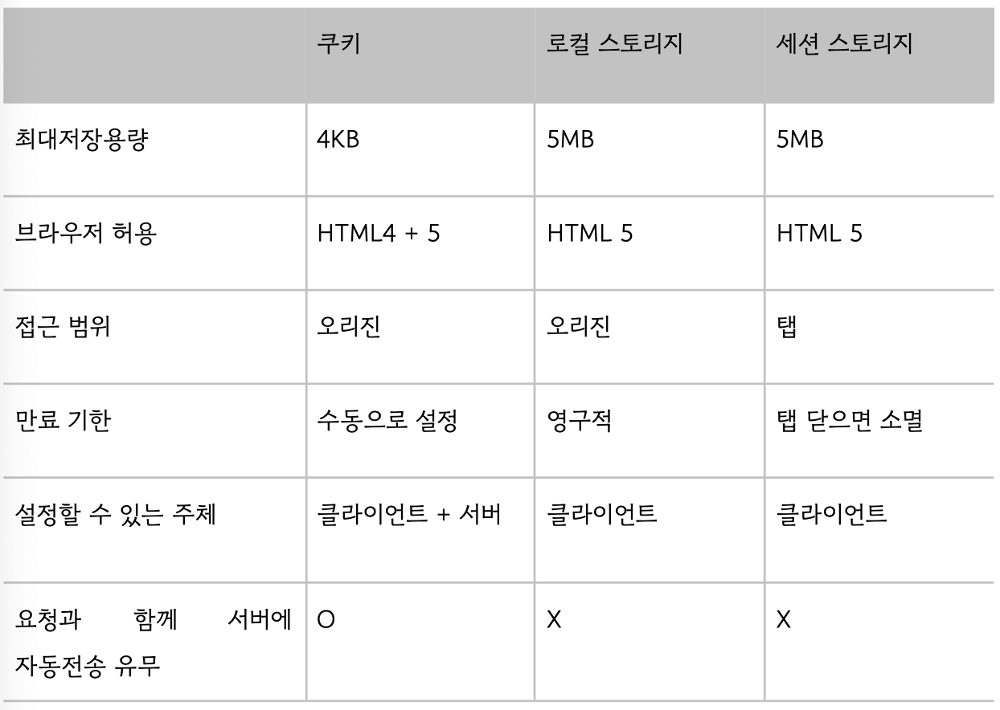

# 쿠키
- 브라우저에 저장된 데이터 조각
- 클라이언트에서, 서버에서 먼저 설정할 수도 있음.<br>
    보통은 서버에서 먼저 설정해서 쿠키를 만드는 게 일반적.
- 서버에서 응답헤더로 Set-Cookie로 설정해서 쿠키를 보내면 그 때 부터 클라이언트에서 요청 헤더 Cookie에 설정되어 자동으로 서버에 전달되게 되고 브라우저에도 저장됨.
    
- 쿠키는 클라이언트와 서버 둘 다 조작 가능. <br>
    but. 보통 서버에서 만료기한 등을 설정 및 컨트롤. 저장용량은 4KB
- 사용사례
    - 로그인, 장바구니, 사용자 커스터마이징, 사용자 행동분석

## 클라이언트에서 설정되는 쿠키
- 클라이언트에서 자바스크립트 - document.cookie를 통해 쿠키를 설정할 수 있고 보낼 때도 이런식으로 header - Cookie에 값을 정해서 보낼 수 있음.<br>
 하지만 이를 권장하진 않음.
    ```js
    axios.get(url, {
    headers: {
    Cookie: "cookie1=value; cookie2=value;
    cookie3=value;"
    }
    }).then
    ```

## 세션 쿠키
- Expires 또는 Max-Age 속성을 지정하지 않는 것을 말함.
- 브라우저가 종료되면 쿠키도 사라짐.

## 영구 쿠키
- Expires 또는 Max-Age 속성을 지정해 특정날짜 또는 일정 기간이 지나면 삭제되게 만든 쿠키, 브라우저를 닫을 때 만료 X

## 문법
```js
Set-Cookie: <cookie-name>=<cookie-value>;
Set-Cookie: <cookie-name>=<cookie-value>; Expires=<date>
Set-Cookie: <cookie-name>=<cookie-value>; Max-Age=<non-zero-digit>
Set-Cookie: <cookie-name>=<cookie-value>; Domain=<domain-value>
Set-Cookie: <cookie-name>=<cookie-value>; Path=<path-value>
Set-Cookie: <cookie-name>=<cookie-value>; Secure
Set-Cookie: <cookie-name>=<cookie-value>; HttpOnly
Set-Cookie: <cookie-name>=<cookie-value>; SameSite=Strict
```
### secure
- 이 옵션으로 https로만 쿠키를 주고받을 수 있음

### httponly
- 공격자가 쿠키를 자바스크립트로 빼낼 수 없게 만듬

### samesite
- 요청이 동일한 도메인에서 시작된 경우에만 쿠키가 애플리케이션으로 전송되도록 허용

### 쿠키의 시큐어 코딩
1. cookie에 세션 ID를 담을 때 이 세션ID 기반으로 클라이언트의 개인정보를 유출할 수 없게 해야 함.
2. 자바스크립트로는 파악할 수 없게 http only 옵션을 걸고 https로만 쿠키를 주고받을 수 있게 secure 옵션을 걸어야 함.
3. 일정시간의 세션 타임아웃을 걸어야 함.

## 쿠키허용 관련 알림창
- 서비스 운용 시 쿠키를 사용한다면 쿠키 허용 관련 알림창을 만들어야 함.
- 방문기록을 추적할 때 쿠키가 사용되기 때문.<br>
    이는 사용자의 데이터 간접수집에 해당하여 KISA 지침을 준수해야 함.

# 로컬스토리지, 세션스토리지, 쿠키의 공통점과 차이점

## 공통점
1. 브라우저에 캐싱함으로써 서버에 대한 요청 감소로 서버 부하 방지.
2. 캐싱으로 인해 웹사이트의 컨텐츠를 더 빨리 다운로드 가능
3. 사이트 기본 서정 커스터마이징을 저장하거나 로그인 상태를 유지할 때 사용 가능.

## 차이점

- 쿠키와 로컬스토리지는 오리진이 같은 여러 개의 창이나 탭을 닫아도 유지됨.
