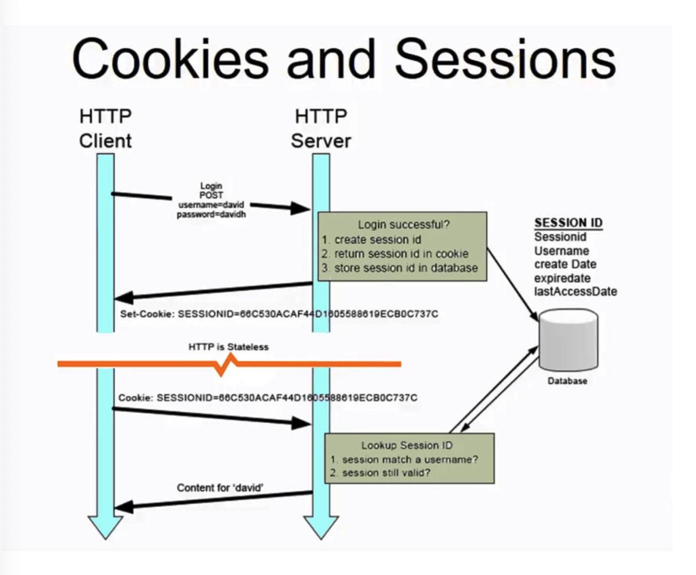
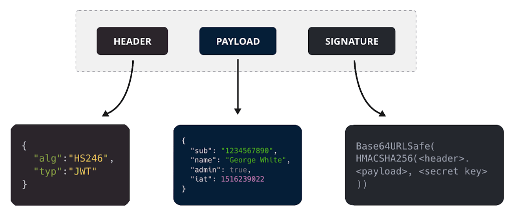

# 세션기반 인증 방식 : 개념
- 로그인은 세션기반 인증 방식과 토큰기반 인증 방식으로 나뉨.
- http는 stateless(상태없음)이므로 데이터의 요청/응답 후 사용자의 정보 등을 유지하지 않음. 
    => 따라서 로그인 상태를 유지하는 방법에 대한 논의 필요
    - 세션 : 서버와 클라이언트의 연결이 활성화된 상태를 말함
    - 세션ID : 웹 서버 또는 DB에 저장되는 클라이언트에 대한 유니크한 ID

## 세션기반 로그인 프로세스
1. 처음 로그인 >> 세션ID 생성 >> 서버에서 세션ID를 쿠키로 설정해 클라이언트에게 전달
2. 클라이언트가 서버에 요청할 때 해당 세션ID를 쿠키로 담아 전에 로그인했던 아이디인 지 확인
3. 로그인 유지
    

## 단점
1. 사용자의 상태에 관한 데이터를 서버에 저장했을 때 로그인 중인 유저의 수가 늘어난다면 서버의 메모리 부하 발생
2. RDBMS에 저장한다면 직렬화 및 역직렬화에 관한 오버헤드 발생

# 토큰기반 인증 방식(access토큰, refresh 토큰) 개념

## 토큰기반 인증 방식
- state를 모두 토큰 자체만으로 처리하며 토큰을 처리하는 한 서버를 두고 다른 컨텐츠를 제공하는 서버는 모두 stateless하게 만드는 방식
- 토큰을 관리하는 별개 서버를 두는 이유
    - 여러 개의 서버를 운용할 경우 토큰 기반 인증 + A도메인을 처리하는 서버로 구축할 경우 A 도메인에서 에러가 발생하게 되면 인증에 관한 기능이 마비되고 이는 B, C, D 등의 도메인 기능이 연쇄적으로 마비될 수 있기 때문.
1. 인증 로직 >> JWT 토큰생성(access 토큰, refresh 토큰)
2. 사용자가 이후에 access 토큰을 HTTP header - Authorization or HTTP Header - Cookie에 담아 인증이 필요한 서버에 요청해 원하는 컨텐츠를 가져옴.

## JWT 토큰
- JSON Web Token으로, 헤더/페이로드/서명으로 이루어져 JSON 객체로 인코딩되며 메세지 인증, 암호화에 사용됨.
    
    - Header
        - 토큰 유형과 서멍 알고리즘, base64URI로 인코딩됨.
    - Payload
        - 데이터, 토큰 발급자, 토큰 유효기간, base64URI로 인코딩 됨.
    - Signature
        - (인코딩된 header + payload) + 비밀키를 기반으로 헤더에 명시된 알고리즘으로 다시 생성된 서명값.
### 장점
1. 사용자 인증에 필요한 모든 정보는 토큰자체에 포함하기 때문에 별도의 인증 저장소가 필요 없음.
2. 다른 유형의 토큰과 비교했을 때 경량화 되어 있음. 
    SAML(Security Assertion Markup Language Tokens)이란 토큰이 있지만 이에 비해 훨씬 경량화 되어 있음.
3. 디코딩했을 때 JSON이 나오기 때문에 JSON을 기반으로 쉽게 직렬화, 역직렬화 가능
### 단점
1. 토큰이 비대해질 경우 당연히 서버 과부화에 영향을 줌
2. 토큰을 탈취당할 경우 디코딩했을 대 데이터를 볼 수 있음

## access토큰, refresh토큰
- access토큰의 수명은 짧게, refresh 토큰은 수명을 길게 함.
- refresh 토큰은 access 토큰이 만료되었을 때 다시 access 토큰을 얻기 위해 사용되는 토큰.
- 따라서 access 토큰이 만료되었을 때마다 인증에 관한 비용 감소

### 주의할 점
- access토큰을 얻었다면 그 이후 요청엔 HTTP Header - Authorization 또는 HTTP Header - Cookie에 담아 요청하게 됨.
- 규칙
    - Bearer <token> 으로 Bearer을 앞에 둬 토큰기반 인증 방식이란 것을 알려줘야 함.
    - https를 사용해야 함
    - 쿠키에 저장한다면 sameSite : "Strict'을 써야함.
    - 수명에 짧은 access token을 발급해야 함.
    - url에 토큰을 전달하지 말아야 함.

## 토큰을 탈취당하는 걸 방지하는 방법.
1. 먼저 Access Token의 수명을 짧게 설정해 탈취된 토큰의 유효 기간을 최소화함. 
    짧은 수명의 Access Token을 사용, 필요할 때만 Refresh Token을 통해 새로운 Access Token을 발급 받음.
2. Refresh Token을 사용해 민감한 작업을 수행하려고 할 때 추가적인 사용자 인증 단계를 요구.
3. 쿠키에 HttpOnly 및 Secure을 걸어 관리

## 현업에서의 토큰 및 쿠키 - 세션 사례
- 보통 토큰기반 인증 방식을 사용한다면 해당 토큰값의 네이밍을 접두사가 token 또는 bearer로 시작하기도 함.
- 토큰 이름을 token이라는 것을 넣어서 해당 사이트가 토큰기반 인증 방식임을 유츄할 수 있음