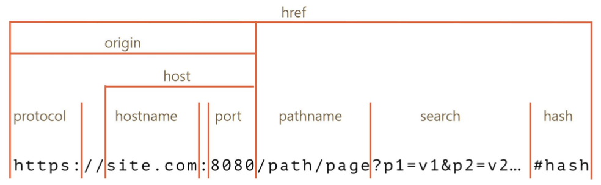
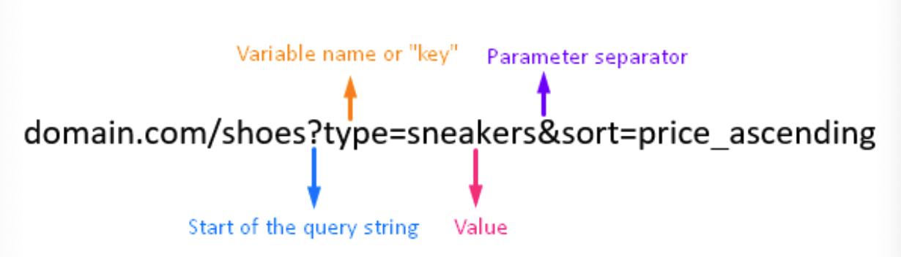

# 로컬 스토리지

## 로컬 스토리지 개념
- 웹 스토리지 객체로 브라우저 내에 {key : value} 형태로 오리진에 종속 되어 저장되는 데이터
- 오리진이 같은 브라우저 내에서 공유됨.
    - 하나의 키에 오로지 하나의 값만 저장
    - 데이터는 사용자가 브라우저에서 수동으로 삭제되지 않는 한 평생 동안 저장소에 저장되며 만료날짜가 없음. 
        사용자가 창이나 탭을 닫아도, 컴퓨터를 종료해도 만료 X
    - 최대 저장용량 5MB
    - 보통 사용자의 행위를 기억할 때, 로그인을 유지하기 위한 값 등으로 사용되며 로컬 스토리지 데이터는 자동으로 서버로 전송 X. 
        (쿠키는 자동 전송됨.)

## 로컬스토리지와 오리진
- 오리진
    
    - search라고 하는 사람도 있지만, 보통은 query string이라함.
    - 여기서 기본 url과 포트(생략 가능) 까지의 내용이 "오리진"
        

## 세션스토리지
- 세션 스토리지(session Storage)는 로컬 스토리지와 매우 유사
- 세션 스토리지는 웹 스토리지 객체로 브라우저 내에 { key : value } 형태로 오리진에 종속되어 저장되는 데이터. 
    - 다만, 동일한 오리진이라도 브라우저의 각 탭마다 독립적으로 저장됨.  
    즉, 다른 탭에서 세션 스토리지에 저장된 데이터에 접근할 수 없습니다.
- 하나의 키에 오로지 하나의 값만 저장됨
- 최대 저장용량은 5MB
- 사용자가 브라우저에서 탭을 닫으면 데이터 만료

