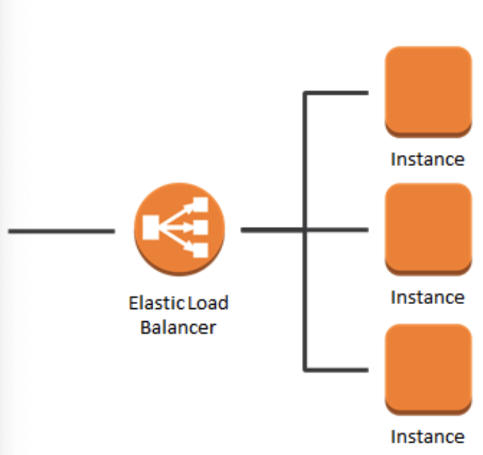
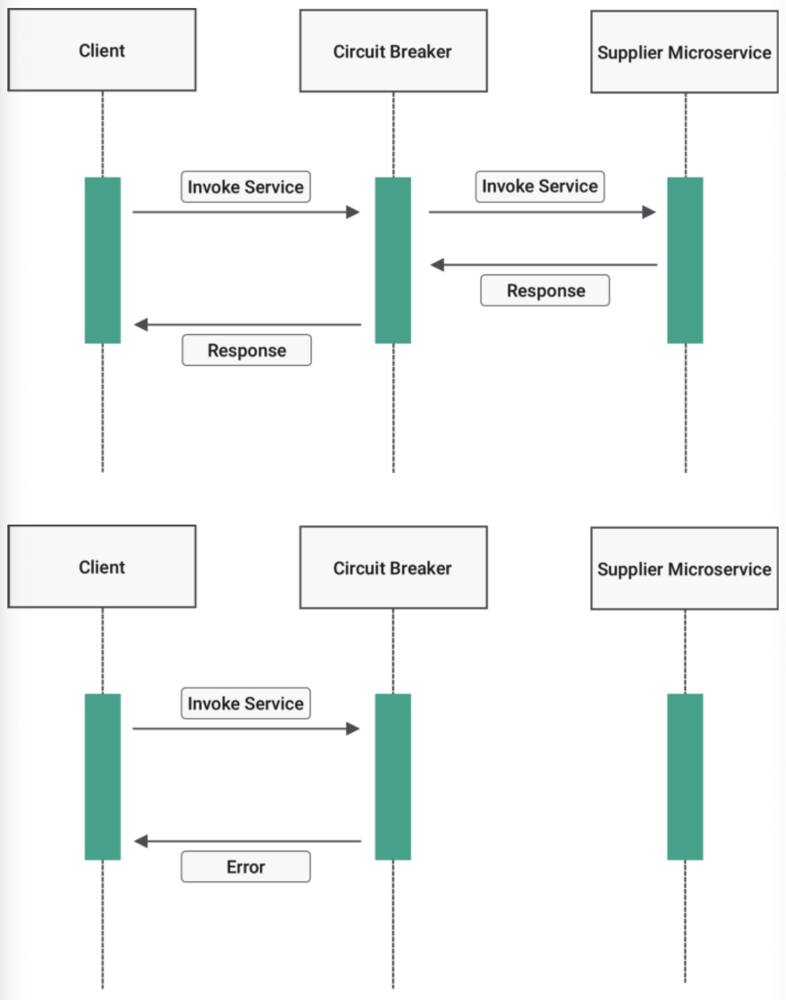
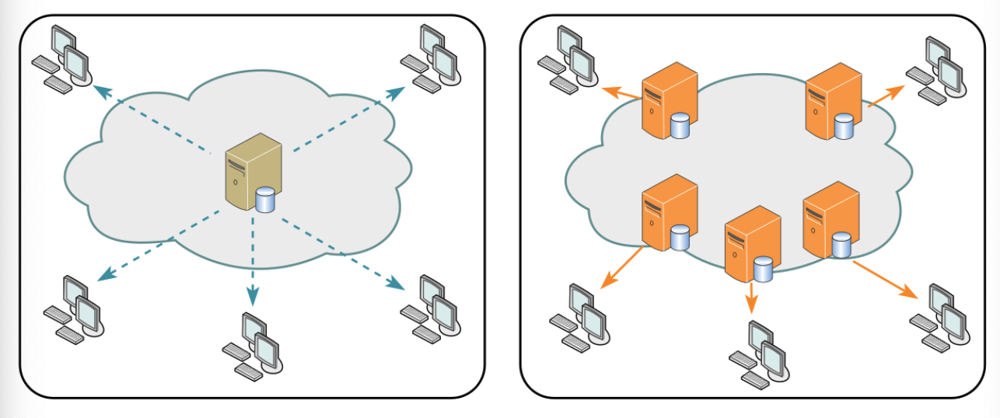

# 대규모 트래픽으로 인한 서버 과부하 해결법

## 서버 과부하의 의미
- 서버가 리소스를 소진하여 들어오는 요청을 처리하지 못할 때 발생.
- 이 때 서버는 사용자의 웹 요청을 처리하지 못해 응답없음이 뜨게 됨.

## 1. 모니터링을 통한 자원 할당
- 과부하의 주된 이유는 "자원의 한계점 도달"
- 서버의 CPU 용량이 80-90%에 도달하거나 메모리가 부족해 계속해서 스와핑일 발생하면 과부하 상태
- **모니터링을 통한 자원의 적절한 할당**으로 해결됨.
    -자원은 CPU, 메모리, 대역폭도 포함됨.

### AWS 오토스케일링
- 서비스 이용 불가능 상태 발생 이전 cloud watch가 계속해서 모니터링 하여 서버 대수를 늘려주는 방법
- AWS Auto Scaling은 애플리케이션을 자동으로 모니터링 하고 자원의 용량을 자동으로 조정

### netdat를 이용한 모니터링
- AWS를 사용하지 않을 경우의 무료 모니터링 서비스
- 설정한 임계치를 기반으로 알림 서비스를 통해 서버 과부하를 방지

### 모니터링의 이뮤
- 서버 중지에 대한 대처 가능
    1. 어떤 페이지에서 어떤 트래픽이 발생했느냐
    2. 어떤 네트워크에서 병목현상이 일어나냐 등등
- 페이지의 간 활용도 차이를 확인하여 서비스 개션에도 도음울 줌

## 2. 로드밸런서
- AWS 오토스케일링은 빠르긴 하지만 구성에 시간이 걸림.  
    따라서 앞단에 로드밸런서를 통해 트래픽을 분산해야 함.
    
- 로드밸런서는 한 서버에 장애가 발생하면 트래픽을 다른 기능 서버로 리다이렉션하여 시스템 중단 방지.

## 3. 블랙스완 프로토콜
- 사후에는 특정 사고의 원인을 분석할 수 있지만, 사고 이전엔 예측할 수 없음을 의미
- 이러한 블랙스완은 매번 일어나기 때문에 이에 따른 대비가 필요
- 구글의 블랙스완 수칙
    1. 영향을 받은 시스템과 각 시스템의 상대적 위험 수준을 확인
        - 체계적으로 데이터를 수집하고 원인에 대한 가설을 수립 후 이를 테스팅
    2. 잠재적으로 영향을 받을 수 있는 내부의 모든 팀에 연락
    3. 최대한 빨리 취약점에 영향을 받는 모든 시스템을 업데이트
    4. 복원계획을 포함한 우리의 대응 과정을 파트너와 고객 등 외부에 전달

## 4. 서킷 브레이커
- 서킷 브레이커 패턴이라 불림
- 서비스 장애를 감지하고 연쇄적으로 생기는 에러를 방지하는 기법
- 서비스와 서비스 사이에 서킷 브레이커 계층을 두고 미리 설정해놓은 timeout 임계값에 도달하면 서킷브레이커가 그 이후의 추가호출에 무조건 에러를 반환함. 
    (연쇄적인 오류전파를 끝냄)

### 필요한 사례 1 : 스레드 차단
- 예를 들어 100개의 스레드가 있고 그 중 98개의 요청이 에러가 있는 서비스에 요청한다면 나머지 2개의 요청은 차단됨.

### 필요한 사례 2 : 계단식 실패 발생
- 서비스 A에 장애가 난다면? 이어져 있는 B, C, D 서비스의 응답도 지연되게 되며 계단식 실패 발생

### 서킷 브레이커 동작 과정

### 서킷 브레이커의 상태
- closed[정상] : 네트워크 요청의 실패율이 임계치보다 낮음
- open[에러] : 임계치 이상의 상태를 말함. 요청을 서비스로 전송하지 않고 바로 오류 반환. 이를 fail fast라고 함.
- half_open[확인중] : open 상태에서 일정 timeout으로 설정된 시간이 지나면 장애가 해결되었는 지 확인하기 위해 half_open 상태로 전환.  
여기서 요청을 전송하고 응답을 확인. 장애가 풀리는지를 확인해서 성공하면 closed, 실패하면 open으로 변경

### 서킷 브레이커의 장점
- 연속적인 에러 발생을 막아주며 일부 서비스가 종료 되더라도 다른 서비스들은 이상없이 동작하게 만들 수 있으며 사용자 경험을 높여줌.

## 5. 컨텐츠 관리

### 불필요한 컨텐츠 제거
- 사용하지 않는 등 불필요한 컨텐츠를 줄여 사용되는 트래픽을 감소시킴

### CDN을 통한 컨텐츠 제공
- CDN을 통해 사용자 가까이, 그리고 분산된 대규모 서버 네트워크를 기반으로 컨텐츠를 제공해서 메인 서버에 대한 부하 감소.
    

### 컨텐츠 캐싱
- 브라우저 캐시(쿠키, 로컬저장소, 세션저장소)를 통해 해당 요청에 관한 항목을 캐시에서 응답을 읽어 네트워크 요청에 관한 비용 제거

### 컨텐츠 압축
- 텍스트 기반 리소스는 gzip 또는 Brotli를 통해 압축해야 함.
- 70% 정도까지 텍스트를 압축할 수 있음.
- 참고할 사항으로 압축을 푸는 과정에서 CPU 자원이 소모되기 때문에 고려해야 함.

### 컨텐츠의 우하한 저하(미리 준비된 응답)
- 제공하는 컨텐츠 및 기능을 일시적으로 줄이는 전략
- 예
    - 정적 텍스트 페이지 제공
    - 검색을 비활성화 
    - 더 적은 수의 검색 결과 반환
    - 필수적이지 않은 기능 비활성화