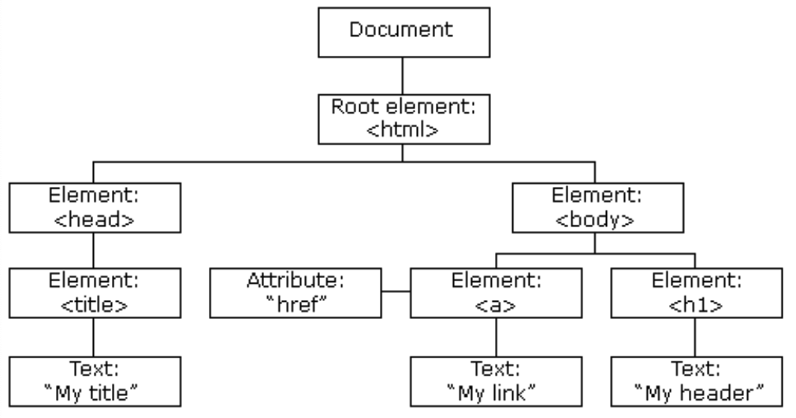

# 브라우저 렌더링이란?
- 브라우저는 브라우저 엔진, 렌더링 엔진, 네트워크 통신부, JS 해석기, UI 백엔드, 자료 저장소로 이루어짐.
    
- 이 중 렌더링 엔진이 브라우저 렌더링을 관정
- DOM 트리, CSS 파서 등을 기반으로 렌더 트리를 구축해 결과적으로 우리가 보는 화면을 구축하는 과정을 의미
    

## DOM 트리와 CSSOM트리 구축

### DOM트리 구축
- 하나의 HTML 페이지는 div, span과 같은 요스들이 HTML 파서에 의해 "구문분석"됨.
- 요소는 하나하나가 노드(Node)로 설정 되어 트리 형태로 저장됨. 
    => DOM 트리
    

### CSSOM 트리 구축
- 각각의 노드는 CSS 파서에 의해 정해진 스타일 규칙이 적용됨. 
    예 ) span.color = "red"
- 이런 것들을 기반으로 CSSOM 트리가 생성됨.
- 이는 DOM 트리 구축과 동시에 일어남
    

### 렌더트리와 렌더레이어 생성
- DOM 트리와 CSSOM 트리가 합쳐져 렌더 객체가 생성됨.
- 병렬적인 렌더 트리가 생성됨.
    
- 이 때 display:none이 포함된 노드는 지워지고, font-size 등 상속적인 스타일은 부모노드에만 위치하도록 설계하는 등의 최적화를 거쳐 렌더 레이어가 완성됨.
    - display:none => 렌더 트리에서 삭제
    - visibility : hidden => 요소가 보이진 않지만, 여전히 레이아웃 공간을 차지하고 있음
    
- 이 때 렌더 레이어가 완성될 때 GPU에서 처리되는 부분이 있음
- 이 요소들은 각각 강제적으로 그래픽 레이어로 분리됨.

### 렌더 레이어를 대상으로 Layout 설정
- 이 때 좌표는 보통 부모를 기준으로 설정됨
- Global Layout은 브라우저 사이즈가 증가하거나 폰트 사이즈가 커지면 변경됨.
    

### 렌더 레이어를 대상으로 칠하기
- 레스터화라고도 함.
- 픽셀마다 점 찍 듯 칠함.

### 레이어 합치기(composite layer) 및 표기
- 각각의 레이어로부터 비트맵이 생성되고, GPU에 텍스처로 업로드됨
- 그 다음 텍스처들은 서로 합쳐져 하나의 이미지로 렌더링 되며 화면으로 출력됨.

#### Q. 렌더트리와 DOM 트리는 1:1 대응인가?
- ㄴㄴ. DOM 트리 > 렌더 객체 > 렌더 트리가 되는 과정에서 display:none으로 사라지는 렌더 객체(노드)들이 있을 수 있기 때문에 1 : 1 대응은 아님.