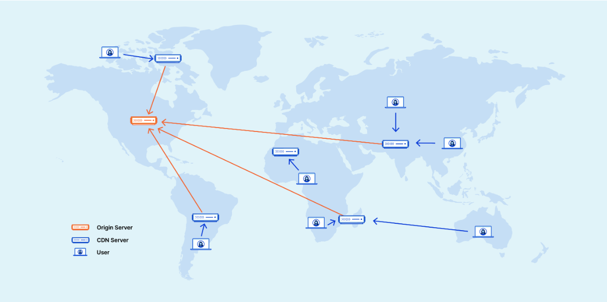

## CDN
- 진짜 네트워크를 공부하면서도, 개발을 하면서도 구글링 좀만 하면 맨날 튀어나옴
- 도대체 이게 뭐길래 이렇게 핫 한 건지 겸사겸사 공부 해보고자 함

## CDN이란?
- 콘텐츠 전송 네트워크(CDN)의 약자
- 데이터 사용량이 많은 애플리케이션의 웹 페이지 로드 속도를 높이는 상호 연결된 **서버 네트워크**
- 일단 개념을 보면 사용자가 서버에 요청한 데이터를 응답 받을 때
    용량이 큰 이미지나 동영상의 경우 로드 속도가 오래 걸림. 
    => 근데 이 중 웹 사이트 콘텐츠는 지리적으로 사용자와 가까운 CDN 서버에 저장하여 속도를 개선하는 방식 
    => 뭔 말이여? 고도의 mock 서버?

## CDN의 중요성
- 주 목적은 대기 시간을 줄이거나 네트워크 설계로 인해 발생하는 통신 지연을 줄임.
    - 서버(웹 사이트, 애플리케이션)와 사용자 간 통신 트래픽이 물리적 먼 거리를 이동하는 경우
    - 클라이언트에서 서버로, 서버에서 클라이언트로 양방향 통신
- CDN은 클라이언트와 서버 간 사이에 중간 서버를 두어 효율성을 높임.
- CDN 서버는 클라이언트-서버 통신의 일부를 관리.

## CDN 이점
- 웹 사이트 성능 향상과 핵심 네트워크 인프라를 지원하는 이점 제공
### 페이지 로드 시간 단축
-  CDN은 반송률을 줄이고, 사용자가 사이트에서 보내는 시간을 늘릴 수 있음
### 대역폭 비용 절감
- 서버에 가해지는 모든 요청은 네트워크 대역폭을 이용하기 때문에 대역폭 비용이 중요함.
    - 캐싱 및 기타 최적화를 통해 CDN은 오리진 서버가 제공해야 하는 데이터의 양을 줄여 웹 사이트 소유자의 호스팅 비용 절감
### 콘텐츠 가용성 제고
- 한 번에 방문자가 몰리는 경우, 네트워크 오류 시 웹 사이트 중단 위험성 감소
    - CDN 서비스를 통해 더 많은 웹 트래픽을 처리하고, 웹 서버의 로드를 줄일 수 있음
    - 하나 이상의 CDN 서버가 오프라인으로 전환되면 다른 운영 서버가 해당 서버를 대체하여 서비스가 중단 되지 않도록 함.
### 웹 사이트 보안 강화
- DDos 공격에 대해 CDN은 여러 중간 서버 간에 로드를 분산해 오리진 서버에 미치는 영향을 줄여 대응 가능.

## CDN을 통한 전송 가능 콘텐츠
### 정적 콘텐츠
- 수정/처리 또는 생성할 필요가 없기 떄문에 CDN에 알맞음
### 동적 콘텐츠
- 실시간으로 변하는 데이터이므로 서버와 서버끼리의 push/pull 과정이 일어남.

## CDN 동작 원리
- 여러 지리적 위치에 접속 지점(POP) 또는 CDN 엣지 서버 그룹을 설정하는 방식으로 작동
- 지리적으로 분산된 네트워크는 캐싱, 동적 가속 및 엣지 로직 계산의 원리를 기반으로 작동
### 캐싱
- CDN에서 캐싱은 네트워크의 여러 서버에 정적 웹 사이트 콘텐츠를 저장하는 프로세스를 의미.
    - 캐싱 동작 원리
        1. 지리적으로 먼 웹 사이트 방문자는 사이트에서 정적 웹 콘텐츠를 처음 요청
        2. 요청이 웹 애플리케이션 서버 or 오리진 서버에 도달. 
            오리진 서버는 원격 방문자에게 응답.  
            또한 해당 방문자와 지리적으로 가장 가까운 CDN POP에 응답 복사본 전송
        3. CDN POP 서버는 복사본을 캐싱된 파일로 저장
        4. 다음에 해당 방문자 또는 해당 위치에 있는 다른 방문자가 동일한 요청 시 오리진 서버가 아닌 캐싱된 서버가 응답함.
### 동적 가속
- 웹 애플리케이션과 클라이언트 사이의 중개 CDN 서버로 인해 발생하는 동적 웹 콘텐츠 요청에 대한 서버 응답 시간을 단축하는 것.
- 동적 데이터에 경우 캐싱이 온전히 이루어지지 않음. 따라서 자신과 오리진 서버 간 연결을 최적화 하여 프로세스 가속화.
- 클라이언트가 인터넷을 통해 웹 서버로 직접 동적 요청을 보내는 경우 네트워크 지연 시간으로 인한 요청 지연/손실 발생.
    보안 검증을 위해 연결을 열고 닫는 시간도 포함됨. 
    => CDN를 이용할 경우, 신뢰할 수 있는 지속적인 연결이 이미 설정되었단 전재. 예를 들어 다음과 같은 기능을 통해 이들 간 연결을 최적화.
    - 지능형 라우팅 알고리즘
    - 오리진에 대한 지리적 근접성
    - 클라이언트 요청을 처리할 수 있으므로 클라이언트 요청을 줄일 수 잇음.
### 엣지 로직 계산
- 클라이언트와 서버 간 통신을 단순화 하는 논리적 계산을 수행하도록 CDN 엣지 서버를 프로그래밍 가능.
    - 사용자 요청을 검사하고 캐싱 동작 수정
    - 잘못된 사용자 요청을 확인하고 처리
    - 응답하기 전 콘텐츠를 수정하거나 최적화.

## CDN 동작 원리 2
- CDN은 세 가지 종류의 서버에 의존
### 오리진 서버
- 말그대로 기존 원본 파일을 가지는 원본 서버.
### 엣지 서버
- 전 세계 지리적으로 위치함. POP(Point of Presence)라고도 함.
- POP 내의 엣지 서버는 오리진 서버에서 복사된 콘텐츠를 캐싱, 인근 사용자에게 해당 콘텐츠 전송.
### DNS 서버
- 오리진 및 엣지 서버의 IP 주소 추적 및 제공.
- 주소 입력 시 서버의 IP가 아닌 CDN을 연결해줌. 요청 받은 CDN은 클라이언트에게 가장 빠르게 서비스를 제공할 수 있는 POP의 서버에 사용ㅇ자를 주선해줌.
- 항상 가까운 POP를 기준으로 제공하는 것이 아닌 특정 POP의 엣지에 트래픽이 몰리는 경우 좀 먼 POP의 CDN을 연결해주기도 함.
- 
### 동작 예시

## CDN 사용성
### 고속 콘텐츠 전송
- 정적/동적 인터넷 콘텐츠 전송을 결합해 CDN을 사용해 고객에게 글로벌 고성능 전체 사이트 환경 제공.
- BBC 뉴스 같은 경우 전 세계에 신속하게 제공해야 할 때
### 실시간 스트리밍
- 고품질의 풍부한 미디어 파일을 안정적이고 비용 효율적으로 제공할 수 있도록 지원함.
- 비디오/오디오 스트리밍 기업은 CDN을 통해 다음과 같은 과제 해결
    - 대역폭 비용 절감
    - 확장성 향상
    - 제공 시간 단축
### 다중 사용자 확장
- 다수의 동시 사용자를 지원하는 데 도움 됨.
### Amazon CloudFront
- 이 CDN을 활용한 게 CloudFront

## 느낀 점/배운 점
- 이 모든 걸 CloudFront를 하면 된다는 게 신기했음. 
- CloudFront를 프론트 배포할 때 왜 S3에 대해 CloudFront로 한 번 더 배포하는 지에 대해 이해를 못했는데 확실히 이해된 케이스 였음.
- 용어가 좀 헷갈려 정리
    - POP
        - 지리적인 관점, 특정 지역 or 네트워크 내에 사용자들을 커버하는 서버 그룹을 의미
    - 엣지 서버
        - POP 내에 있는 서버들을 엣지 서버라 함
    - CDN
        - 이러한 엣지 서버들과 오리진 서버와의 다양한 기능과 관계를 CDN이라 함.
    - CDN 서버
        - 오리진 서버가 아닌 엣지 서버를 일컫음.

## 참고
https://www.akamai.com/ko/glossary/what-is-a-cdn
https://aws.amazon.com/ko/what-is/cdn/
https://somaz.tistory.com/154
https://www.cloudflare.com/ko-kr/learning/cdn/what-is-a-cdn/
https://velog.io/@bcl0206/CDN