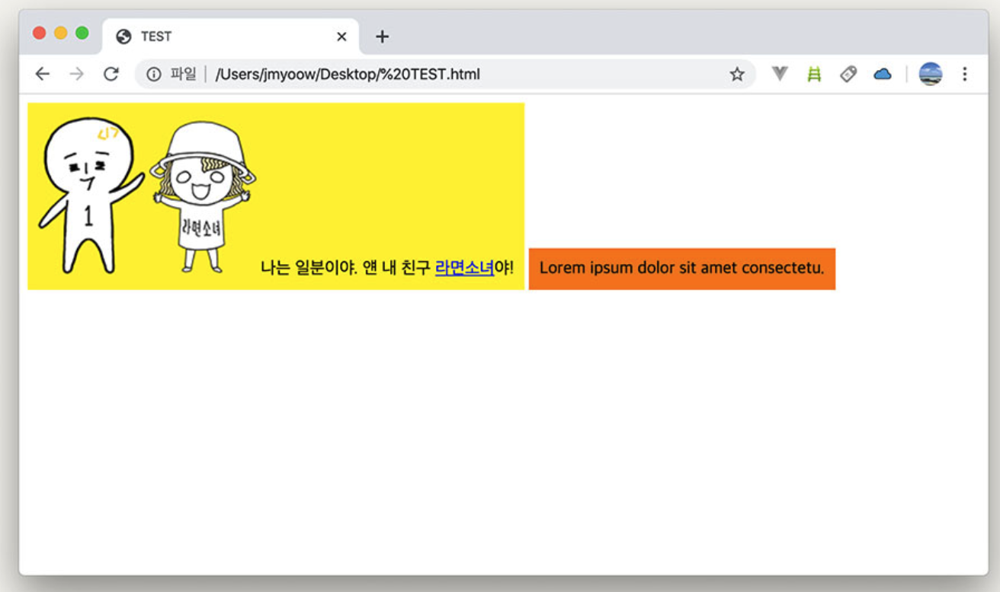
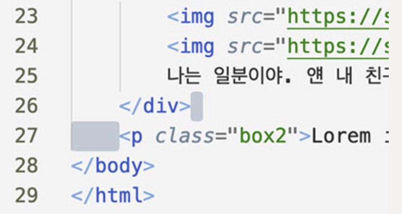
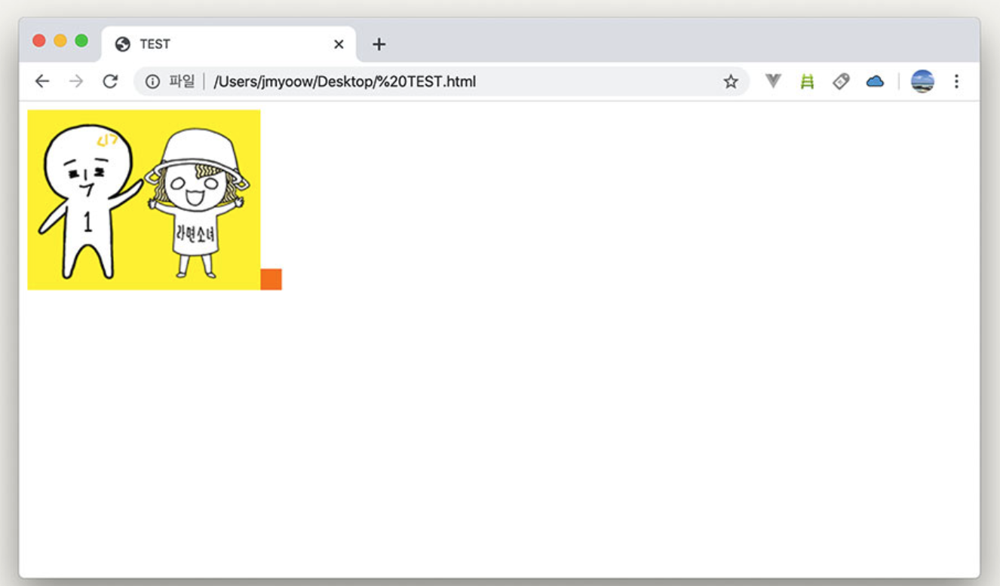

# flex를 배우기 전 기본 CSS 레이아웃 개념

## display
- HTML 요소들을 시각적으로 어떤 형식으로 보여줄지를 결정하는 속성
    - display: inline;은 텍스트처럼
    - display: block;은 쌓이는 상자처럼
```html
<div class="box1">
	
	
	나는 일분이야. 얜 내 친구 <a href="https://youtube.com/라면소녀">라면소녀</a>야!
</div>
<p class="box2">Lorem ipsum dolor sit amet consectetu.</p>
```
- display: block인 요소들
    - div, p
- display : inline인 요소들
    - img, a

### inline
- 텍스트처럼 쭉 가로로 배치되는 형태
- 위에 이미지들의 하단(발)부분을 보면 오른쪽 텍스트와 같은 선 상에 있음.
- 텍스트 형식이다 보니 나열 되다가 공간이 모자라면 줄바꿈됨.
- 자주 쓰는 요소들
    - span
    - a
    - img
    - strong 등

### block
- 박스
- width : 옆으로늘어날 수 있는 만큼 최대한(자기 부모 요소의 width 만큼),
- height : 내용물의 높이
- <b>"block 요소에 아무것도 넣지 않는다면 height가 0이므로 화면에 보이는 것이 없게됨."</b>

## inline -> block
- inline은 원래 텍스트이므로 width, height를 적용할 수 없음
<br>(img는 제외. 이미지 크기는 width, height로 설정할 수 있음.)
- 따라서 display 속성을 임의로 바꾸어 inline 요소의 display 속성을 변경할 수 있음
```css
.box1 a {
	display: block;
	/* a의 기본값은 display: inline; */
	background: lightgray;
}
```

## inline-block
- inline과 block의 특징을 모두 가짐.
- inline처럼 텍스트 흐름대로 쭉 나열 되고, block처럼 박스 형태라 width, height로 크기 설정 가능.
```css
.box1 {
	display: inline-block;
	width: 300px;
}
.box2 {
	display: inline-block;
	width: 200px;
}
```

- 근데 이렇게 하니 노란 박스와 오렌지 박스 사이에 여백이 생김.
- 이유는 inline-block 요소를 텍스트라 생각하면 됨.
	- HTML 소스 상에서의 "빈 칸".
	- 스페이스바를 눌러 띄어쓰기를 하면 한 칸 공간 생기는 것처럼 inline 요소의 특성이 있기 때문에 똑같이 동작
	
	- 이런 공백 없애려면 공백도 텍스트니까 텍스트 크기를 0으로 하면 됨. <br> 따라서 저 공백의 위치한 부분은 body이므로 body의 font-size를 0으로 설정
		```css
		body {
			font-size: 0;
		}
		```
	- 근데 이러면 공백 뿐 아니라 모든 텍스트가 0이 되기 때문에 아래와 같이 됨
	
	- 그래서 각 박스의 font-size를 원래대로 회복 시켜줌
		```css
		.box1,
		.box2 {
			font-size: 1rem;
			/* root 요소인 <html>의 font-size를 적용 */
		}
		```
- 보통 부모 역할 하는 컨테이너가 따로 있기 때문에 이 경우에만 body에 설정했지. 원래는 그 컨테이너에 font-size : 0;으로 설정.
	```html
	<body>
	<div class="container">
		<div class="box1"></div>
		<div class="box2"></div>
	</div>
	</body>
	```

## 최종
```css
body {
	font-size: 0;
}
.box1,
.box2 {
	display: inline-block;
	vertical-align: top;
	padding: 10px;
	font-size: 1rem;
}
.box1 {
	background: #fff000;
}
.box2 {
	margin: 0; /* p태그 자체의 margin 삭제 */
	background: #ff7200;
}
```

## 느낀점
- global css 설정에서 font-size나 기본 설정들을 하는 맥락이 이런 것들 때문이겠구나란 걸 느낌.

## 참고
https://studiomeal.com/archives/282