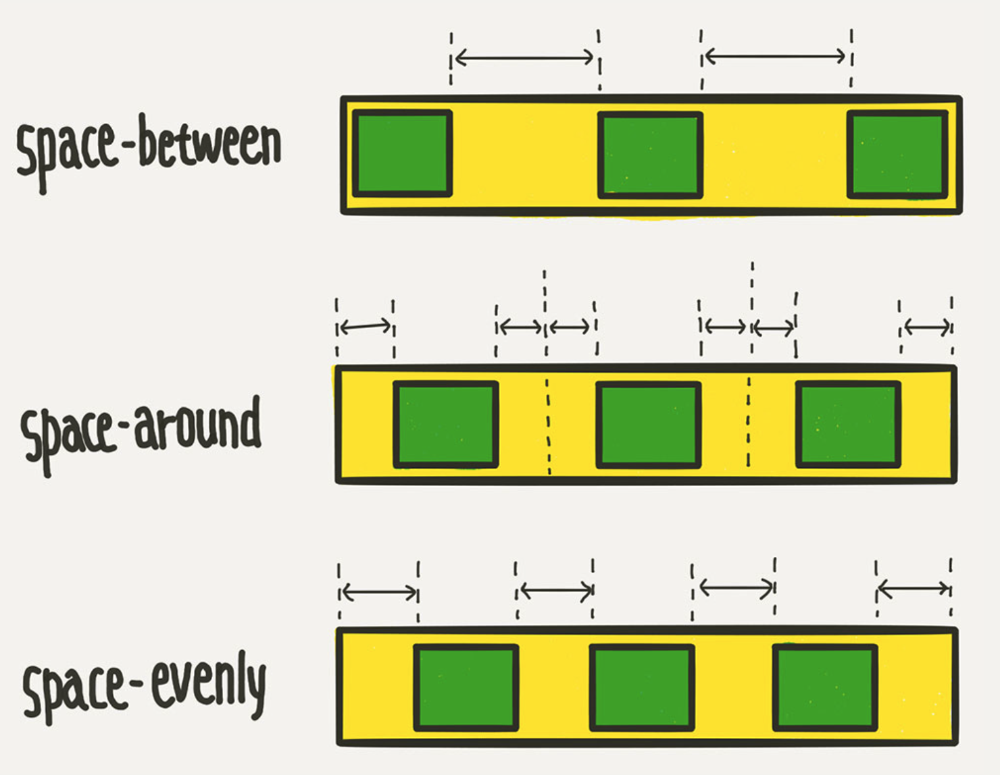
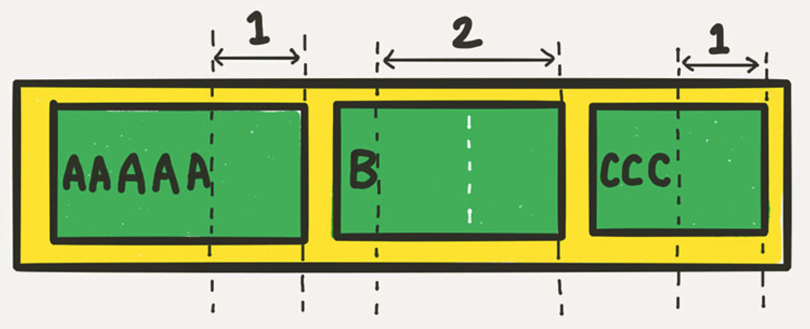

# CSS 공부 flex

- 레이아웃을 공부하지 않고 하니 "참여하기" 페이지의 "수상이력" 컴포넌트의 레이아웃을 잡는 데 많이 어려웠음. 따라서 공부의 필요성을 느낌

## display:flex;
- 레이아웃용 배치 기능
- flex container와 flex item으로 구분됨
- 기본 display:flex; 상태에선 item의 width 범위 만큼에 공간을 가짐
```html
<!DOCTYPE html>
<html>
<head>
<style>
.container {
    display: flex;
	/* display: inline-flex; */
}
</style>
</head>
<body>

<div class="container">
	<div class="item">helloflex1</div>
	<div class="item2">abc</div>
	<div class="item3">helloflex</div>
</div>

</body>
</html>
```
- container에 width와 height를 조정하면 전체 container 박스의 width과 height가 조정되며, 각 아이템의 height가 영향을 받음
- 각 item에게 width를 조정하는 경우는 item이 차지하는 공간의 범위를 조정하는 것이므로 item별로 변경됨.<br>
근데 height의 경우, 하나의 item만 적용해도 전체 item에게 동일하게 적용됨.
```html
<!DOCTYPE html>
<html>
<head>
<style>
.container {
    display: flex;
	/* display: inline-flex; */
}

.item {
    width:300px;
}

.item2 {
    height:100px;
}

.item3 {
    width:300px;
}
</style>
</head>
<body>

<div class="container">
	<div class="item">helloflex1</div>
	<div class="item2">abc</div>
	<div class="item3">helloflex</div>
</div>

</body>
</html>
```

## flex-direction
- item들이 배치되는 축의 방향을 결정
    - row : item들이 행(가로) 방향으로 배치됨.
    - row-reverse : item들이 역순으로 가로 배치됨.
    - column : item들이 열(세로) 방향으로 배치됨.
    - column-reverse : item들이 역순으로 세로 배치됨.
```html
<!DOCTYPE html>
<html>
<head>
<style>
.container {
	flex-direction: row;
	/* flex-direction: column; */
	/* flex-direction: row-reverse; */
	/* flex-direction: column-reverse; */
}

.item {
    width:300px;
}

.item2 {
    height:100px;
}

.item3 {
    width:300px;
}
</style>
</head>
<body>

<div class="container">
	<div class="item">helloflex1</div>
	<div class="item2">abc</div>
	<div class="item3">helloflex</div>
</div>

</body>
</html>
```

## flex-wrap
- 컨테이너가 더 이상 item들을 한 줄에 넣을 수 없을 경우 item 줄바꿈 결정 속성.
    - nowrap : 줄바꿈 하지 않음. 넘치면 그냥 삐져 나가게
    - wrap : 줄바꿈함. float나 inline-block으로 배치한 요소들과 비슷하게 동작
    - wrap-reverse : 줄바꿈함. 근데 item을 역순으로 배치.
```html
<!DOCTYPE html>
<html>
<head>
<style>
.container {
	flex-wrap: nowrap;
	/* flex-wrap: wrap; */
	/* flex-wrap: wrap-reverse; */
}
</style>
</head>
<body>

<div class="container">
	<div class="item">helloflex1</div>
	<div class="item2">abc</div>
	<div class="item3">helloflex</div>
</div>

</body>
</html>
```

## flex-flow
- flex-direction과 flex-wrap을 한꺼번에 지정할 수 있는 단축 속성
```html
<!DOCTYPE html>
<html>
<head>
<style>
.container {
	flex-flow: row wrap;
	/* 아래의 두 줄을 줄여 쓴 것 */
	/* flex-direction: row; */
	/* flex-wrap: wrap; */
}
</style>
</head>
<body>

<div class="container">
	<div class="item">helloflex1</div>
	<div class="item2">abc</div>
	<div class="item3">helloflex</div>
</div>

</body>
</html>
```

## justify-content
- 메인축 방향으로 item들을 정렬하는 속성.
    - flex-start : item들을 시작점으로 정렬
    - flex-end : item들을 끝점으로 정렬
    - center : item들을 가운데로 정렬
    - space-between : item들의 사이에 균일한 간격 생성
    - space-around : item들의 둘레에 균일한 간격 생성
    - space-evenly : item들의 사이와 양 끝에 균일한 간격 생성.
```html
<!DOCTYPE html>
<html>
<head>
<style>
.container {
	justify-content: flex-start;
	/* justify-content: flex-end; */
	/* justify-content: center; */
	/* justify-content: space-between; */
	/* justify-content: space-around; */
	/* justify-content: space-evenly; */
}
</style>
</head>
<body>

<div class="container">
	<div class="item">helloflex1</div>
	<div class="item2">abc</div>
	<div class="item3">helloflex</div>
</div>

</body>
</html>
```


## 수직축 방향 정렬
- 수직축 방향으로 item들을 정렬하는 속성
    - stretch : item들을 수직축 방향으로 끝까지 쭈욱 늘림
    - flex-start : item들을 시작점으로 정렬
    - flex-end : item들을 끝으로 정렬
    - center : item들을 가운데로 정렬
    - baseline : item들을 텍스트 베이스 라인 기준으로 정렬
```html
<!DOCTYPE html>
<html>
<head>
<style>
.container {
	align-items: stretch;
	/* align-items: flex-start; */
	/* align-items: flex-end; */
	/* align-items: center; */
	/* align-items: baseline; */
}
</style>
</head>
<body>

<div class="container">
	<div class="item">helloflex1</div>
	<div class="item2">abc</div>
	<div class="item3">helloflex</div>
</div>

</body>
</html>
```
- 그래서 justify-content : center;와 align-items: center;로 컨테이너 내에서 가운데 정렬로 사용됨.

## align-content
- flex-wrap: wrap;이 설정된 상태에서, item들의 행이 2줄 이상 되었을 때의 수직축 방향 정렬 결정 속성.
```html
<!DOCTYPE html>
<html>
<head>
<style>
.container {
	flex-wrap: wrap;
	align-content: stretch;
	/* align-content: flex-start; */
	/* align-content: flex-end; */
	/* align-content: center; */
	/* align-content: space-between; */
	/* align-content: space-around; */
	/* align-content: space-evenly; */
}
</style>
</head>
<body>

<div class="container">
	<div class="item">helloflex1</div>
	<div class="item2">abc</div>
	<div class="item3">helloflex</div>
</div>

</body>
</html>
```

## flex-basis
- flex item의 기본 크기 설정(flex-direction이 row일 땐 너비, column일 땐 높이)
    - 값으로 width와 height를 조정하는 수치가 적용됨.
    - 기본값 auto : 해당 item의 width 값 사용
    - content : 컨텐츠의 크기
```html
<!DOCTYPE html>
<html>
<head>
<style>
.container {
    display:flex;
    word-wrap: break-word;
}

.item {
	flex-basis: auto; /* 기본값 */
	/* flex-basis: 0; */
	/* flex-basis: 50%; */
	/* flex-basis: 300px; */
	/* flex-basis: 10rem; */
	/* flex-basis: content; */
}
</style>
</head>
<body>

<div class="container">
	<div class="item">helloflex1</div>
	<div class="item">abc</div>
	<div class="item">helloflex</div>
</div>

</body>
</html>
```
- flex-basis과 width의 차이점
    - flex-basis은 item에게 적용한 적용 값보다 해당 item의 크기가 크다면 원래 상태를 유지하지만, 반대로 item의 크기가 작다면 적용 값의 크기만큼으로 해당 item의 크기를 설정함.
    - width는 모든 item에 대해 해당 크기로 설정됨.<br>
    따라서 item의 크기가 크다면 영역을 벗어나 다른 영역을 침범하거나, 삐져 나오게 됨.<br>
    따라서 word-wrap: break-word를 통해 줄바꿈 해줘야함.

## flex-grow
- item이 flex-basis의 값보다 커질 수 있는 지를 결정하는 속성
- flex-grow에는 숫자값이 들어가는데, 몇이든 일단 0보다 큰 값이 셋팅되면 해당 item이 유연한 박스로 변하고 원래의 크기보다 커지며 빈 공간을 메움.
- 기본값이 0이므로 따로 적용하지 않으면 item이 늘어나지 않음.
```html
<!DOCTYPE html>
<html>
<head>
<style>
.item {
	flex-grow: 1;
	/* flex-grow: 0; */ /* 기본값 */
}
</style>
</head>
<body>

<div class="container">
	<div class="item">helloflex1</div>
	<div class="item">abc</div>
	<div class="item">helloflex</div>
</div>

</body>
</html>
```
- flex-grow에 들어가는 숫자의 의미는 item들의 flex-basis를 제외한 여백 부분을 <b>flex-grow에 지정된 숫자의 비율</b>로 나누어 가짐
```html
<!DOCTYPE html>
<html>
<head>
<style>
/* 1:2:1의 비율로 세팅할 경우 */
.item:nth-child(1) { flex-grow: 1; }
.item:nth-child(2) { flex-grow: 2; }
.item:nth-child(3) { flex-grow: 1; }
</style>
</head>
<body>

<div class="container">
	<div class="item">helloflex1</div>
	<div class="item">abc</div>
	<div class="item">helloflex</div>
</div>

</body>
</html>
```


## flex-shrink
- flex-grow와 쌍을 이루는 속성
- item이 flex-basis의 값보다 작아질 수 있는지를 결정
- 숫자값이 들어감. 몇이든 일단 0보다 큰 값이 셋팅 되면 해당 item이 유연한 박스로 변하고 flex-basis보다 작아짐.
- 기본값이 1이기 때문에 따로 셋팅하지 않아도 item이 flex-basis보다 작아질 수 있었음
```html
<!DOCTYPE html>
<html>
<head>
<style>
.item {
	flex-basis: 150px;
	flex-shrink: 1; /* 기본값 */
}
</style>
</head>
<body>

<div class="container">
	<div class="item">helloflex1</div>
	<div class="item">abc</div>
	<div class="item">helloflex</div>
</div>

</body>
</html>
```
- flex-shrink를 0으로 셋팅하면 item의 크기가 flex-basis보다 작아지지 않기 때문에 고정폭의 컬럼을 쉽게 만들 수 있음. 고정 크기는 width로 설정.
```html
<!DOCTYPE html>
<html>
<head>
<style>
.container {
	display: flex;
}
.item:nth-child(1) {
	flex-shrink: 0;
	width: 100px;
}
.item:nth-child(2) {
	flex-grow: 1;
}
</style>
</head>
<body>

<div class="container">
	<div class="item">hello</div>
	<div class="item">Lorem ipsum dolor sit amet consectetur adipisicing elit. Saepe, sunt.</div>
</div>

</body>
</html>
```

## flex
- flex-grow, flex-shrink, flex-basis를 한 번에 쓸 수 있는 축약형 속성
```html
<!DOCTYPE html>
<html>
<head>
<style>
.item {
	flex: 1;
	/* flex-grow: 1; flex-shrink: 1; flex-basis: 0%; */
	flex: 1 1 auto;
	/* flex-grow: 1; flex-shrink: 1; flex-basis: auto; */
	flex: 1 500px;
	/* flex-grow: 1; flex-shrink: 1; flex-basis: 500px; */
}
</style>
</head>
<body>

<div class="container">
	<div class="item">hello</div>
	<div class="item">Lorem ipsum dolor sit amet consectetur adipisicing elit. Saepe, sunt.</div>
	<div class="item">abc</div>
	<div class="item">helloflex</div>
</div>

</body>
</html>
```

## align-self
- 수직축 정렬
- align-items의 item 버전.
- align-items가 전체 아이템의 수직축 방향 정렬,<br>
align-self는 해당 아이템의 수직축 방향 정렬
```html
<!DOCTYPE html>
<html>
<head>
<style>
.item {
	align-self: auto;
	/* align-self: stretch; */
	/* align-self: flex-start; */
	/* align-self: flex-end; */
	/* align-self: center; */
	/* align-self: baseline; */
}
</style>
</head>
<body>

<div class="container">
	<div class="item">hello</div>
	<div class="item">Lorem ipsum dolor sit amet consectetur adipisicing elit. Saepe, sunt.</div>
	<div class="item">abc</div>
	<div class="item">helloflex</div>
</div>

</body>
</html>
```
- 기본값 auto로, align-items의 설정을 상속 받음.
- align-self는 align-items보다 우선권이 있어. 전체 설정보다 개별 설정을 더 우선시 한다는 것.

## order
- 각 item들의 시각적 나열 순서 결정 속성
- 숫자값이 들어가며, 작은 숫자일 수록 먼저 배치됨.<br>
**"시각적"** 순서일 뿐, HTML 자체의 구조를 바꾸는 건 아님.

## z-index
- Z축 정렬. 숫자가 클 수록 위로 올라감<br>
(position에서의 z-index랑 똑같음)
```html
<!DOCTYPE html>
<html>
<head>
<style>
.item:nth-child(2) {
	z-index: 1;
	transform: scale(2);
}
/* z-index를 설정 안하면 0이므로, 1만 설정해도 나머지 아이템을 보다 위로 올라온다 */
</style>
</head>
<body>

<div class="container">
	<div class="item">hello</div>
	<div class="item">Lorem ipsum dolor sit amet consectetur adipisicing elit. Saepe, sunt.</div>
	<div class="item">abc</div>
	<div class="item">helloflex</div>
</div>

</body>
</html>
```

## 참고
https://studiomeal.com/archives/197