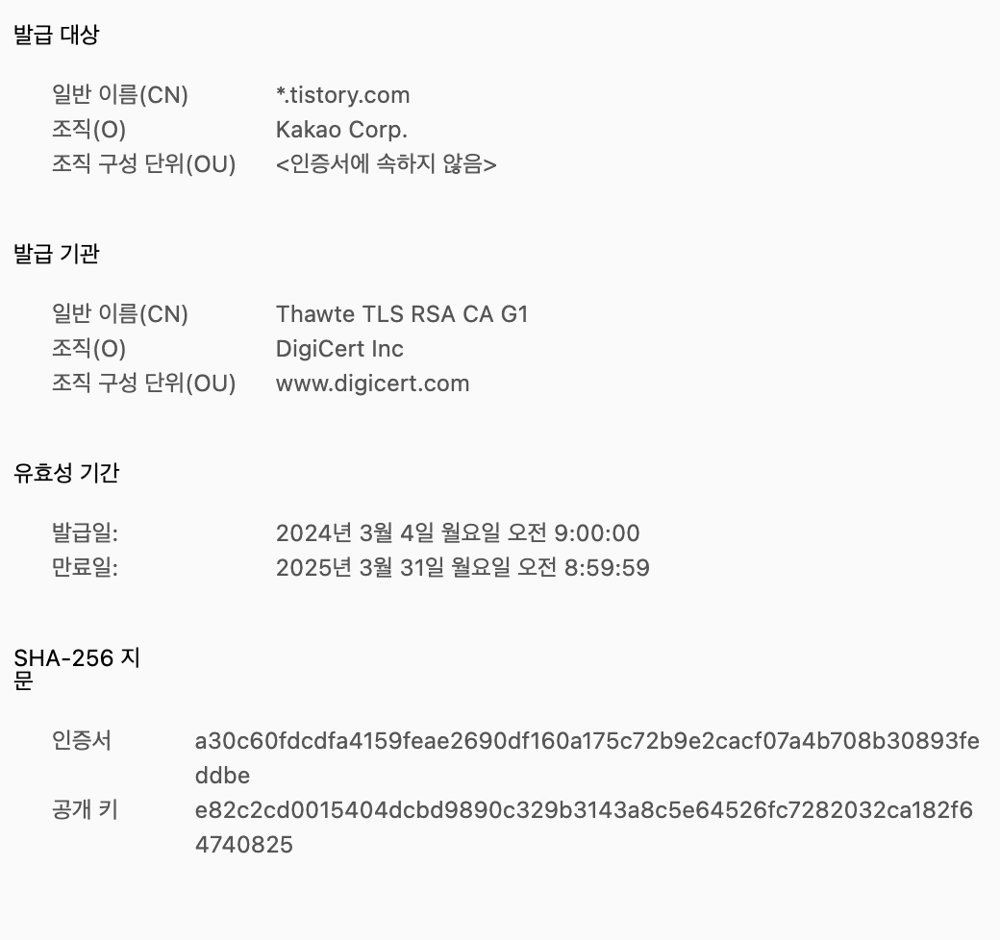
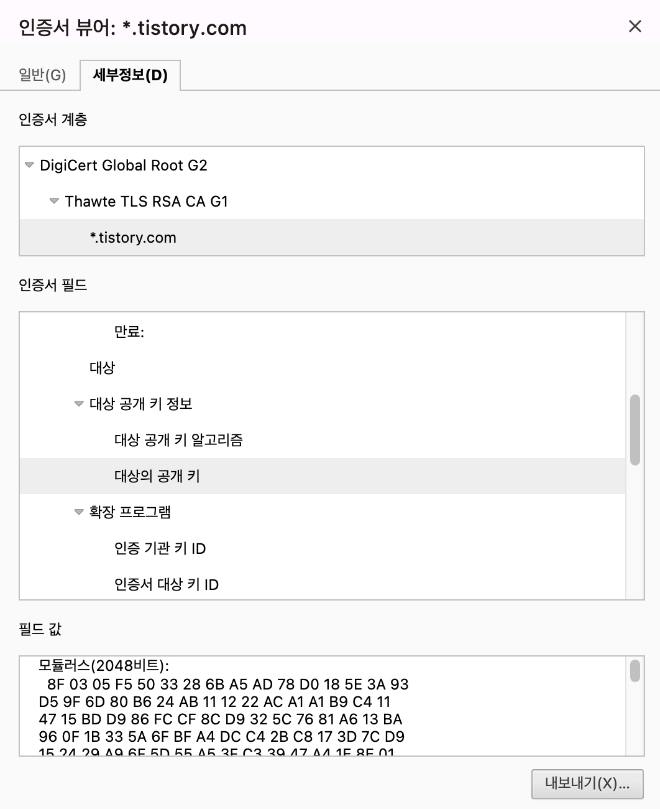
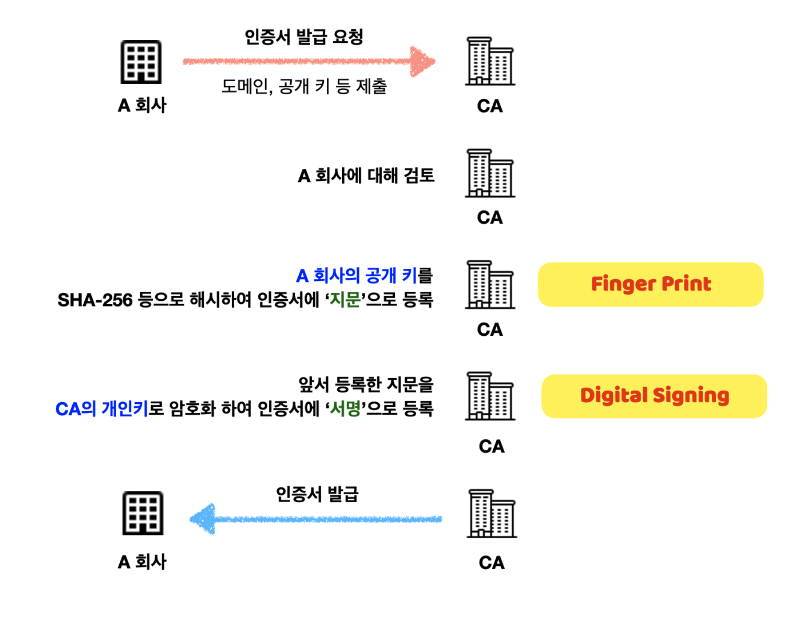
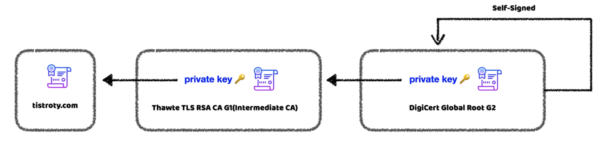
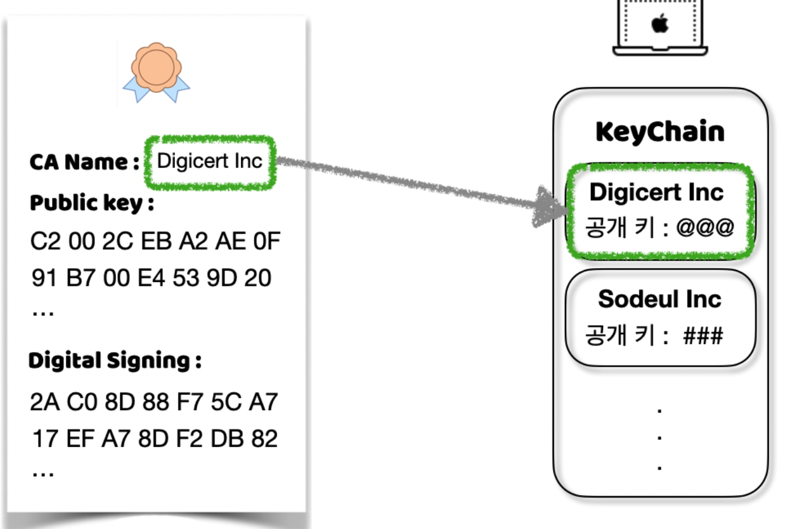

# 인증서
- TLS은 그럼 어디서 오는 걸까?
- 결국 TLS를 누군가로부터 받는 다면 그것도 통신으로 받을 텐데 그럼 그건 어떻게 처리할까?
- 클라이언트는 그럼 해당 TLS를 어디서 나서 사용할까?
- 인증서란 무엇인가?
- 이 의문증 해소를 위한 공부

# 인증서란?
- 서버와 클라이언트 간 통신을 할 때 서버가 신뢰할 수 있는 서버라는 것을 확인하는 작업
- 이를 인증서를 통해 확인

# 인증서의 구성
1. 서비스 정보(인증서를 발급한 CA, 서비스의 도메인 등)
2. 서버 측 공개키(공개키, 공개키 암호화 방법)
3. 지문, 디지털 서명 등

# CA
- 인증서를 발급해주는 기관
- 신뢰성이 엄격하게 공인된 기업들만 가능
- TLS 통신을 위해선 해당 CA 기관을 통해 인증서를 발급 받아야 함.
- CA는 <b>자체적인 공개키와 비밀키를 가지고 있음</b> CA의 비밀키는 절대적으로 누설되면 안됨.

## CA에서의 인증서 발급
- 메커니즘

- 즉, TLS 방식을 그대로 사용해 인증서를 제공
- 이렇게 상위 인증 기관이 인증서가 포함하고 있는 공개키(인증서)를 상위 기관의 비밀키로 암호화 하여 상호 보증하게 되는 것을 <b>"인증서 체인"</b>이라 함.
- 놀랍게도 이러한 인증서 체인은 내가 발급받은 기관이 Root CA가 아니라면 CA 기관 마저 상위 CA 기관에게 발급받은 것.

- 결국 Root CA는 Self-Signed(스스로 보증)함. 
    이는 자신의 인증서를 해시한 후, CA가 아닌 자신의 비밀키로 암호화 하여 서명으로 등록한 것을 말함.
- 모든 사이트가 해당 CA를 통해서만 인증서를 받는 건 아님. TLS 사용 여부도 마찬가지.  
    대신 사설 기관에서 받은 것이므로 보증되지 않음.

## 클라이언트의 인증서
- 클라이언트는 서버가 전달한 인증서의 무결성 입증법은?
- 클라이언트는 CA 리스트를 가지고 있음(공개키 포함)
- OS 설치 시 PC에 포함 되거나, 브라우저가 포함함. 
    (Mac은 keyChain에, 브라우저는 소스코드에)
- CA 리스트는 공인으로 인증된 CA 기관들의 리스트들
- 즉, 서버가 인증서를 클라이언트에게 전달하면 클라이언트는 CA 리스트를 통해 전달 받은 인증서가 CA에서 발급받은 인증서인 지 확인.

## 회사의 인증부터 클라이언트와의 핸드쉐이크까지 과정 정리
1. A 회사는 서버에 대한 도메인, 공개키등을 CA에 제출
2. CA는 검토 후 회사의 공개키를 해시 알고리즘을 통해 해시 한 후 '지문'으로 등록
3. 등록된 '지문'을 CA의 개인키를 통해 암호화 하여 '서명'으로 등록
4. CA는 이 인증서를 A 회사에 발급 
이 단계에서 인증서엔 회사의 공개키, '서명', CA의 해시 알고리즘이 작성되어 있음
5. 클라이언트가 A 회사의 서버에 접속 요청
6. A 회사의 서버는 클라이언트에게 인증서 확인 요청
7. 클라이언트는 자신의 CA 리스트에 있는 CA와 인증서의 CA명이 일치하는 확인 
8. 일치한다면, 클라이언트는 인증서에 있는 '서명'을 CA 공개키를 통해 복호화. 복호화 후 나온 결과물은 '지문' 
(3번에서 개인키를 통해 암호화 했기 때문에 공개키를 통해 복호화 가능)
9. 그리고 인증서에 있는 서버의 공개키를 인증서에 있는 해시 알고리즘을 통해 암호화 
10. 그러면 8번에서 진행했던 '지문'과 9번에서 진행한 암호화된 해시값이 일치하는 지 확인
11. 일치한다면 해당 서버를 신뢰하게 되고 이제 TLS 암호화 방식이 진행됨.

### 배운 점과 느낀 점
- TLS는 CA로부터 회사가 인증을 받으면 인증서를 통해 받게됨.
- 결국 CA로부터 받는 인증서도 TLS 방식으로 인증서를 받게됨.
- 클라이언트는 OS 설치 때나 브라우저를 통해 CA 리스트를 해당 CA들의 공개키들과 함께 가지고 있게 됨.
    - 여기서 의문이 그럼 새로운 CA가 추가되면 걔넨 어떻게 되나??
    - OS 업데이트 및 브라우저 업데이트 시에 CA 목록이 추가될 수 있음.
- 인증서는 클라이언트와 서버 간 신뢰성을 보장하기 위한 CA를 비롯한 인증 기관 혹은 사설 인증 기관에서 발급되는 보증 서류

## 참고
https://babbab2.tistory.com/5?category=1058182

