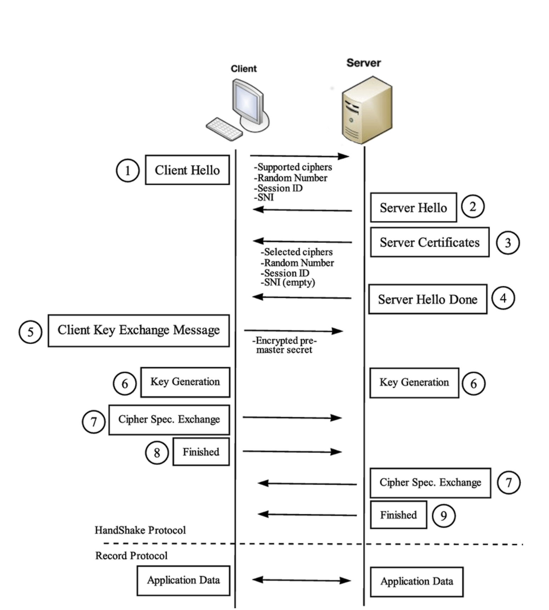

# 핸드쉐이킹
- 내용을 보니 핸드쉐이킹도 간단한 영역이 아닌 거 같아 추가 공부

# 핸드 쉐이킹이란?
- 정의는 실제 데이터를 주고 받기 전, 양측이 서로 연결할 수 있는 상태인 지를 확인하는 작업
- TLS에선 서로의 암호화 방식을 주고받으며, 합의 하는 과정. 서버의 무결성을 확인하고, 대칭키를 전달받는 과정

## 1. Client Hello
- 클라이언트가 서버에 메세지 패킷을 날림.
- 패킷 안 메세지 정보
    1. TLS version
        - Client에서 사용하는 TLS version
    2. Cipher Suite List
        - Client가 지원하는 암호화 방식들 
        (대칭키 암호화 시스템 + 공개키 암호화 시스템 + 해시 함수)
        - 서로 지원하는 암호화 방식을 맞추기 위해 HandShake를 통해 합의
    3. Client Random Data
        - 클라이언트가 생성한 난수
        - 대칭키 만들 때 사용
    4. Session ID
        - 최초 한 번의 HandShake를 위한 Session ID
        - <b>"이게 세션 ID를 사용하는 이유"</b>
        - <del>사실 이거까진 중요하진 않을 거 같아서 안쓰려고 했더니 이거 보고 쓴다는...</del>
        - 일단 Session ID는 0으로 초기화 되어 있는 상태. 나중에 서버측에서 정해줘서 전달 받으면 여기에 저장됨.
        - 이렇게 Session ID가 있다면 앞에 있던 인증서 무결성, TLS 무결성 등의 과정을 진행할 필요 X
    5. SNI(Server Name Indication)
        - 서버 이름 표시
        - 옛날엔 IP 주소와 도메인이 1대1 대응이라 인증서를 사용함에 문제가 없었지만, 요즘엔 IP 주소 하나에 여러 개의 도메인이 연결되기 때문에 문제 발생.  
        서버에서 발생한 인증서 하나에 모든 도메인을 명시하는 것은 사실상 불가능하고, 이런 인증서가 한 두개가 아니니 비효율적
        - 따라서 어떤 도메인에 접속하는 지를 명시
        - 따라서 SNL을 통해 물리적으로 동일한 서버에 존재하는 각기 다른 도메인들이 서로 다른 TLS 인증서를 적용할 수 있음
        - 근데 SNI를 전송할 때 평문(암호화 X)으로 전송  -> 스니핑 가능, 사용자가 접속하고자 하는 도메인이 노출됨.(한마디로 서버 엔드포인트 같은 거나 그런건가?)
## 2. Server Hello
- 클라이언트의 Client Hello에 대한 응답
- 패킷 정보
    1. TLS Version
        - Server에서 사용하는 TLS Version
    2. Selected Suite
        - Client가 보낸 암호화 방식 중 서버가 사용 가능한 암호화 방식을 선택해 전송
    3. Server Random Data
        - 서버에서 생성한 난수
        - 클라이언트와 동일하게 대칭키를 만들 때 사용
    4. Session ID
        - Client Hello에 Session ID가 0? -> 새로운 Session ID를 생성해 전송 
        Session Id가 0이 아니라면? -> Session ID 유효성 검사 후 전송
    5. SNI
        - Server에선 비워서 보냄
## 3. Server Certificate
- 서버의 인증서를 클라이언트에게 보내는 단계
- 클라이언트는 이 인증서를 통해 서버의 인증서 무결성 검사(Certification 페이지의 과정)
- 확인이 됐다면, 이전에 주고 받았던 클라이언트 난수와 서버의 난수를 조합 해 pre master secret이라는 키 생성
- 이 대칭키를 통해 서버의 공개키로 암호화 후 서버로 전송  
그리고 클라이언트와 서버 둘 다 자신들이 가진 난수와 pre master secret 키를 조합하여 TLS의 PRF를 통해 Master Secret 생성.  
이 Master Secret을 기반으로 실제 데이터 암호화에 사용될 여러 개의 세션 키(대칭키)를 도출.

## 4. Server Hello Done
- 서버가 클라이언트에게 모든 메세지를 보냈단 뜻으로 보내는 메세지

## 5. Client Key Exchange
- 클라이언트가 만든 pre master secret(대칭키)키를 서버의 공개키로 암호화한 것을 서버에게 전송

## 6. Key Generation
- 통신 과정은 아니고 서로가 서로에게 대칭키 잘 공유했다 하이파이브 하는  개념?

## 7. Cipher Spec Exchange
- 이후로 전송되는 모든 메세지는 협상된 알고리즘과 키를 이용하여 암호화 하겠다는 서로에게 알림 메세지 전송

## 8. Finished
- 양측 다 TLS Handshake 성공 및 종료

### 참고
https://babbab2.tistory.com/7?category=1058182

### 배운 점과 느낀 점
- 모든 내용이 배운 내용이었음
- Session ID가 클라이언트와 서버의 필요한 인증 과정을 한 번만 한다는 개념만 있었지 이렇게 디테일한 과정이 생략되어 있을 줄 몰랐음
- 