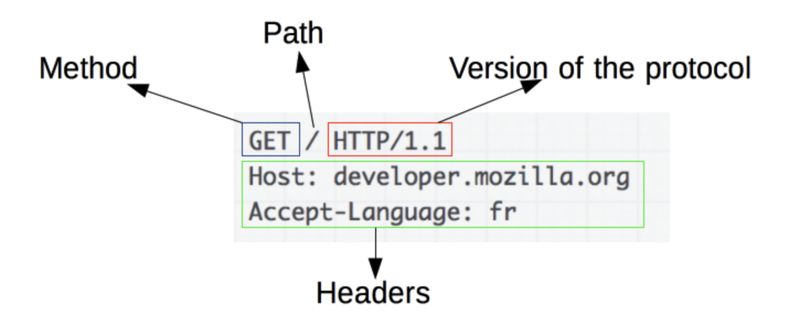

# https와 http의 차이점

- 최근 프로젝트 중 AWS CloudFront를 통해 프론트엔드 배포 자동화를 하는 과정에서 CORS 에러 및 네트워크 에러 발생

 

- 배포되는 URL은 https지만, 서버 API 엔드포인트 주소가 http였기 때문에 에러 발생. (https -> http로 전송)
- 백엔드와 협의 했지만, 이미 http로 fix 되어 변경 불가
- 따라서 http 배포를 사용하는 S3 배포를 사용
- https가 http 상위 호환일 텐데 보안 상 문제가 발생한 단 이유로 강제로 에러를 만들어내는 것인 지에 대한 의문이 생겨 공부 시작

## http
- 클라이언트와 서버 간 통신을 위한 통신 규칙 세트 or 프로토콜

### http의 동작 원리
- OSI 네트워크 통신 모델의 애플리케이션 계층 프로토콜.
- 요청으론 GET이나 POST, 응답으론 상태 코드(200, 400, 404 등)와 같이 여러 유형으로 요청과 응답을 정의.

## https
- http의 상위 버전으로 브라우저와 서버가 데이터를 전송하기 전 안전하고 암호화된 연결 설정

### https 동작 원리
- http 요청/응답을 SSL 및 TLS 기술을 결합.
- https 웹 사이트는 독립된 인증 기관(CA)에서 SSL/TLS 인증서를 획득해야 함.
- 이러한 웹 사이트는 신뢰를 구축하기 위해 데이터를 교환하기 전 브라우저와 인증서를 공유
- SSL 인증서는 암호화 정보도 포함하므로 서버와 웹 브라우저는 암호화된 데이터나 스크램블된 데이터를 교환 가능.
- 프로세스
    1. 사용자 브라우저의 주소 표시줄에 https:// 형식을 입력하여 https 웹 사이트 방문
    2. 브라우저는 서버의 SSL 인증서를 요청 해 사이트의 신뢰성 검증 시도
    3. 서버는 퍼블릭 키가 포함된 SSL 인증서 회신 전송
    4. 웹 사이트의 SSL 인증서는 서버 아이덴티티 증명.  브라우저가 퍼블릭 키를 사용해 비밀 세선 키가 포함된 메세지를 암호화 하고 전송함. 
    5. 웹 서버는 개인 키를 사용해 메시지를 해독하고 세션 키를 검색.  
    그런 다음, 세션 키를 암호화 하고 브라우저에 승인 메세지 전송
    6. 브라우저와 웹 서버 모두 동일한 세션 키를 사용해 메세지를 안전하게 교환하도록 전환

### SSL/TLS
- 웹 사이트와 브라우저 사이에 전송된 데이터를 암호화 하여 인터넷 연결 보안을 유지하는 표준 기술
- TLS는 SSL의 신버전. SSL의 표준화 버전이 TLS
- TLS는 보안과 성능 상의 이슈로 두 가지 암호화 방식을 모두 사용.
    - 대칭키 암호화 방식
    - 비대칭키 암호화 방식

### 대칭키와 비대칭키 암호화 방식
- 대칭키 암호화 방식
    - 암호화 및 복호화 키 둘 다 동일한 방식
    - 서로가 키를 공유하는 과정에서 키가 노출될 수 있음
    - 따라서 보안에 일부분 취약
    - 대신 성능면에서 좋음
- 비대칭키 암호화 방식
    - 공개키와 개인키, 한 쌍의 키를 통해 암호화/복호화 하는 방식
    - 공개키를 통해 암호화, 개인키를 통해 복호화
    - 이러한 방식의 대표 알고리즘은 RSA
    - 하지만 RSA 알고리즘의 암호화 방식은 복잡하기 때문에 성능 이슈 발생
    - 따라서 통신에서 단독으로 쓰이기엔 어려움이 있음

### TLS 암호화
- 따라서 처음에 대칭키를 서로 공유하는 통신은 RSA 비대칭키 방식 사용, 실제 통신 할 때는 대칭키 방식 사용
- 예시 과정
    1. 서버는 공개키와 개인키를 보유
    2. 클라이언트가 서버에게 데이터 요청
    3. 서버는 공개키를 클라이언트에게 제공
    4. 클라이언트는 공캐리를 받고 TLS 프르토콜을 통해 세션키 생성
    5. 세션키로 공개키를 암호화
    6. 클라이언트는 서버에게 암호화된 세션키 제공
    7. 서버는 암호화된 세션키를 개인키를 통해 복호화
    8. 이를 통해 실질적으로 암호화 및 복호화하는 키는 대칭키면서 보안 이슈 해결

> 이래서 https와 http 간 통신을 제한
1. 클라이언트 환경이 http, 서버 환경이 https인 경우  
서버 환경은 TLS 프로토콜을 통해 공개키를 제시하지만 http 환경은 해당 데이터를 키로 인식하지 않을 거고, 키로 인식한다 하더라도 세션키를 생성해야 하지만 TLS 프로토콜 환경이 아니기 때문에 세션키를 생성하지 못해 문제 발생.
  
2. 클라이언트 환경이 https, 서버 환경이 http인 경우  
클라이언트 환경은 TLS 프로토콜 환경에 따라 서버로부터 받은 데이터를 세션키를 생성하여 암호화 해야 하지만 해당 데이터는 공개키가 아니기 때문에 문제 발생

- 그리고 클라이언트와 서버 간 TLS 프로토콜의 암호화 및 복호화에 대한 키 관련 교류 과정을 <b>"핸드쉐이크"</b>라고 함

## https 선호 이유
- 보안
    - http는 일반 텍스트이므로 보안에 취약
    - 반면 https는 사용자의 민감한 데이터를 전송 시 제 3자가 해당 데이터를 가로챌 수 없음
- 권위
    - 검색 엔진 측면에서도 보안도가 낮은 http를 추천할 이유가 없음. 
- 성능 및 분석
    - 로드 속도가 훨씬 빠름.

### 배운 점과 느낀 점
- 모든 내용이 배운 내용이었음
- 대충 말로만 들었던 TLS와 TLS가 뭔 지도 알게 되었고, TLS를 통한 암호화 과정도 재밌었음
- 가장 핵심이었던 왜 저런 오류가 발생했던 것인 지에 대한 이유가 명확해져서 너무 좋음
- 하지만 새로운 의문이 발생
    - 서버나 클라이언트는 TLS 프로토콜이 어디서 난 거지?
    - 서버는 TLS 인증서를 받을 때 결국 통신으로 받을 텐데 거기서 보안이 어그러 지면 의미 없는 거 아닌가?
    - 인증서는 그럼 어디서 나는 거야?

## 참고
https://aws.amazon.com/ko/compare/the-difference-between-https-and-http/
https://mangkyu.tistory.com/98
https://babbab2.tistory.com/4?category=1058182