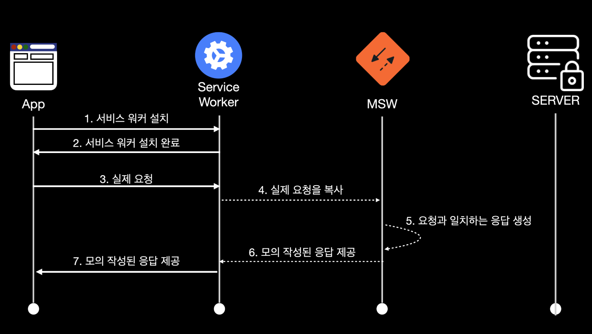
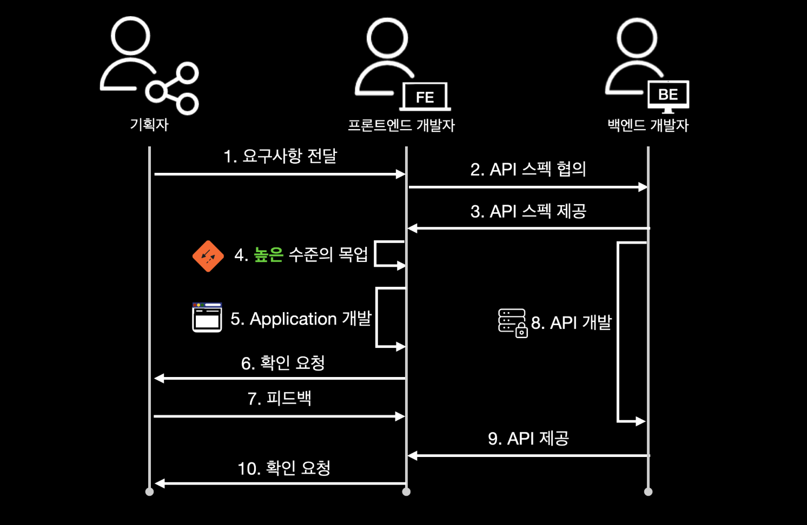

# mock 서버
- 백엔드 개발자가 API를 내리는 바람에 mock을 적용해야 했는데 사용법을 몰라 공부

## Mock Data란?
- 실제 API에서 받아온 데이터가 아닌 프론트엔드 개발자가 필요에 의해 샘플로 만든 데이터

## Mock Data 사용 목적
- 백엔드 API가 미완성인 상황에선 하드 코딩으로 작업하게 됨<br> -> 실제 API와 통신 때 문제가 발생할 가능성이 높아짐.
- 따라서 Mock Data를 통해 문제를 해결
    - 백엔드 API가 미완성인 상태에서도 작업에 차질 없이 개발 가능
    - 백엔드 API의 구성을 미리 맞춰볼 수 있음
    - 실제로 API 통신을 진행할 때 원활하게 할 수 있음

## Mock Data 생성
- 실제 API의 데이터 형식과 동일하게 하기 위해 JSON 형식으로 생성.
    ```js
    {
    "id": 7,
    "userId": 1,
    "projectId": 6,
    "message": "기획자에게 하고 싶은 말",
    "email": "devpals@mail.com",
    "phoneNumber": "010-9999-0000",
    "career": null,
    "status": "",
    "createdAt": "2025-01-08T17:54:43.000Z",
    "updatedAt": "2025-01-09T09:01:59.000Z",
    "User": {
      "id": 8,
      "nickname": "김개발1",
      "email": "devpals@mail.com",
      "bio": null,
      "profileImg": "프로필 이미지 주소",
      "UserSkillTag": [
        {
          "userId": 8,
          "skillTagId": 28,
          "createdAt": "2025-01-08T11:57:17.000Z",
          "SkillTag": {
            "id": 28,
            "name": "Figma",
            "img": "스킬 태그 이미지 주소",
            "createdAt": "2025-01-02T15:11:15.000Z"
          }
        },
        {}
      ]
    }
  },
  ```

## Mock Data 사용
- 실제 데이터와 동일하게 fetch 메서드에서 호출
- fetch 메서드의 첫 번쨰 인자인 API 주소를, 생성한 Mock Data의 주소로 입력.<br>
-> http://localhost:3000은 생략 가능. 생략 하지 않을 경우, 로컬 서버가 여러 개 열려 있다면 새로운 로컬 서버를 실행할 때마다 포트번호가 바뀌게 되어 일일이 수정해야 함.

## MSW란?
- Mock Service Worker는 Service Worker API를 사용해 실제 네트워크 요청을 가로채는 API Mocking 라이브러리
- 서버향의 네트워크 요청을 가로채 모의 응답을 보내주는 역할.

## Service Worker란?
- 웹 애플리케이션의 메인 스레드와 분리된 볃로의 백그라운드 스레드에서 실행 시킬 수 있는 기술 중 하나.
- Service Worker 덕에 애플리케이션의 UI Block 없이 연산 처리 가능
    - 먼저, 네트워크가 원활할 때 동기화를 시켜주는 백그라운드 동기화 기능이나, 높은 비용의 계산을 처리할 때 또는 푸시 이벤트를 생성할 때 주로 사용
    - MSW의 동작 방식과 관계되어 있는, 네트워크 요청을 가로채는 행위도 수행.<br>
    Service Worker가 애플리케이션과 서버 사이에 Request를 가로채서 직접 Fetch에 대한 컨트롤도 할 수 있기 때문에 다른 작업도 가능해짐.<br>
    ex) HTTP Request/Response를 보고 캐싱 처리, 로깅 등 여러 가지 새로운 동작을 만듬.<br>
    MSW도 이 과정을 통해 Request를 가로채 Response를 Mocking 하는 원리를 사용
- Service Worker의 사용이 제한되는 경우
    - 대부분의 모든 브라우저는 지원하지만, IE와 같은 일부 브라우저에서는 지원 X
    - localhost가 아니라면 HTTPS 환경이 필요.<br>
    중간에서 네트워크로 연결을 가로채는 기능이기 때문에 HTTPS 환경에서만 동작.
- MSW는 Service Worker를 기반으로 모의 API를 만들어 내기 때문에 다른 프론트엔드에서 사용하는 수많은 라이브러리나 프레임워크에 종속적이지 않고 호환성에 문제 없이 동작.

## MSW 동작 원리

1. Service Worker를 브라우저에 설치
2. 설치 이후 브라우저에서 실제 이루어지는 요청을 Service Worker가 가로채게 됨.
3. Service Worker에서는 해당하는 실제 요청을 복사해 MSW에게 해당 요청과 일치하는 모의 응답을 제공 받고 이를 브라우저에게 그대로 전달.
4. 이 과정으로 실제 서버 존재 여부와 상관없이 실제 요청으로 이어지지 않고 예상할 수 있는 요청에 대해 Mocking이 가능해짐.

## MSW를 활용한 개발 방식

- API 없이도 프론트엔드 개발자는 어느 정도의 완성도를 확보해 기획자가 피드백을 주고 받을 수 있음.
- 이후 API가 완성된다면 MSW를 끄기만 하면 되니 편함

## MSW 코드 적용
-  API 함수
    - createProject.ts
        ```ts
        export const createApplicant = http.post(
        `${import.meta.env.VITE_API_BASE_URL}/project`,
        () => {
            return HttpResponse.json({
            status: 200,
            });
        }
        );
        ```
- 이런 API 함수가 모여 Mocking 할 API를 핸들링할 핸들러에 포함되는 핸들러
    - browser.ts
        ```ts
        export const handlers = [
        fetchProjectLists,
        fetchProjectStatistic,
        fetchMethodTag,
        fetchPositionTag,
        fetchSkillTag,
        passNonPassList,
        sendResult,
        myProjectList,
        applicantList,
        projectDetail,
        applicantInfo,
        passNonPass,
        myPageProfile,
        myPagePositionTag,
        myPageSkillTag,
        myPageJoinedProjectList,
        myPageAppliedProjectList,
        userPageProfile,
        userPageAppliedProjectList,
        passNonPassList,
        mypageEditProfile,
        login,
        createApplicant,
        createProject,
        ];
        ```
- 해당 모의 API의 모의 응답을 위한 핸들러를 MSW에 사용할 수 있도록 주입(import)
    - browser.ts
        ```ts
        export const worker = setupWorker(...handlers);
        ```
- 마지막으로, MSW를 실행 시키기 위한 코드 추가
    - index.tsx(main.tsx)
        ```tsx
         if (process.env.NODE_ENV === 'development') {
            const { worker } = await import('./mock/browser');
            await worker.start();
        }
        ```

## 배운점과 느낀 점
- 뭔가 되게 간단한 느낌인데 온전히 메커니즘이 이해가 되었다는 느낌은 받지 못했음
- 어떤 부분을 추가적으로 공부해야 하는 지 프로젝트에 적용시키면서 알아봐야 할 거 같음.


## 참고
https://mswjs.io/docs/getting-started
https://tech.kakao.com/posts/458
https://j-tech-dev.tistory.com/100
https://velog.io/@na_jeong/React-Mock-Data
https://velog.io/@eunnbi/Project-API-mocking-with-MSW