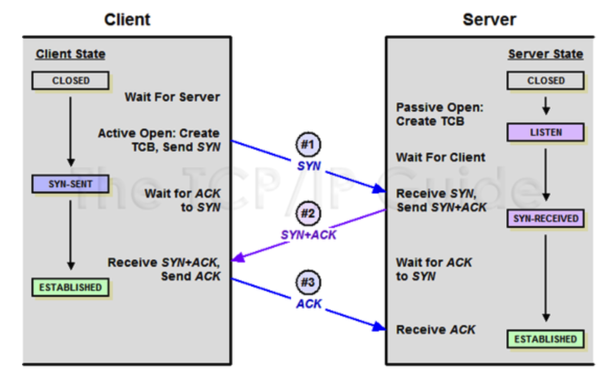
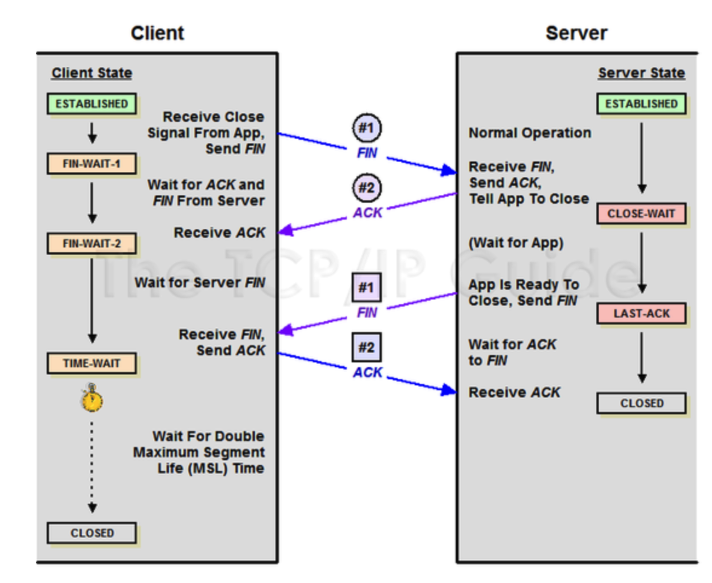

# socket
- 웹 소켓을 배우기 전 소켓에 대한 개념이 필요하다 판단함.

# socket이란?
- 네트워크에서 데이터를 주고 받는 두 장치 간 종단점을 의미.
- 통신 채널의 한 부분으로, 인터넷 프로토콜(IP)와 함께 TCP/IP 네트워크에서 사용됨.

# TCP
- 전송 제어 프로토콜
- 두 호스트가 교환하는 데이터와 승인 메세지의 형식을 정의
- 데이터 패킷에 일련의 번호를 부여해 데이터 손실을 찾아 교정하고, 순서를 재조합해 클라이언트에게 전달할 수 있게 함. => 데이터는 네트워크 선로를 통해 전달되는 과정에서 손실 or 순서가 뒤바뀌어 전달될 수 있기 때문.
- 인터넷은 패킷을 통해 정보를 전달하므로 패킷을 전달하는 규약도 필요함.
- 패킷은 데이터를 일정 단위로 쪼개어 전송한 것이므로 순서대로 도착한다는 보장이 없어 규칙이 필요함.
- TCP를 통해 전달 받은 패킷을 재조립하고, 손상 or 손실된 패킷은 재전송을 요청하는 패킷을 통해 재전송 받음.
- 통신 과정
    - 3 Way handShaking
    - 4 Way handShaking

## TCP/IP
- IP는 데이터가 찾아갈 주소, TCP는 찾아 온 데이터가 형식에 맞게 왔는 지 확인하는 필터.
- 데이터가 전송되는 전체 네트워크 과정
- 이 과정을 통해 대부분의 네트워크 통신이 이루어짐.
    1. 브라우저를 사용해 URL 입력으로 웹페이지 요청.
    2. 사용자의 요청은 TCP 패킷으로 만들어짐.
    3. 이 패킷들은 다시 인터넷 상에서 원하는 주소로 이동할 수 있도록 하기 위해 IP 패킷(자신의 주소, 도착해야 될 상대방의 주소 포함)으로 만들어지고, 이는 이더넷 카드로 보내져 internet으로 나가게 됨.
    4. 라우터, 토클링 등의 장치를 통해 인터넷 상에 있는 TCP/IP 패킷은 요청된 웹페이지 주소의 이더넷 카드로 전달됨.
    5. 전달된 패킷은 바로 윗 계층을 보내짐.<br>
    인터넷 계층에서 IP 패킷을 분석해 패킷이 어디서 왔는 지, 도착지가 여기가 맞는 지 확인.
    6. 맞다면 전송계층으로 보내 TCP 프로토콜로 통신 메세지를 검사해 다시 애플리케이션 계층으로 보냄
    7. 애플리케이션 layer에서는 웹 서버가 통신 메세지를 http 프로토콜에 준하여 검사를 해 사용자가 요청한 웹 페이지를 읽고, 이를 다시 전송 계층으로 보냄. 웹 페이지를 브라우저까지 전송하는 과정은 정반대의 역순으로 진행됨.
    8. 최종적으로 웹 브라우저는 웹 페이지를 받아 렌더링 작업을 거친 후 화면에 출력
- 이 과정에서 각 클라이언트와 서버 단에서 데이터를 송수신 하는 이더넷 카드는 물리적인 장치이며, **소켓**은 그 전 단계로, 추상화된 네트워크 세계에서 데이터가 송수신되는 종단점. 즉, 소프트웨어적으로 소켓에서 데이터가 나가면 이더넷 카드를 통해 실질적으로 데이터가 인터넷에 배포됨.

## TCP 3 Way HandShaking
- TCP 3 Way HandShaking은 위 8개의 과정 중 최초 클라이언트 단에서 요청을 보내는 경우 애플리케이션 단계에서 요청하고자 하는 데이터를 IP 패킷화 한 후 해당 패킷을 내보내기 전 전송 계층에서 발생하는 핸드쉐이킹. 
- 데이터 전송을 위한 네트워크 연결을 설정하는 과정.<br>
양쪽 모두 데이터 전송 준비 완료를 보장하고, 실제로 데이터 전달이 시작되기 전 다른 한 쪽이 준비 되었다는 것을 알 수 있게 함.
- 최초 요청하는 쪽에서 단 한 번 발생하며, TLS 프로토콜의 session ID처럼 양쪽이 <b>"연결식별자(4-tuple)"</b>와 상태 정보를 유지.<br><br>
따라서 해당 핸드쉐이킹은 보통 최초 연결을 시도하는 쪽의 전송 단계에서 한 번 실행됨.

    1. 클라이언트 서버 접속 요청을 위한 SYN(synchronize) 패킷 전송.<br>
    이 때 클라이언트는 SYN을 보내 SYN/ACK를 기다리는 SYN_SENT 상태가 됨.
    2. 서버는 SYN  요청을 받고 클라이언트에게 요청을 수락한다는 ACK와 SYN flag가 살정된 패킷을 발송하고, 다시 ACK(acknowledgement)로 응답하길 기다림(서버는 SYN_RECEIVED 상태가 됨)
    3. 클라이언트는 서버에 ACK를 보내고 이후로 데이터를 서로 주고 받음(서버는 EST ABLISHED 상태가 됨)

### 클라이언트 소켓
- 클라이언트 애플리케이션에서 생성되며, 서버와의 연결을 요청하는 역할.
- 연결 요청은 일반적으로 서버의 IP 주소와 포트 번호를 통해 수행됨.
### 서버 소켓
- 서버 애플리케이션에서 생성되며, 클라이언트의 연결 요청을 기다리고 수락하는 역할.
- 서버 소켓은 특정 포트에서 들어오는 연결 요청을 감시(listen).<br> 요청이 들어오면 새로운  소켓을 생성해 클라이언트와의 통신 채널을 열게됨.


## TCP 4 Way HandShaking
- 3 Way HandShaking은 TCP를 초기화할 때 사용되는 거라면, 이건 세션을 종료할 때 수행되는 절차

    1. 클라이언트가 연결을 종료한다는 FIN(Finish) 플래그 전송
    2. 서버는 확인 메세지를 보내고 자신의 통신이 끝날 때까지 기다리는데 이 상태를 TIME WAIT 상태라 함
    3. 서버 통신이 끝났으면 연결이 종료되었다고 클라이언트에게 FIN 플래그 전송
    4. 클라이언트는 확인했다는 메세지를 보냄(ACK)

## TCP/IP를 활용한 서버/클라이언트 기본 네트워킹
- 서버 측
    ```c++
    #include <sys/socket.h>			// 소켓 프로그래밍에 필요한 함수 & 상수 정의
    #include <unistd.h>
    #include <netinet/in.h>			// 인터넷 프로토콜을 위한 구조체 & 상수 정의
    #include <arpa/inet.h>			// 인터넷 주소 변환 함수들을 정의
    #include <stdlib.h>
    #include <stdio.h>
    #include <string.h>

    #define PORTNUM 9001			// 9001 포트 지정

    int main() {
        char buf[256];
        struct sockaddr_in sin, cli;
        int sd, ns, clientlen = sizeof(cli);

        memset((char *)&sin, '\0', sizeof(sin));			// 구조체 초기화
        sin.sin_family = AF_INET;							// 소켓 종류 AF_INET 지정 (ipv4)
        sin.sin_port = htons(PORTNUM);						// 포트 번호 지정
        sin.sin_addr.s_addr = inet_addr("192.168.147.129");	// IP 주소 설정
        
        if ((sd = socket(AF_INET, SOCK_STREAM, 0)) == -1 ) {	// ipv4 | TCP 사용
            perror("socket");
            exit(1);
        }
        
        if (bind(sd, (struct sockaddr *)&sin, sizeof(sin))) {	// bind() 함수를 사용해 IP주소/포트 번호와 연결
            perror("bind");
            exit(1);
        }
        
        if (listen(sd, 5)) {									// liten() 함수를 호출해 클라이언트의 요청을 받을 준비가 끝났음을 운영체제에 알림
            perror("listen");
            exit(1);
        }
        
        while (1) {
            if ((ns = accept(sd, (struct sockaddr *)&cli, &clientlen)) == -1) {
                perror("accept");
                exit(1);
            }													// accept() 함수를 사용해 클라이언트의 요청이 올 때까지 기다림
            sprintf(buf, "%s", inet_ntoa(cli.sin_addr));		
            printf("*** Send a Message to Client(%s)\n", buf);  // 어떤 클라이언트가 서버로 접속했는지 확인 & 출력
            
            strcpy(buf, "Welcome to Network Server!!");			// 서버에서 클라이언트로 보낼 간단한 환영 메시지를 작성
            if (send(ns, buf, strlen(buf) + 1, 0) == -1) {		// send() 함수를 사용해 클라이언트로 보낼 메시지를 보냄
                perror("send");
                exit(1);
            }
            
            if (recv(ns, buf, sizeof(buf), 0) == -1) {			// 클라이언트가 보낸 메시지를 recv() 함수로 받아서 출력
                perror("recv");
                exit(1);
            }
            printf("** From Client : %s\n", buf);
            close(ns);
        }
        close(sd);												// 작업이 끝나면 소켓을 닫음
    }
    ```
    - bind 함수
        - 소켓에 주소를 할당하는 함수
            ```c++
            int bind(int 소켓 디스크립터, struct sockaddr* 구조체 변수의 주소값, socklen_t 구조체 변수의 길이정보);
            ```
        - 초기화 한 구조체를 소켓에 할당해 소켓에 주소 할당
        - 이후 연결 요청 대기상태로 진입해야 함.
        - 보통 서버는 시작할 때 잘 알려진 포트번호를 bind함. <br>하지만 만약 서버가 bind를 하지 않으면, 커널은 소켓에 대한 일시적인 포트 선택
        - 클라이언트는 bind를 하지 않음. 따라서 서버에 대해 모든 사용 가능한 인터페이스에서 응답 가능. <br>애플리케이션에서 따로 포트번호를 지정하지 않는다면 커널이 임시 포트번호를 선택.
    - listen 함수
        - 주소가 할당된 소켓에 연결 요청 대기 => passive 소켓
            ```c++
            int listen(int 소켓 파일디스크럽터, int 연결 요청 받을 개수)
            ```
        - 클라이언트가 연결 요청을 했을 때 연결이 수락될 때까지 연결 요청을 대기시킬 수 있는 상태
        - 오직 TCP 서버에서만 사용 가능
        - 보통 소켓을 만들고 bind 한 후 accept 함수를 호출하기 전 사용
        - 이제 연결 요청이 오면 수락해야 함.
            > - backlog : 커널은 2개의 큐를 가짐.
            >    - incomplete connection queue: 각 entry마다 TCP 3-way handshaking을 기다리는 클라이언트의 SYN을 가지고 있음.
            >        - 3-way가 완료되면 completed 큐로 넘어감
            >    - completed connection queue : TCP 3-way가 완료되면 클라이언트를 지님. => 여기서 최초 발생한 TCP 연결에 대한 정보를 저장.
        - 3-way가 지나면 accept 할 수 있음.
    - accept 함수
        - 클라이언트와 서버가 데이털르 주고 받을 수 있는 상태를 뜻함.
        - 클라이언트와 통신할 수 있게 해주는 소켓을 생성<br>
        complete connection 큐에서 대기 중인 클라이언트의 연결 요청을 수락하는 기능 수행.
        - 호출 성공 시 통신에  사용할 소켓을 생성하고 소켓의 파일 디스크립터를 반환.
        ```c++
        int accept(int 서버소켓의 파일 디스크립터,struct sockaddr* addr, socklen_t* addrlen);
        ```
        - addr : 클라이언트의 소켓 주소 정보를 담을 구조체 주소
        - addrlen : addr에 전달된 주소의 변수 크기, 단 크기를 sizeof()로 정한 후 주소로 넘김.
        - 즉, accept 함수를 통해 서버와 클라이언트의 통신을 수락하고, 이에 사용할 소켓을 넘김.
        - accept의 리턴값 = 클라이언트 소켓 디스크럽터. 실패하면 -1.

- 클라이언트 측
    - 클라이언트는 서버가 listen을 통해 연결 요청을 받을 수 있는 상태일 때, 연결을 요청할 수 있음.
    ```c++
    #include <sys/socket.h>
    #include <unistd.h>
    #include <netdb.h>			// 네크워크 데이터베이스 관련 구조체 & 함수 정의
    #include <netinet/in.h>
    #include <arpa/inet.h>
    #include <stdlib.h>
    #include <stdio.h>
    #include <string.h>

    #define PORTNUM 9001	// 클라이언트도 서버와 같은 포트 번호 사용

    int main() {
        int sd;
        char buf[256];
        struct sockaddr_in sin;
        
        memset((char *)&sin, '\0', sizeof(sin));				// 구조체 초기화
        sin.sin_family = AF_INET;
        sin.sin_port = htons(PORTNUM);							// 서버의 포트번호 지정
        sin.sin_addr.s_addr = inet_addr("192.168.147.129");		// 접속할 서버의 주소를 지정
        
        if ((sd = socket(AF_INET, SOCK_STREAM, 0)) == -1) {		// ipv4 | TCP 소켓을 생성
            perror("socket");
            exit(1);
        }
        
        if (connect(sd, (struct sockaddr *)&sin, sizeof(sin))) {
            perror("connect");
            exit(1);
        }														// 서버와 접속
        
        if (recv(sd, buf, sizeof(buf), 0) == -1) {				// 접속한 후 서버에서 보낸 메시지를 받아 출력
            perror("recv");
            exit(1);
        }
        
        printf("** From Server : %s\n", buf);
        
        strcpy(buf, "I want a HTTP Service.");					// 서버로 보낼 메시지를 복사한 후 메시지를 서버로 전송
        if (send(sd, buf, sizeof(buf) + 1, 0) == -1) {
            perror("send");
            exit(1);
        }
        
        close(sd);
    }
    ```
    - connect 함수
        - 함수 실행에 성공하면 리턴 0, 실패하면 리턴 -1
        ```c++
        int connect(int sockfd, const struct sockaddr* servaddr,socklen_t addrlen);
        ```
        - sock : 클라이언트 소켓의 파일 디스크럽터
        - servaddr : 연결 요청할 서버의 주소 정보를 담은 변수의 주소값, 함수가 실행되면 여기엔 클라이언트의 주소 정보가 채워짐.
        - addrlen : servaddr에 전달된 주소의 변수 크기를 바이트 단위로 전달, 이것도 크기를 정한 후 변수의 주소값을 전달, 함수가 실행되면 클라이언트의 주소정보 길이가 저장됨.
        - connect는 생성된 소켓의 파일 디스크립터를 반환
            ```
            connect함수가 실행되고 두가지 상황이 실행되어야 함수가 반환됨.
                1. 서버에서 연결요청 접수(0)
                2. 오류로 인한 연결 요청 중단(-1) <br>
            연결 요청은 서버의 accept를 의미하는게 아님. 서버에 연결 대기를 걸어 놓는 것임
            => connect가 반환이 되어도 바로 연결이 되지 않을 수도 있음.
            ```
        - 서버에선 bind를 통해 소켓에 직접 IP와 포트를 할당했지만, 클라이언트에선 connect가 호출 될 때 연결할 서버의 주소 정보도 함께 전달되며, 커널에서 IP는 컴퓨터에서 할당된 것으로, 포트는 임의로 배정됨. => 자동 할당됨.
    - close 함수
        - 소켓을 close할 때 사용. => 연결 종료.
        ```c++
        int close(int sockfd)
        ```

## 참고
https://velog.io/@wjddnjswjd12/TCPIP-net-Socket-%EB%AA%A8%EB%93%88-%EB%93%B1%EB%93%B1-%EA%B3%B5%EB%B6%80-%EA%B8%B0%EB%A1%9D

https://velog.io/@zh025700/%EB%84%A4%ED%8A%B8%EC%9B%8C%ED%81%AC%ED%94%84%EB%A1%9C%EA%B7%B8%EB%9E%98%EB%B0%8D04-TCP%EA%B8%B0%EB%B0%98-%EC%84%9C%EB%B2%84-%ED%81%B4%EB%9D%BC%EC%9D%B4%EC%96%B8%ED%8A%B81

https://velog.io/@white-jelly/TCP-%EA%B8%B0%EB%B0%98-%ED%94%84%EB%A1%9C%EA%B7%B8%EB%9E%98%EB%B0%8D